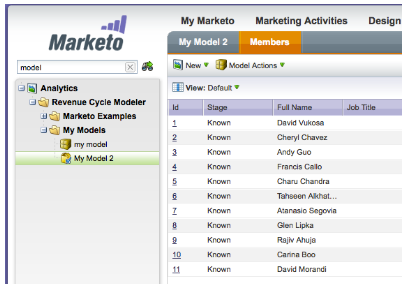

# Notas de la versión: Mayo de 2013 {#release-notes-may}

Las siguientes funciones se incluyen en la versión de mayo. Verifique la disponibilidad de las funciones [Marketing](https://docs.marketo.com/display/docs/assets/pricing.php) [Edition](https://docs.marketo.com/display/docs/assets/pricing.php).

Después de la versión, asegúrese de consultar la ficha [Nueva versión](release-notes-december-2013.md) de la Comunidad para ver artículos detallados de la base de conocimiento para cada función.

## Archivos de calendario para Páginas de aterrizaje {#calendar-files-for-landing-pages}

Cree un archivo de calendario como Mi token que se pueda agregar a la página de aterrizaje. Este archivo de calendario integrado (p. ej. .ics) procesará todos los tokens, incluidos Mis tokens en páginas de aterrizaje de recursos locales.

## Ficha Membresía de modelo {#model-membership-tab}

Vista todos los datos del miembro del modelo en un solo lugar para poder supervisar y solucionar fácilmente los problemas. La nueva ficha Miembros es una vista de solo lectura disponible cuando se selecciona un modelo de ciclo de ingresos aprobado.

## Árbol de acciones de flujo reorganizado {#reorganized-flow-action-tree}

Encuentre acciones de flujo más rápido con el árbol de acciones de flujo recién reorganizado.

## Acciones de flujo renombradas {#renamed-flow-actions}

Cambiar estado de progresión ahora es Cambiar estado de Programa. Cambiar datos de Programa ahora cambia el éxito de Programa

