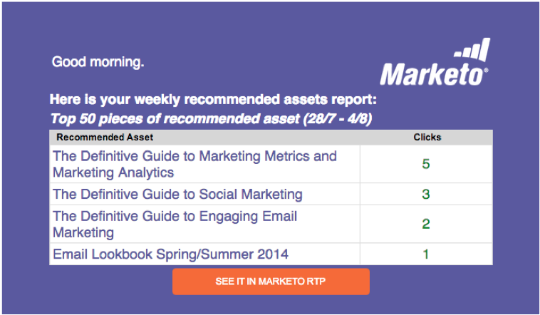

# Notas de la versión: Agosto de 2014 {#release-notes-august}

Las siguientes funciones se incluyen en la versión de agosto de 2014. Compruebe la disponibilidad de las funciones en la edición de marketing. Vuelva después de la versión para ver vínculos a la documentación detallada de las funciones.

## Licencias del calendario de mercadotecnia {#marketing-calendar-licenses}

A partir del 5 de septiembre de 2014, solo 5 usuarios pueden tener acceso gratuito al calendario de marketing. Asegúrese de [Publicar/Revocar una licencia del calendario de mercadotecnia](/help/marketo/product-docs/core-marketo-concepts/marketing-calendar/understanding-the-calendar/issue-revoke-a-marketing-calendar-license.md) a los usuarios de su elección antes de hacerlo para obtener acceso sin interrupciones.

## Nuevos permisos de usuario {#new-user-permissions}

Se agregaron los siguientes permisos de usuario nuevos:

| Permiso | Descripción |
|---|---|
| Explorador de ingresos de Access | Si compró RCA, ahora tendrá control sobre quién puede acceder a él. |
| Importar Lista | Restringir a los usuarios de la importación de listas en la base de datos de posibles clientes. |
| Importación de listas | Restringir a los usuarios de la importación de listas mediante un programa en actividades de marketing. |
| Activar Campaña Déclencheur | Controlar quién puede y quién no puede activar las campañas de déclencheur. |
| Programar Campaña por lotes | Controlar quién puede y quién no puede programar ejecuciones de campaña por lotes. |

## Exportar usuarios y roles desde el administrador {#export-users-and-roles-from-admin}

Ahora puede [Exportar una Lista de usuarios y funciones](/help/marketo/product-docs/administration/users-and-roles/export-a-list-of-users-and-roles.md) desde Marketing. También puede incluir una marca de hora &quot;Último inicio de sesión&quot; en la exportación.

## Eliminar Canales y etiquetas {#delete-channels-and-tags}

Ahora puede eliminar los canales y estados no utilizados. Como siempre, solo puede ocultar una que esté en uso actualmente.

## DKIM automatizado {#automated-dkim}

Para mejorar la capacidad de entrega, todos los correos electrónicos salientes serán firmados por DKIM (DomainKeys Identified Mail). De forma predeterminada, los mensajes de correo electrónico utilizarán la firma DKIM compartida de Marketing. Tendrá la opción de personalizar esta firma.

>[!NOTE]
>
>DKIM se implementará lentamente, puede que no lo vea durante unas semanas.

## Actualizaciones de Personalización en tiempo real {#real-time-personalization-updates}

Hemos agregado etiquetas a la página de campaña para que pueda etiquetar el contenido de sus corazones.

## Objetivo móvil {#mobile-targeting}

¡Preguntaste por la comunidad y nos entregamos! Ahora puede incluir, excluir o establecer una llamada a acción específica para usuarios de móviles y tabletas.

## Segmentación y objetivo 1:1 mejorados {#enhanced-segmentation-and-targeting}

Ahora puede usar operadores de filtro avanzados para segmentar visitantes conocidos.

## Uso compartido de campañas {#campaign-sharing}

Ahora puede compartir rápida y fácilmente un vínculo de previsualización de campaña RTP.

## Informe Motor de recomendación de contenido {#content-recommendation-engine-report}

Hemos agregado un nuevo informe de motor de recomendaciones de contenido para que pueda ver un buen resumen.

## Administración de usuarios mejorada {#enhanced-user-administration}

Los usuarios administradores ahora pueden bloquear usuarios debido a varios intentos fallidos de inicio de sesión. También puede desbloquear a esos usuarios si lo desea.

## Control de seguimiento {#tracking-control}

Ahora puede excluir direcciones IP específicas de todos los seguimientos y sistemas de informes de la Personalización en tiempo real.

