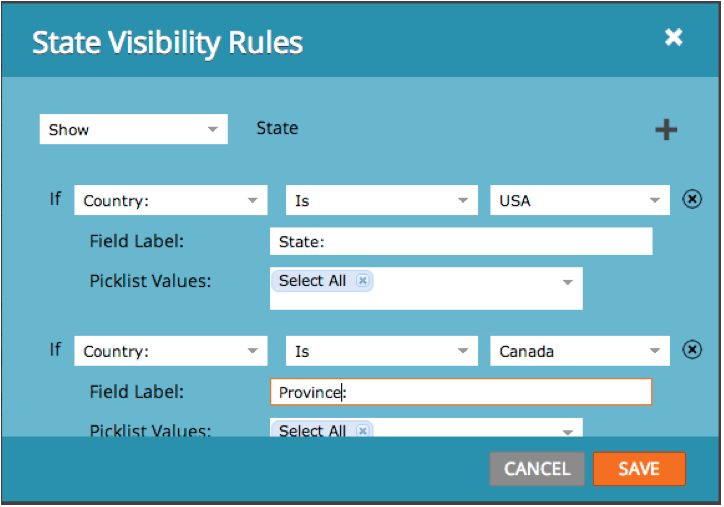
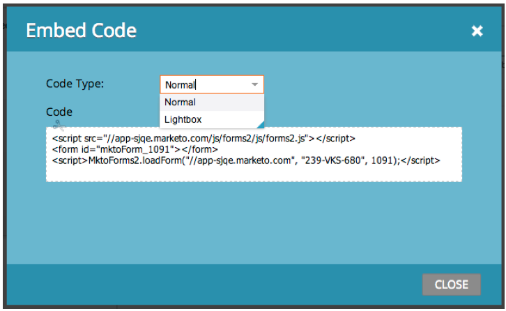

# Notas de la versión: Enero de 2014 {#release-notes-january}

Las siguientes funciones se incluyen en la versión de enero de 2014. Consulte su [edición de marketing](https://www.marketo.com/pricing/) para conocer la disponibilidad de las funciones.

## Forms 2.0 {#forms}

Mirando hacia arriba: La documentación de Forms 2.0 estará disponible próximamente. Mientras tanto, conozca más a continuación y en el [vídeo de introducción](https://docs.marketo.com/display/docs/forms)!

Controle el proceso de creación de formularios y dé un descanso a los desarrolladores web. [Forms](https://docs.marketo.com/display/docs/forms) 2.0 está diseñado para que los especialistas en marketing puedan crear formularios sólidos tanto visual como funcionalmente sin necesidad de conocimientos de programación.

**Proporcione a su Forms la configuración visual que merecen:**

Los diseños de temas, la personalización de botones y los diseños flexibles le permiten diseñar formularios de aspecto moderno que se ajusten al aspecto del sitio.

**Visibilidad condicional y lógica de página de seguimiento:**

\
¿Desea que &quot;Estado&quot; solo se muestre si un usuario selecciona Estados Unidos como su &quot;País&quot;? ¿Qué hay de presentar diferentes documentos técnicos a los clientes en función de cómo responden a las preguntas del formulario? Cree una lógica condicional en los formularios directamente desde el editor. ¡No se requiere javascript!

**Incruste Forms fácilmente en sus propias páginas de aterrizaje:**

Atrás quedan los días de extraer código HTML de los formularios colocados en páginas de aterrizaje de marketing y colocarlos en un iFrame. Simplemente tome el código incrustado y colóquelo en la página de aterrizaje donde desee que se represente el formulario. Dos modos -normal y Lightbox- le proporcionan aún más flexibilidad con los formularios de marketing en su sitio.

Obtenga más información en el [vídeo de introducción a Forms 2.0](https://docs.marketo.com/display/docs/forms). (La documentación llega pronto a [Forms](https://docs.marketo.com/display/docs/forms) buceo profundo!)

## Límites de comunicación para el Programa de correo electrónico {#communication-limits-for-email-program}

[Establezca Límites de comunicación en un ](../../product-docs/email-marketing/email-programs/email-program-actions/enable-disable-communication-limits-in-an-email-program.md) programa de correo electrónico para asegurarse de no sobrecomunicarse con la base de datos. Si una persona supera el límite definido, no recibirá el correo electrónico.

## Campos adicionales en la Análisis de pertenencia a Programa {#additional-fields-in-program-membership-analysis}

Ahora puede agregar y agrupar las métricas de [Análisis de pertenencia a Programas](../../product-docs/reporting/revenue-cycle-analytics/program-analytics/build-a-program-membership-analysis-report-that-lists-leads.md) por atributos de posible cliente y compañía. Por ejemplo, puede agregar el campo Industria para ver la división de los miembros del programa y los éxitos.

