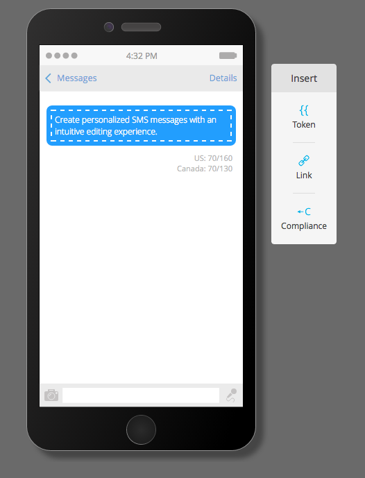

# Notas de la versión: Verano &#39;16 {#release-notes-summer}

Las siguientes funciones están incluidas en la versión del verano de 2016. Compruebe la disponibilidad de las funciones en su edición de Marketo. Haga clic en los vínculos de título para ver los artículos detallados de cada función.

## [Marketing basado en cuentas](https://docs.marketo.com/display/docs/account+based+marketing) {#account-based-marketing}

El marketing basado en cuentas de Marketo proporciona todos los elementos básicos en una plataforma unificada:

* **Target** : detección de cuentas, coincidencia de posibles clientes con cuentas y listas de cuentas con nombre
* **Participación** : personalización basada en cuentas, participación en canales múltiples y flujos de trabajo específicos de la cuenta
* **Medida** : perspectivas de nivel de cuenta y lista, puntuación de participación de cuenta e impacto en la canalización y los ingresos

>[!NOTE]
>
>ABM está disponible como complemento de su suscripción a Marketo, por lo que póngase en contacto con su representante de ventas para que la implemente.

## [Pista de auditoría](/help/marketo/product-docs/administration/audit-trail/audit-trail-overview.md) {#audit-trail}

La pista de auditoría ofrece un historial completo de los cambios realizados en la suscripción a Marketo. Creará responsabilidad entre usuarios y administradores, ayudará a identificar la causa del comportamiento inesperado y proporcionará seguridad para saber quién está haciendo qué y cuándo. Esta información estará disponible en cualquier momento y se puede utilizar para responder preguntas como:

* ¿Qué ha pasado con este recurso o esta configuración y quién la actualizó por última vez?
* ¿Qué ha estado haciendo el usuario X?
* ¿Quién está iniciando sesión en nuestra cuenta?

## [Integración de LaunchPoint de SMS de Marketo-Vibes](/help/marketo/product-docs/mobile-marketing/vibes-sms-messages/create-a-vibes-sms-message.md) {#marketo-vibes-sms-launchpoint-integration}

Cree fácilmente mensajes SMS directamente en Marketo. Personalice y dirija su mensaje utilizando sus datos enriquecidos de Marketo y supervise fácilmente su rendimiento mediante el panel de mensajes SMS.

>[!NOTE]
>
>Esta función requiere que tenga una cuenta de Vibes SMS existente.

## [Mejoras en Email 2.0](/help/marketo/product-docs/email-marketing/general/email-editor-2/email-editor-v2-0-overview.md) {#email-enhancements}

**Variables de nivel de módulo**

Anteriormente, todas las variables especificadas en las plantillas de correo electrónico 2.0 tenían un alcance &quot;global&quot;. Cuando se utilizan variables dentro de módulos, esto no siempre es deseable si se planea utilizar varias instancias del módulo. Con esta versión, las variables ahora se pueden especificar como &quot;nivel de módulo&quot;, lo que permite indicar que el usuario debe poder establecer valores únicos para cada módulo en el que se utilicen.

**Actualizaciones de sintaxis**

* Ahora puede utilizar &quot;mktoAddByDefault&quot; en módulos especificados en Plantillas de correo electrónico 2.0 para indicar qué módulos se deben mostrar en nuevos correos electrónicos de forma predeterminada. Esto resulta mucho más práctico si está creando una plantilla de correo electrónico con grandes números de módulos.
* En los elementos de imagen, ahora puede especificar si las propiedades &quot;height&quot; y &quot;width&quot; del elemento HTML subyacente `` deben bloquearse o editarse para el usuario final. mktoLockImgSize=&quot;true&quot; hará que la altura/anchura se bloquee (incluso si se cambia la imagen). Del mismo modo, mktoLockImgStyle=&quot;true&quot; hará que la propiedad &quot;style&quot; se bloquee.

**Búsqueda de código**

Utilice la nueva funcionalidad de búsqueda para buscar y reemplazar contenido de forma eficaz en el código del correo electrónico. Esta funcionalidad también está disponible en el editor de plantillas de correo electrónico.

**Compatibilidad con tokens en elementos de imagen**

Los tokens ahora se pueden utilizar en el área &quot;URL externa&quot; de la experiencia de inserción de imagen. Si ha especificado imágenes con `{{my.tokens}}`, ahora puede hacer referencia a estos tokens en el Editor de correo electrónico 2.0. Tenga en cuenta que la imagen seguirá apareciendo rota en el lienzo del Editor de correo electrónico 2.0. Sin embargo, los verá procesados en Preview y Send Sample antes de enviar su correo electrónico.

## Varios dominios de marca {#multiple-branding-domains}

Atrás quedaron los días en los que los vínculos de seguimiento de correo electrónico solo podían marcarse con un único dominio de promoción de la marca. Ahora puede agregar varios dominios de promoción de la marca para inspirar la confianza del consumidor, crear un aspecto más optimizado para centrarse en la marca, mejorar la capacidad de envío de correo electrónico y elegir, por correo electrónico, qué dominio de marca utilizar para los vínculos de seguimiento de cada correo electrónico.

## [Tokens del programa](/help/marketo/product-docs/demand-generation/landing-pages/personalizing-landing-pages/tokens-overview.md) {#program-tokens}

Hemos creado un nuevo tipo de token para los programas. Ahora puede procesar Nombre del programa, Descripción e ID en los pasos de recursos y flujo de campaña inteligente.

## [Clave de empresa](/help/marketo/product-docs/marketo-sales-insight/msi-outlook-plugin/authorize-the-marketo-outlook-plugin.md) {#enterprise-key}

Requerir que cada persona de su equipo de ventas instale nuestro complemento de perspectivas de ventas para Outlook puede ser tedioso. Hemos introducido una nueva forma de instalar el complemento para Outlook de forma remota mediante una clave de empresa. Envíe a su equipo de TI su clave única que se encuentra en la sección Perspectiva de ventas de Marketo de Administración y permita que hagan el resto.

## [Campañas de personalización web](/help/marketo/product-docs/web-personalization/working-with-web-campaigns/create-a-new-dialog-web-campaign.md) {#web-personalization-campaigns}

Especifique un retraso para que las campañas web reaccionen en el sitio web.

## [Exportación de Recommendations y Análisis de contenido](/help/marketo/product-docs/web-personalization/understanding-web-personalization/understanding-content-analytics.md) {#content-analytics-and-recommendations-export}

Vea sin conexión los datos de análisis y recomendaciones de contenido.

## [Compatibilidad de API con el Editor de correo electrónico 2.0](https://developers.marketo.com/documentation/asset-api/) {#api-support-for-email-editor}

Las API de recursos preexistentes, anteriormente solo compatibles con plantillas y correos electrónicos v1.0, ahora están habilitadas para los recursos de correo electrónico v2.0.

## [Sitio para desarrolladores de Marketo](https://developers.marketo.com/) {#marketo-developers-site}

¡Nuevo y mejorado!

## [Configuración de privacidad](/help/marketo/product-docs/administration/settings/understanding-privacy-settings.md) {#privacy-settings}

Los especialistas en marketing pueden utilizar la configuración de privacidad para decidir si desean rastrear o no a los visitantes mediante las funciones de Munchkin y de Personalización web. El nivel de seguimiento se controla mediante la configuración No rastrear del explorador, una cookie de exclusión o una IP no específica. Estos métodos pueden afectar al valor y la funcionalidad de Marketo en áreas específicas, pero si el especialista en marketing no cambia nada, la funcionalidad de Marketo permanece igual.

Esta función se lanzará a los clientes de forma gradual durante un periodo de seis semanas. Si lo necesita de inmediato, póngase en contacto con el servicio de asistencia técnica de Marketo.
