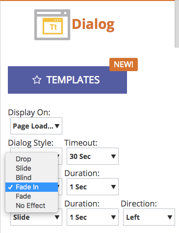

# Notas de la versión: Primavera &#39;17 {#release-notes-spring}

Las siguientes funciones se incluyen en la versión de la primavera de 2017. Compruebe la disponibilidad de las funciones en la edición de marketing.

Haga clic en los vínculos de título para vista de artículos detallados para cada función. **Nota**: Si un tema tiene varios subtítulos, los vínculos se colocan allí.

## [Forms de LinkedIn Lead Gen](/help/marketo/product-docs/demand-generation/social/social-functions/set-up-linkedin-lead-gen-forms.md) {#linkedin-lead-gen-forms}

[Los ](https://business.linkedin.com/marketing-solutions/native-advertising/lead-gen-ads) formularios de generación de posibles clientes de LinkedIn son una forma más directa de que un negocio ejecute campañas de generación de posibles clientes en LinkedIn. Las personas pueden rellenar formularios para expresar interés en un producto o servicio, lo que permite a la empresa capturar los detalles de la persona y sincronizarlos con Marketing, donde pueden producirse procesos de seguimiento automáticos y actividades de enrutamientos de posibles clientes.

La integración de Marketing Cloud con LinkedIn Lead Gen Forms captura automáticamente la información que un posible cliente proporciona en el formulario de generación de posibles clientes. Las acciones y notificaciones de seguimiento se pueden automatizar mediante el nuevo déclencheur **Rellena el formulario de generación de posibles clientes de LinkedIn** y filtra.

## [Caduca plantilla MSI](/help/marketo/product-docs/marketo-sales-insight/msi-for-salesforce/features/actions-in-the-msi-panel/send-marketo-email/publish-an-email-to-sales-insight.md) {#expire-msi-template}

Atrás quedan los días de limpieza de plantillas obsoletas en Sales Insight. Establezca una fecha de caducidad cuando publique su correo electrónico y nos encargaremos de cancelarlo cuando se produzca la fecha de caducidad.

>[!NOTE]
>
>Si establece la fecha de caducidad para el 31/5/17, significa que la plantilla se eliminará de Sales Insight al final del día el 31/5/17.

## [API de extracción masiva para personas y Actividades](https://developers.marketo.com/rest-api/bulk-extract/) {#bulk-extract-apis-for-people-and-activities}

Transfiera fácilmente grandes cantidades de datos de persona y actividad de Marketing a sus sistemas externos.

## Mejoras de ABM {#abm-enhancements}

**[Campos personalizados en cuentas con nombre ABM](https://docs.marketo.com/x/1wnG)**

Marketo ABM ahora le permite crear hasta 10 campos personalizados en sus cuentas con nombre. Puede asignar estos campos personalizados a los campos del objeto Cuenta de CRM y Marketo ABM sincronizará los datos, lo que le permitirá ampliar sus cuentas con nombre de ABM y ayudarle a dirigir su mercadotecnia.

**[Puntuación de porcentaje en cuentas con nombre ABM](https://docs.marketo.com/display/docs/assets/abmpercentiles.png)**

Las puntuaciones de cuenta con nombre pueden variar considerablemente. Marketo ABM ahora calcula automáticamente un percentil para cada una de sus puntuaciones, de modo que puede ver de un vistazo dónde cada cuenta con nombre se clasifica entre las demás cuentas con nombre.

**[API de Lista de cuentas ABM](https://developers.marketo.com/rest-api/lead-database/named-account-lists/)**

Aproveche las integraciones de socios ABM sólidas y enriquecidas con la compatibilidad mejorada de API para Listas de cuentas con nombre.

## Mejoras en la personalización de Web {#web-personalization-enhancements}

**[Campaña Web tras desplazamiento](/help/marketo/product-docs/web-personalization/working-with-web-campaigns/set-how-your-web-campaign-displays.md)**

Los nuevos efectos de Campaña web proporcionan a sus visitantes web una experiencia más personalizada. Configure las Campañas web personalizadas para que solo se muestren cuando un visitante web se desplace hacia abajo en la página web. Puede configurar las Campañas web de cuadro de diálogo para que se muestren al desplazarse en función de:

* porcentaje de la página desplazada
* píxel alcanzado
* desplazamiento por debajo del pliegue de la página

**[Campaña Web tras intención de salida](/help/marketo/product-docs/web-personalization/working-with-web-campaigns/set-how-your-web-campaign-displays.md)**

Capturar la atención del visitante antes de que cierre la página. Configure las Campañas web personalizadas para que solo se muestren cuando un gesto del ratón indique que el visitante está abandonando la página.

**[Efectos de animación para Campañas web](/help/marketo/product-docs/web-personalization/working-with-web-campaigns/create-a-new-dialog-web-campaign.md)**

Configure los efectos de animación para la Campaña web de cuadro de diálogo para personalizar el modo en que aparece una campaña al entrar o salir de la página web. Puede seleccionar entre 6 efectos diferentes y controlar el tiempo y la dirección del cuadro de diálogo.

**[Personalización del botón Cerrar cuadro de diálogo](/help/marketo/product-docs/web-personalization/working-with-web-campaigns/create-a-new-dialog-web-campaign.md)**

Personalice el botón Cerrar para los cuadros de diálogo. Seleccione entre una serie de opciones que se utilizan en Campañas web de estilo de cuadro de diálogo transparente. Seleccione el icono, el color y la posición para el botón Cerrar. También puede añadir su propia imagen de botón.

**[Archivar Campañas Web](/help/marketo/product-docs/web-personalization/working-with-web-campaigns/archive-a-web-campaign.md)**

Archivar es un nuevo estado de Campaña Web que le permite archivar Campañas Web y ocultarlas de la vista de Campaña Web predeterminada. Esto le permite centrarse en sus campañas activas más relevantes y recuperar campañas archivadas antiguas según demanda.

**[Localización](/help/marketo/product-docs/administration/settings/select-your-language-locale-and-time-zone.md)**

La Personalización web ahora se ofrece en todos los idiomas compatibles con el mercado (inglés, japonés, alemán, español, francés y portugués).

## Mejoras predictivas {#predictive-enhancements}

**[Localización](/help/marketo/product-docs/administration/settings/select-your-language-locale-and-time-zone.md)**

El contenido predictivo ahora se ofrece en todos los idiomas compatibles con el marketing (inglés, japonés, alemán, español, francés y portugués).

## [Desuso del Editor de texto enriquecido heredado y del Editor de formularios 1.0](https://nation.marketo.com/docs/DOC-4315) {#legacy-rich-text-editor-and-form-editor-deprecation}

A partir del 1 de agosto de 2017, los clientes que sigan utilizando el Editor de texto enriquecido heredado y el Editor de formularios 1.0 pasarán automáticamente a la nueva experiencia.
