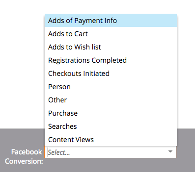

# Notas de la versión: Verano &#39;17 {#release-notes-summer}

Las siguientes funciones están incluidas en la versión del verano de 2017. Compruebe la disponibilidad de las funciones en su edición de Marketo.

Haga clic en los vínculos de título para ver los artículos detallados de cada función. Nota: Algunas de las funciones incluidas en esta versión no tienen artículos asociados. Si un tema tiene varios subencabezados, los vínculos se colocan allí.

## [Etapas de conversión sin conexión adicionales de Facebook](/help/marketo/product-docs/demand-generation/facebook/set-up-facebook-offline-conversions.md) {#additional-facebook-offline-conversion-stages}

Elija hasta 7 etapas de conversión sin conexión adicionales para asignarlas a las etapas del ciclo vital de Marketo (más allá de las 3 disponibles actualmente). Optimice su gasto publicitario de Facebook en función de las conversiones en el recorrido de sus clientes para lograr un mejor ROI.

## [Bloquear plantilla de perspectivas de ventas](/help/marketo/product-docs/marketo-sales-insight/msi-for-salesforce/features/actions-in-the-msi-panel/send-marketo-email/lock-sales-template.md) {#lock-sales-insight-template}

Garantice la coherencia del mensaje y el contenido al evitar que se editen las plantillas de ventas. Esto ayuda a estandarizar las plantillas y a mantener las comunicaciones profesionales.

## Mejoras de ABM {#abm-enhancements}

**Fuente de datos para la búsqueda de la empresa japonesa**

Haga coincidir personas con nombres de empresas japoneses en el idioma local.

**[Integración de ABM y LeanData](https://docs.marketo.com/x/pKmt)**

La integración LeanData ahora permite la coincidencia de cliente potencial a cuenta en Marketo. Mantenga el marketing y las ventas alineados teniendo los mismos posibles clientes asociados con las cuentas dentro de los sistemas de ventas y marketing del registro. Las opciones más flexibles proporcionan a las operaciones de marketing y ventas un mayor control sobre las reglas de coincidencia entre cliente potencial y cuenta, de modo que puedan lograr el nivel de precisión deseado.

## Mejoras en la personalización web {#web-personalization-enhancements}

**[Mejoras en la vista previa de campañas](/help/marketo/product-docs/web-personalization/working-with-web-campaigns/preview-and-test-a-web-campaign.md)**

Los profesionales de marketing ahora pueden garantizar que sus campañas web tengan un aspecto bueno en cualquier dispositivo *antes de* iniciarlas. Con estas mejoras, verá cómo se renderizarán las campañas web en equipos de escritorio, dispositivos móviles y tabletas. El nuevo complemento para Chrome también ofrece vistas previas más coherentes y precisas.

**[Mejoras en la campaña de utilidades](/help/marketo/product-docs/web-personalization/working-with-web-campaigns/create-a-new-widget-web-campaign.md)**

Ya están disponibles nuevas opciones para las campañas en utilidades, que incluyen:

* Activación de campañas (retraso, desplazamiento)
* Visualización de campañas (cualquier posición alrededor de la pantalla)
* Cambiar la flecha de expandir/minimizar a cualquier texto de llamada a acción

## ContentAI {#contentai}

**[Análisis y sugerencias de ContentAI](/help/marketo/product-docs/predictive-content/predictive-content-analytics-overview.md)**

Aumente el retorno en el marketing de contenido con análisis más profundos y sugerencias de contenido con tecnología de IA para aumentar la participación. Los análisis potentes muestran el rendimiento del contenido recomendado, incluidas las vistas populares, de tendencias y basadas en audiencias. También verá sugerencias para incluir contenido adicional.

## Analytics {#analytics}

**Mejoras en las perspectivas de correo electrónico**

Saque aún más partido a su experiencia de perspectivas de correo electrónico con nuevas formas de preparar y compartir datos. Ahora puede descargar los resultados de las perspectivas de correo electrónico en Microsoft Excel y PowerPoint para trabajar con los datos fuera de Marketo.

## Soporte de configuración de identidad federada {#federated-identity-configuration-support}

Mantenga la autenticación (Active Directory) detrás del firewall local mientras continúa utilizando Microsoft Dynamics CRM en la nube.
