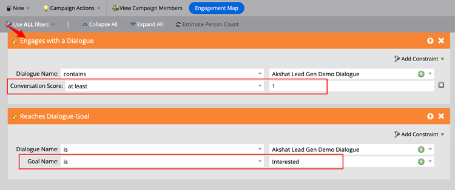

# Notas de la versión de Dynamic Chat {#dynamic-chat-release}

Las versiones de Adobe Dynamic Chat funcionan con un modelo de entrega continua que permite un enfoque más escalable de la implementación de funcionalidades. A veces hay varias versiones en un mes, por lo que vuelva a consultar regularmente la información más actualizada.

La página de notas de la versión estándar del Marketo Engage [ se encuentra aquí](/help/marketo/release-notes/current.md){target="_blank"}.

## Versión de septiembre/octubre de 2024 {#sep-oct-release}

### Análisis de chat en vivo mejorado {#enhanced-live-chat-analytics}

Se han realizado varias mejoras en el panel de Analytics, entre las que se incluyen:

* Número total solicitado de chats en directo: número de visitantes solicitados para un &quot;chat con el agente&quot;

* Total de chat en directo conectado: número de visitantes conectados frente al total solicitado para un &quot;chat con el agente&quot;

* Total de solicitudes de chat en vivo perdidas: número de visitantes desatendidos frente al total solicitado para un &quot;chat con el agente&quot;

* Duración media del chat en minutos: Analice la &quot;duración media del chat&quot; entre los visitantes y sus agentes.

* Tiempo medio de respuesta del agente en segundos: Analice el &quot;tiempo medio empleado&quot; por los agentes para responder a sus preguntas y respuestas en directo en el chat

* Tablero diario: las solicitudes de chat en vivo se conectan correctamente, las solicitudes de chat en vivo se pierden, ordenan y filtran las actividades de chat en vivo recientes

### Puntuación de conversación {#conversation-scoring}

Cuantifique los posibles clientes en función de la calidad de su interacción de chat y utilice esa métrica como Déclencheur/filtro en campañas inteligentes de Marketo Engage. Use el nuevo atributo _puntuación de conversación_ en las siguientes actividades:

* Participa en un diálogo
* Interactúe con un flujo de conversación
* Interacción con un agente

**Aspectos a tener en cuenta:**

* El valor de la puntuación estará entre 0, 1, 2 y 3 (el valor predeterminado es nulo)

* Cuando finaliza o se suelta la conversación, el valor de puntuación no se puede editar

* Configurar una puntuación:

   * En la bandeja de entrada del agente: durante una conversación en directo, el agente puede actualizar o establecer una puntuación para la conversación, que se almacena en la actividad de conversación

   * En el diseñador de secuencias: en la tarjeta de objetivos, el usuario puede actualizar o establecer una puntuación para la conversación

### Nueva lógica de creación de posibles clientes {#new-lead-creation-logic}

Si un posible cliente rellena un formulario con el correo electrónico `abc@test.com` y está cookie como xyz, más adelante rellena el mismo formulario con el correo electrónico `def@test.com`, se crea un nuevo registro de persona, pero la cookie xyz se asocia con la nueva persona y se elimina de la persona `abc@test.com`.

Por lo tanto, cuando un visitante con cookie abc aterriza en una página y proporciona un ID de correo electrónico como `abc@test.com`:

<table><thead>
  <tr>
    <th>Visitor</th>
    <th>Cookie</th>
    <th>Correo electrónico proporcionado</th>
    <th>Comportamiento esperado</th>
  </tr></thead>
<tbody>
  <tr>
    <td>Anónimo</td>
    <td>abc</td>
    <td>No existe en la base de datos</td>
    <td>Crear una nueva persona</td>
  </tr>
  <tr>
    <td>Anónimo</td>
    <td>abc</td>
    <td>Existe en base de datos</td>
    <td>Combinar persona</td>
  </tr>
  <tr>
    <td>Anónimo</td>
    <td>xyz</td>
    <td>Existe en base de datos</td>
    <td>Combinar persona</td>
  </tr>
  <tr>
    <td>Persona conocida</td>
    <td>abc</td>
    <td>Igual que la persona existente</td>
    <td>Actualizar persona</td>
  </tr>
  <tr>
    <td>Persona conocida</td>
    <td>abc</td>
    <td>Diferente a la persona existente</td>
    <td>Si ya existe una persona conocida, transfiera la cookie y resuelva ese perfil. Si no existe ninguna persona con este correo electrónico, cree un nuevo registro de persona y transfiera la cookie</td>
  </tr>
  <tr>
    <td>Persona conocida</td>
    <td>xyz</td>
    <td>Igual que la persona existente</td>
    <td>Añadir nueva cookie a la misma persona</td>
  </tr>
  <tr>
    <td>Persona conocida</td>
    <td>xyz</td>
    <td>Diferente a la persona existente</td>
    <td>este escenario no es posible como si se tratara de una nueva cookie de   valor predeterminado considerado como nuevo perfil anónimo</td>
  </tr>
</tbody></table>

### Tiempo de carga de flujo de conversación optimizado {#optimized-conversation-flow-load-time}

Para mejorar la experiencia del usuario, ahora se muestra un cargador de reflejos en lugar de un espacio en blanco mientras se carga el flujo de conversación.

**Antes de**

**Después**

### Opción para heredar la fuente {#option-to-inherit-font}

Ahora puede permitir que el bot de chat herede directamente la fuente de la página web en la que se aloja en lugar de administrar la fuente de la marca en Dynamic Chat. Al habilitar esta opción, el bot de chat tomará la fuente definida en la etiqueta `<body>` de la página.

### Integración de Demandbase con Dynamic Chat {#demandbase-integration-with-dynamic-chat}

Los usuarios de Demandbase pueden traer su propia licencia de Demandbase y activar la integración. Utilice los atributos de persona de Demandbase para la segmentación de diálogos, la promoción condicional de la marca y el enrutamiento personalizado.

La resolución de estos valores de atributo con una persona se realizaría en tiempo real y se almacenaría en el perfil de persona correspondiente.

## Versión de agosto de 2024 {#august-release}

**Fecha de lanzamiento: sábado, 23 de agosto de 2024**

### Personalizar el formato de los mensajes de conversación {#custom-format-conversation-messages}

Los diseñadores de transmisiones ahora admiten [insertar HTML](/help/marketo/product-docs/demand-generation/dynamic-chat/automated-chat/stream-designer.md#create-a-stream){target="_blank"} para personalizar el aspecto de tus conversaciones.

### Desplazamiento del bot de chat hasta la parte inferior {#chatbot-scroll-to-bottom}

Se ha añadido un icono en el bot de chat para que los visitantes web salten directamente al último mensaje. Esto ayuda a los visitantes a desplazarse por el texto para volver rápidamente a la conversación.

### Notificaciones de Core Pulse {#core-pulse-notifications}

Ahora los usuarios reciben una [notificación por correo electrónico](/help/marketo/product-docs/demand-generation/dynamic-chat/live-chat/live-chat-overview.md#failed-action-notifications){target="_blank"} cuando falla una reserva de reunión o un chat en vivo.

### Compatibilidad con varias conversaciones {#support-for-multiple-conversations}

El bot de chat ahora admite varias conversaciones. Los visitantes del sitio web pueden mantener diferentes conversaciones en diferentes páginas al mismo tiempo, con la capacidad de alternar entre ellas.

### Ordenación predeterminada del contenido {#default-sorting-for-content}

De forma predeterminada, los registros de conversaciones, las preguntas sin responder y las tablas de generación de preguntas se ordenan por fecha de creación (de la más reciente a la más antigua).

### Resolución de posibles clientes en tiempo real {#real-time-lead-resolution}

Durante una conversación con un posible cliente anónimo y se proporciona un ID de correo electrónico, resolvemos si existe un registro de posible cliente conocido con ese ID de correo electrónico y utilizamos ese registro para la personalización en tiempo real. Si encontramos varios registros, los combinamos en tiempo real. Este comportamiento se implementa tanto para los cuadros de diálogo como para los flujos de conversación.

### Sincronización de posibles clientes sin cookies del Marketo Engage {#syncing-leads-without-cookies}

Anteriormente, cuando se activaba la sincronización del Marketo Engage, el Dynamic Chat solo sincronizaba los posibles clientes conocidos con uno o más ID de cookie del Marketo Engage. Ahora, todos los posibles clientes conocidos (ID de cookie presente o no) se sincronizarán con el Dynamic Chat y se pueden utilizar para la personalización de conversaciones.

### Pasar datos de visitante adicionales a Flujos de conversación {#pass-additional-visitor-data}

Si está capturando información del visitante a través de otros canales, como formularios o inicios de sesión, ahora puede pasar esta información directamente al Dynamic Chat.

### Datos deducidos actualizados {#refreshed-inferred-data}

La mayoría de las conversaciones en un sitio web son con visitantes anónimos. Puede segmentarlos con datos deducidos, que dependen de las direcciones IP de los visitantes. Hemos actualizado nuestra base de datos de IP y los datos inferidos respectivos, que ahora admiten cuatro veces más IP.

### Sonido añadido a la notificación del navegador del agente {#sound-added-to-agent-browser-notification}

Cuando se asigna un chat en vivo a un agente, recibe una notificación del navegador. Pero de vez en cuando no los ven. Hemos agregado un [sonido de notificación](/help/marketo/product-docs/demand-generation/dynamic-chat/live-chat/live-chat-overview.md#when-a-live-chat-is-routed-to-an-agent){target="_blank"} para ayudar a evitar que las notificaciones perdidas sigan su curso.

### Capacidad para actualizar el perfil del posible cliente durante el chat en vivo {#update-lead-profile-during-live-chat}

Durante un chat en vivo, los agentes quieren capturar información sobre el visitante y actualizar el perfil respectivo. Ahora existe la opción de actualizar los valores de atributo de los objetos de cliente potencial y compañía.

## Lanzamiento de junio de 2024 {#june-release}

**Fecha de publicación: viernes, 06 de junio de 2024**

### Tarjeta de flujo de conversación {#conversational-flow-card}

Optimice varios pasos en un flujo dentro de sus cuadros de diálogo aprovechando la tarjeta Flujo de conversación.

Ejemplo: si su objetivo es impulsar los registros para su seminario web a través de varios cuadros de diálogo, debe volver a crear el mismo flujo en todos los cuadros de diálogo que tengan ese objetivo. Y si tiene que actualizar cualquier detalle, tendrá que editar cada Diálogo individual de uno en uno. Ya no es así, gracias a la tarjeta de Flujo de Conversación.

Además de reutilizar los flujos a través de varios cuadros de diálogo, también puede utilizar el mismo flujo de transición al déclencheur a través de otros canales, como formularios y páginas de destino.

### Límites de uso {#usage-limits}

La página Límites de uso muestra información importante, como los detalles del paquete y el estado del límite de uso.

## Lanzamiento de mayo de 2024 {#may-release}

**Fecha de versión: jueves, 15 de mayo de 2024**

### Biblioteca de respuestas aprobadas previamente {#pre-approved-response-library}

[Cree una biblioteca con aprobación de mercadotecnia](/help/marketo/product-docs/demand-generation/dynamic-chat/generative-ai/response-library.md){target="_blank"} de preguntas y respuestas generadas por IA para configurar charlas generativas sobre IA en minutos.

### Preguntas sin respuesta {#unanswered-questions}

[Use un repositorio de preguntas sin responder](/help/marketo/product-docs/demand-generation/dynamic-chat/generative-ai/unanswered-questions.md){target="_blank"} de conversaciones anteriores para generar nuevas respuestas aprobadas previamente y mantener una biblioteca de respuestas con la información más reciente.

### Resúmenes de conversación {#conversation-summaries}

[Proporcione a los agentes de ventas conversaciones resumidas](/help/marketo/product-docs/demand-generation/dynamic-chat/live-chat/agent-inbox.md#conversation-summary){target="_blank"}, incluidas perspectivas sobre temas clave de discusión antes de las reuniones, para reducir el tiempo de preparación y mejorar los agentes de ventas de armas con la información más reciente.

### Métodos abreviados de ventas de GenAI {#genai-sales-shortcuts}

[Proporcione a los agentes de chat en vivo formas más rápidas](/help/marketo/product-docs/demand-generation/dynamic-chat/live-chat/agent-inbox.md#shortcuts){target="_blank"} de acceder a las respuestas generadas por IA, editar las respuestas generadas existentes y buscar contenido adicional para enviar a los compradores durante la conversación.

### Asistente de conversación {#conversation-assist}

Ayude a los agentes de ventas a responder con precisión durante las conversaciones en directo mediante respuestas aprobadas previamente por su equipo de marketing.

### Empujones de conversación {#conversation-nudges}

Empuje a los visitantes web con una llamada a la acción para llevar las conversaciones a su conclusión.

## Versión de abril de 2024 {#april-release}

**Fecha de publicación: miércoles, 23 de abril de 2024**

### Flujos de conversación ahora disponibles para todos los usuarios {#conversational-flows-available-to-all-users}

Haga que sus formularios y páginas de aterrizaje sean más conversacionales y acorte el canal de ventas al permitir que los posibles clientes cualificados reserven una reunión o conversen con Ventas inmediatamente después de enviar un formulario con Conversational Forms, ahora totalmente disponible&#42; para todos los usuarios Dynamic Chat.

_&#42;Anteriormente disponible como característica de prueba con 100 participaciones de por vida. Las participaciones en el flujo de conversación ahora se contarán para el límite mensual de 250 conversaciones comprometidas para los usuarios del paquete Select._

### Funciones de devolución de llamada {#callback-functions}

Las [funciones de devolución de llamada](/help/marketo/product-docs/demand-generation/dynamic-chat/setup-and-configuration/callback-functions.md){target="_blank"} le permiten recopilar eventos de análisis de Dynamic Chat en sistemas externos, como Adobe Analytics o Google Analytics, a medida que los visitantes se relacionan con conversaciones de Dynamic Chat. Para habilitar los eventos de Dynamic Chat Analytics, registre una llamada de retorno con la API para escucharlos. Esto le permite tener una vista más integral de la participación del Dynamic Chat en relación con otros datos clave, como el tráfico web.

### Condiciones de disponibilidad del agente activas añadidas a la ramificación condicional {#live-agent-availability-conditional-branching}

Además de los campos de Marketo Engage nativo y personalizado, ahora puede utilizar la ramificación condicional para crear ramas en función de la disponibilidad del agente. Esto resulta útil si solo desea ofrecer a los visitantes la opción de hablar con un agente activo cuando hay agentes activos disponibles.

### Condición de lista inteligente agregada a la bifurcación condicional {#smart-list-condition}

Con la adición de la nueva condición de lista inteligente de Marketo Engage en la bifurcación condicional, puede crear ramas basadas en audiencias preexistentes que ya ha creado en Marketo Engage, en lugar de definir condiciones de bifurcación de audiencias en Dynamic Chat.

### Ramificación condicional para flujos de conversación {#conditional-branching-for-conversational-flows}

Hemos lanzado la ramificación condicional para los cuadros de diálogo a principios de este año, y ahora también puede aprovechar la ramificación condicional en los flujos de conversación. La ramificación condicional permite crear ramas en el flujo en función de diferentes condiciones.

### Chat en vivo para Flujos de conversación {#live-chat-for-conversational-flows}

Hemos lanzado la funcionalidad de chat en vivo para Diálogos en 2023, y ahora también puede agregar compromisos de chat en vivo a sus Flujos de conversación. Si utiliza flujos de conversación con sus formularios de Marketo Engage, ahora puede permitir que visitantes cualificados chateen con un agente en directo inmediatamente después del envío del formulario.

### Actividades recientes del Marketo Engage en la bandeja de entrada del agente {#recent-marketo-engage-activities-in-agent-inbox}

Hemos añadido actividades de Marketo Engage recientes a la sección Actividades recientes de la bandeja de entrada del agente, de modo que cuando un visitante del sitio solicita hablar con un agente, este puede ver rápidamente si el visitante ha participado recientemente en alguna de las siguientes actividades de Marketo Engage (últimas 25 actividades):

* Abrió el email
* Página web visitada
* Completó el formulario
* Tuvo un momento interesante

### Estado de conexión del calendario en la administración de agentes {#calendar-connection-status-in-agent-management}

Los administradores ahora pueden ver fácilmente qué agentes con permisos de reservas de reuniones han conectado sus calendarios en Dynamic Chat. Esto le permite asegurarse de que todo su equipo de ventas está conectado y listo para aceptar convocatorias de reunión de Dynamic Chat.

### Configuración mínima de aviso en la configuración del calendario del agente {#minimum-notice-setting-in-agent-calendar-configuration}

Los usuarios informaron de que los visitantes web reservaban reuniones en su calendario con tan solo 10 minutos de antelación, por lo que introdujimos una configuración de aviso mínimo en la configuración del calendario del agente y establecimos el tiempo de espera predeterminado en 24 horas.

### Comportamiento para agregar o quitar usuarios actualizado {#add-remove-user-behavior-updated}

Algunos usuarios indicaron que tenían problemas para agregar y eliminar agentes en Dynamic Chat, por lo que realizamos algunos cambios para resolver estos problemas.

Cuando se agrega un usuario al Admin Console con permiso de citas en directo o de citas, se muestra inmediatamente en la lista de administración del agente y está disponible para agregarlo a los cuadros de diálogo, los flujos de conversación, las reglas de enrutamiento y los equipos.

Cuando un usuario con permisos de reserva de reuniones o chat en vivo se elimina del Admin Console, se elimina inmediatamente del Dynamic Chat, ya no estará disponible para el chat en vivo o el enrutamiento de reuniones, y ya no contará con los límites de licencia.

### Rendimiento de informe de nivel de conversación mejorado {#improved-conversation-level-report-performance}

Los informes de nivel de flujo de diálogo individual y conversación ahora son más precisos y eficaces. Anteriormente, los informes de Diálogo podían tardar varios segundos en cargarse y, en ocasiones, los datos no eran coherentes con los informes de rendimiento globales. Ahora, los informes de Diálogo individuales se cargan en un instante y los datos siempre se alinean con los datos de informes globales.

### Actualizaciones de permisos {#permission-updates}

Hemos limpiado la estructura de permisos y los nombres en Adobe Admin Console para que la administración de permisos sea más intuitiva.

* La categoría &quot;Administración de conversaciones&quot; ahora se denomina &quot;Conversaciones&quot;
* La categoría &quot;Reuniones&quot; ahora se denomina &quot;Actividades&quot;
* La categoría &quot;Configuración de agente&quot; ahora se denomina &quot;Agentes&quot;
* La categoría &quot;Configuración de administración&quot; ahora se llama &quot;Configuración&quot;
* Se eliminó la categoría &quot;Chat en directo&quot; y todos los permisos de chat en directo se movieron a la categoría Agentes

### Compatibilidad con hipervínculos en la bandeja de entrada del agente {#support-for-hyperlinks-in-agent-inbox}

Ahora, cuando los agentes de chat en vivo comparten direcciones URL con los visitantes en el chat, esas direcciones URL estarán hipervinculadas para que los visitantes puedan simplemente hacer clic en ellas para navegar a la página, en lugar de tener que copiar y pegar la URL en su explorador.

### Introduzca el comportamiento de clave actualizado en la bandeja de entrada del agente {#enter-key-behavior-updated-in-agent-inbox}

Hemos cambiado el comportamiento de la tecla de retorno en la bandeja de entrada del agente, por lo que al pulsar la tecla Intro o Retorno se enviará el mensaje y al pulsar Mayús+Intro se creará un salto de línea.

### Página de operación por turnos eliminada {#round-robin-page-removed}

¡No te preocupes! El enrutamiento round robin sigue siendo completamente funcional y funciona del mismo modo que siempre lo ha hecho. Acabamos de eliminar la página que mostraba una lista de agentes a menudo inexacta y su orden en la cola de enrutamiento round robin.

Cuando lanzamos Dynamic Chat en 2022, no había compatibilidad con el chat en vivo, solo con las reservas de reuniones y la página de enrutamiento round robin se diseñó teniendo en cuenta solo las reservas de reuniones. Con la introducción del chat en vivo el año pasado, la página round robin se volvió obsoleta ya que no reflejaba con precisión la naturaleza más compleja del enrutamiento round robin entre agentes con permisos tanto de reservación de reuniones como de chat en vivo. Exploramos algunas opciones diferentes para resolver esto, pero finalmente decidimos que eliminarlo por completo era la mejor opción para minimizar la confusión.

## Lanzamiento de febrero de 2024 {#february-release}

**Fecha de publicación: viernes, 22 de febrero de 2024**

### Página Conversaciones {#conversations-page}

La nueva página Conversaciones le ofrece una ventanilla única para ver las transcripciones de todas las conversaciones (automatizadas y en directo) que se produjeron para su instancia, tanto de posibles clientes conocidos como anónimos, lo que le ofrece una mejor visibilidad de cómo sus clientes interactúan con sus diálogos, flujos de conversación y agentes activos.

### El intervalo de fechas en el panel global aumentó de 90 días a 24 meses {#date-range-in-global-dashboard}

Tú preguntaste y nosotros lo hicimos. Ahora puede ver datos de participación del Dynamic Chat de hasta dos años en todos los paneles de análisis.

### Ramificación condicional en cuadros de diálogo {#conditional-branching-in-dialogues}

La ramificación condicional permite crear ramas en los flujos de diálogo en función de diferentes condiciones. Ahora puede presentar contenido diferente a distintas personas en el mismo cuadro de diálogo en función de los atributos del posible cliente y de la empresa en Marketo Engage.

## Lanzamiento de enero de 2024 {#january-release}

**Fecha de la versión: jueves, 24 de enero de 2024**

### Configuración del límite de chat en directo simultáneo en la administración de agentes {#Concurrent-live-chat-limit-setting}

De forma predeterminada, cada agente de chat en vivo de su instancia puede participar en un máximo de 5 sesiones de chat en vivo a la vez. Hemos introducido una nueva configuración en la administración de agentes que le permite ajustar este límite de 1 a 10.

