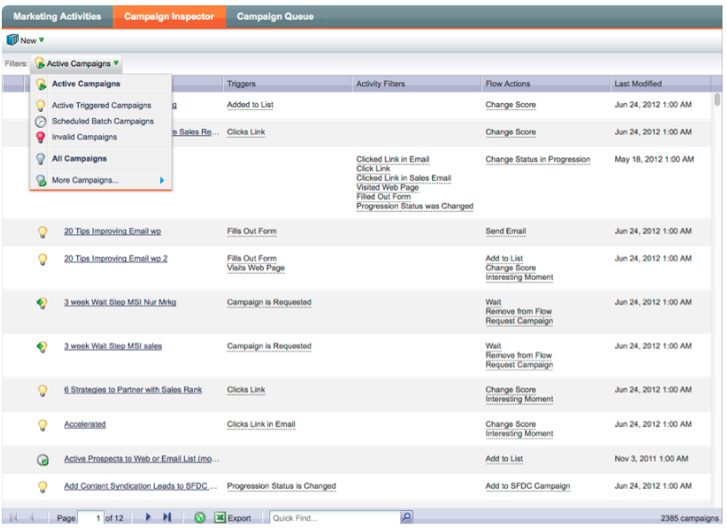

# Notas de la versión: diciembre de 2012 {#release-notes-december}

La versión de diciembre incluye la muy esperada función **Forward to Friend**, así como varios otros detalles. Tenga en cuenta que las funciones marcadas con un asterisco (&#42;) solo están disponibles en Select Edition y en RCA (Revenue Cycle Analytics).

## Enviar a un amigo {#forward-to-friend}

Habilita la opción para compartir contenido con otras personas incluyendo el enlace **Reenviar a amigo** en tus correos electrónicos. La adición de nuevos filtros y déclencheur le ayudará a identificar a sus influencers, identificando a los usuarios que reenviaron un correo electrónico, así como a aquellos que recibieron los correos electrónicos reenviados.

Para incluir una invitación de **Reenviar a un amigo** en el correo electrónico, ábrala en el editor e inserte el token `{{system.forwardToFriendLink}}`.

Use los déclencheur y filtros correspondientes para identificar a los usuarios que usaron el vínculo **Reenviar a amigo** y a los que recibieron el correo electrónico.

## Permisos granulares de administración {#granular-admin-permissions}

Nuestra versión más reciente te brinda mayor acceso y control sobre los roles de [!UICONTROL Admin], al controlar el acceso a diferentes funciones en el área de [!UICONTROL Admin] de Marketo para cada rol. Cuando crea una función nueva, puede asignar funciones [!UICONTROL Admin] específicas a las que la función puede tener acceso.

>[!NOTE]
>
>De manera predeterminada, los roles existentes con permiso de ‘[!UICONTROL Administración de acceso]’ tienen acceso a todas las funciones de [!UICONTROL Administración] hasta que se modifiquen y a menos que se modifiquen.

## Adaptador [!UICONTROL BrightTALK] {#brighttalk-adapter}

El adaptador [!UICONTROL BrightTALK] de Marketo le permite capturar información de asistencia de una transmisión web en vivo o bajo demanda, directamente en un evento de Marketo.

## Marketo [!DNL Sales Insight] para [!DNL Microsoft Dynamics] {#marketo-sales-insight-for-microsoft-dynamics}

[!DNL Sales Insight] ya está disponible para [!DNL Microsoft Dynamics] clientes.

## Sincronización de oportunidad de [!DNL Dynamics] {#dynamics-opportunity-sync}

Sincronizar datos de oportunidad entre Marketo y [!DNL Microsoft Dynamics].

## Informe de oportunidades influenciadas por el marketing&#42; {#marketing-influenced-opportunities-report}

Vea qué porcentaje de la canalización y de los ingresos de su compañía se vio influido por sus programas de marketing. En **[!UICONTROL Explorador de ingresos]**, ahora puede crear informes personalizados con el nuevo punto amarillo &quot;Oportunidad influenciada por el marketing&quot; en Análisis de oportunidad. También puede utilizar los dos informes siguientes en la carpeta Estándar:

* Influencia del marketing en las oportunidades creadas
* Influencia del marketing en oportunidades ganadas cerradas

## Campos de oportunidad personalizados en Análisis de oportunidad de programa&#42; {#custom-opportunity-fields-in-program-opportunity-analysis}

Agregue campos de oportunidad personalizados para enriquecer los informes de Análisis de oportunidad de programa en [!UICONTROL Explorador de ingresos].

## Inspector de campañas {#campaign-inspector}

¿Alguna vez se ha preguntado qué campañas están usando una acción de flujo específica, como [!UICONTROL Cambiar puntuación] o [!UICONTROL Solicitar campaña]? ¿O dónde se está utilizando un filtro determinado? El nuevo [!UICONTROL Inspector de campañas] (disponible en el cofre del tesoro) le permite identificar estas campañas, así como las campañas activas y las campañas con errores.

Vaya a **[!UICONTROL Administrador]** > **[!UICONTROL Cofre del tesoro]** para habilitar el **[!UICONTROL Inspector de campaña]**.

