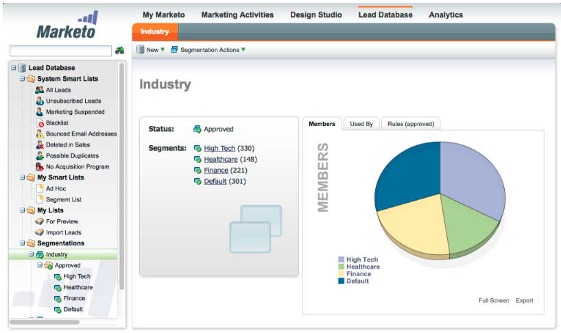
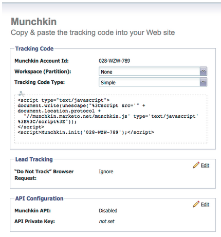

# Notas de la versión: Ene/Feb de 2012 {#release-notes-jan-feb}

En la versión de enero/febrero se incluyen las siguientes funciones. Compruebe la disponibilidad de las funciones en Marketo Edition. Vuelva después del lanzamiento para ver los vínculos a la documentación detallada de las funciones.

## Contenido dinámico avanzado {#advanced-dynamic-content}

_Disponible para las versiones Pro y Enterprise_

Con el contenido dinámico avanzado puede crear comunicaciones por correo electrónico y páginas de aterrizaje atractivas relevantes para su audiencia sin tener que crear varios recursos para el mismo mensaje. Los controladores de vista previa actualizados le permiten ver cada versión única en una sola pantalla.

## Segmentación  {#segmentation}

_Disponible para las versiones Pro y Enterprise_

La segmentación es un grupo de segmentos, que son un grupo segmentado de personas a las que comercializa. Los segmentos se definen mediante reglas que se rigen por criterios de filtro similares a las listas inteligentes. Sus segmentos pueden basarse en datos demográficos, como el puesto o el sector, o en comportamientos como páginas web visitadas o vínculos en los que se ha hecho clic.

## Fragmentos {#snippets}

_Disponible para las versiones Pro y Enterprise_

Almacene contenido enriquecido que se pueda utilizar una y otra vez para crear correos electrónicos y páginas de aterrizaje estáticos o dinámicos.

## PURL {#purls}

_Disponible para las versiones Pro y Enterprise_

Gracias a las direcciones URL personalizadas (PURL), los especialistas en marketing ahora pueden crear direcciones URL específicas del contacto para impulsar la personalización, la mensurabilidad y las respuestas de alza en programas de marketing multitáctil tanto para campañas de correo directo como de correo electrónico.

## Compatibilidad con la directiva de privacidad de la UE {#eu-privacy-directive-support}

Las nuevas funciones para respetar la configuración de &quot;No rastrear&quot; del navegador incluyen la capacidad de deshabilitar el seguimiento de posibles clientes anónimos; esto facilita el cumplimiento de las regulaciones de seguimiento de privacidad más estrictas de la UE.

## Inicio de sesión único {#single-sign-on}

Las organizaciones ahora tienen la capacidad de admitir un inicio de sesión sin problemas en la aplicación de Marketo mediante SAML 2.0 para el inicio de sesión único desde un portal corporativo.

## Editores de correo electrónico y páginas de aterrizaje actualizados {#updated-email-and-landing-page-editors}

Los editores de correo electrónico y páginas de aterrizaje se han rediseñado con una interfaz más atractiva, una navegación intuitiva y una experiencia de usuario considerablemente mejorada. Esto incluye lo siguiente:

Un HTML y una vista de texto en paralelo

El nombre del formulario, el correo electrónico de origen, la respuesta a (NUEVO) y el asunto se muestran en el editor. Se puede acceder a todas las demás configuraciones mediante el botón Editar configuración.

## Compatibilidad con navegadores {#browser-support}

* Mozilla Firefox 9.0
* Google Chrome 16
* Microsoft Internet Explorer 8 y 9
* **Nota**: ya no se admite Internet Explorer 7

## Administración de programas {#program-management}

La administración simplificada de programas mejora la facilidad de uso con la eliminación de tokens y la eliminación sencilla de programas.

## Cancelar suscripción al informe de suscripción {#unsubscribe-from-subscription-report}

Ahora puede cancelar la suscripción directamente desde el informe.

## Actualizaciones de Munchkin {#munchkin-updates}

Las nuevas llamadas de Munchkin reducen los tiempos de carga de las páginas web y proporcionan un rendimiento más coherente para los eventos de vínculos de clics.

## Análisis de oportunidad de programa (solo RCA) {#program-opportunity-analysis-rca-only}

Comprender la contribución de marketing a los ingresos de oportunidades individuales

## Análisis de fase de ingresos del programa {#program-revenue-stage-analysis}

Obtenga información sobre la velocidad de plomo del programa al comprender qué programas adquirieron los impulsores rápidos

