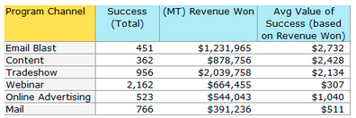

# Notas de la versión: junio de 2012 {#release-notes-june}

## Mejoras en Marketo Lead Management {#marketo-lead-management-enhancements}

### Cambiar nombre {#rename}

Puede cambiar el nombre de las listas inteligentes, las listas estáticas y las campañas. Si utiliza estos recursos en filtros, déclencheur o flujos, el nombre también se actualizará automáticamente. Siempre ha podido cambiar el nombre de los correos electrónicos, formularios y carpetas.

Además, hemos mejorado la introducción y visualización del texto de descripción de los recursos.

## Importar asignaciones de campos {#import-field-mapping}

¡Hemos hecho que importar una lista en Marketo sea mucho más fácil! Durante el proceso de importación, se puede asignar el nombre del campo Marketo al nombre del encabezado de columna del archivo de importación. Además, en [!UICONTROL Admin] puede configurar nombres de alias asignados al nombre del campo en Marketo, asegurándose de que los usuarios seleccionen el campo correcto cada vez.

A medida que siga importando y asignando campos, Marketo recordará y mostrará las asignaciones durante la importación para facilitar su uso. Y para facilitar aún más la vida, puede hacer clic en el encabezado Valor de muestra para ver los diferentes valores que se rellenarían en el campo. Esto ayuda a garantizar que asigne el campo correcto cada vez.

## [!UICONTROL Página de resumen] para listas inteligentes y listas estáticas {#summary-page-for-smart-lists-and-static-lists}

¿Alguna vez se ha preguntado dónde se están utilizando sus listas? ¿O quién creó la lista o quién la modificó por última vez? La nueva página de resumen disponible en listas inteligentes y listas estáticas le proporcionará estos detalles importantes.

En las páginas de resumen de Programa y Campaña existentes, también hemos añadido la fecha de creación/usuario y la información de fecha/usuario de la última modificación.

## [!UICONTROL Utilizado por] para Assets {#used-by-for-assets}

Hemos agregado una nueva pestaña a nuestras páginas de recurso [!UICONTROL Resumen], que se llama [!UICONTROL Usado por].

Ejemplo: [!UICONTROL Utilizado por] para listas estáticas

## Cuadrícula de página de aterrizaje {#landing-page-gridlines}

La adición de líneas de cuadrícula de página de aterrizaje facilita la alineación de texto, gráficos y formularios en la página de aterrizaje. Actívelo y desactívelo para cualquier página de aterrizaje y ajuste el ancho entre líneas.

## Posibles clientes bloqueados de correos {#leads-blocked-from-mailings}

Al programar una campaña, puede hacer clic en el enlace para ver la lista de posibles clientes bloqueados en su correo.

## [!UICONTROL Esperar] paso: token de posible cliente y mi token {#wait-step-lead-token-and-my-token}

En nuestra versión de mayo, agregamos opciones avanzadas al paso de flujo [!UICONTROL Wait]. Con estos cambios, puede especificar un día, una fecha y una hora laborables. En esta versión, hemos añadido la capacidad de utilizar un token en el paso de espera. Por ejemplo, es posible que quiera usar `{{lead.Birthday}}` para enviar un correo electrónico en su cumpleaños, o usar `{{my.Event Date}}` para enviar un recordatorio final del seminario web.

## [!UICONTROL Ver] como [!UICONTROL miniaturas] en Design Studio {#view-as-thumbnails-in-design-studio}

Cambie la vista de una lista de imágenes a una vista de miniaturas.

Nota: A partir de esta versión, la ordenación anterior de las cuadrículas de listas inteligentes no se aplicará a la siguiente lista inteligente que visualice. Por ejemplo, si ordena una lista inteligente por Nombre de la compañía, no ordenaremos automáticamente la siguiente lista inteligente vista por este mismo campo.

Recordatorio: la actualización del informe de rendimiento del correo electrónico está en curso.

## Mejoras de Marketo Revenue Cycle Analytics {#marketo-revenue-cycle-analytics-enhancements}

### Nuevas métricas en el análisis de oportunidades de programas  {#new-metrics-in-program-opportunity-analysis}

Ahora puede obtener información sobre la cantidad promedio de toques de marketing antes de crear o cerrar oportunidades, así como el valor promedio de un toque de marketing.

## Visualización de gráficos múltiples {#displaying-multi-charts}

La función de varios gráficos le permite mostrar varios gráficos en un único informe del Explorador de ciclos de ingresos. Por ejemplo, puede utilizar esta función cuando desee mostrar los mismos datos en distintos meses. Esta función también evita que tenga que crear filtros e informes independientes.

## Tipo de gráfico de cuadrícula de calor  {#heat-grid-chart-type}

Las cuadrículas de calor permiten visualizar los datos para identificar patrones de rendimiento de marketing. Este tipo de visualización codificará con colores los resultados para que vea el análisis empresarial complejo en una visualización fácil de entender.

## Tipo de gráfico de dispersión  {#scatter-chart-type}

Los gráficos de dispersión le ayudan a visualizar datos en varias dimensiones en un gráfico. Este tipo de visualización trazará una burbuja en un gráfico basado en los atributos utilizados. A continuación, puede utilizar una medida para codificar con colores la burbuja y/o utilizar una medida para especificar el tamaño de la burbuja.

