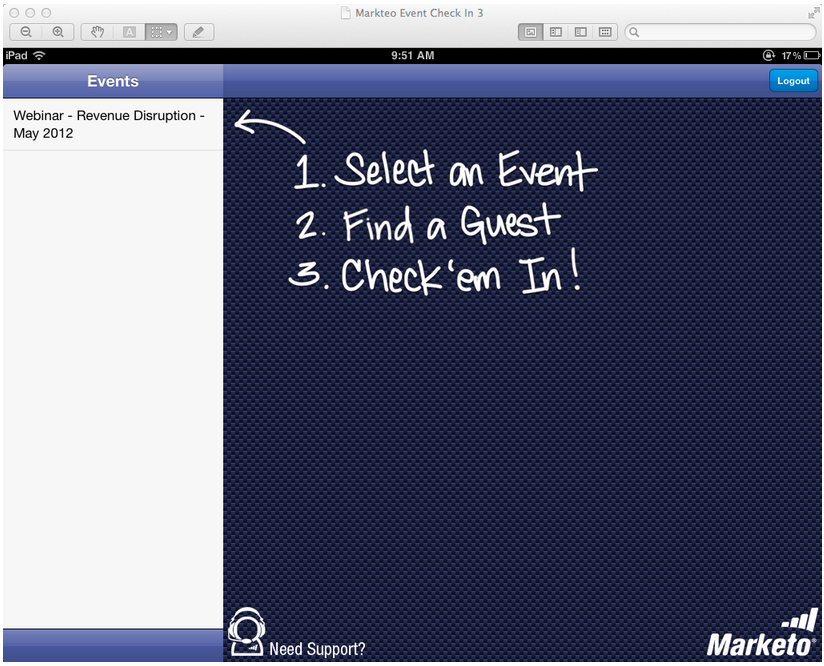

# Notas de la versión: Mayo de 2012 {#release-notes-may}

## Rediseño del informe Rendimiento del correo electrónico {#email-performance-report-redesign}

Nota: será una implementación escalonada, a partir de la versión de mayo

Hemos hecho que los informes Rendimiento del correo electrónico y Rendimiento del correo electrónico de campaña se ejecutaran más rápido. También hemos mejorado las definiciones de ciertas métricas y consolidado las métricas &quot;Mensajes enviados&quot; y &quot;Posibles clientes enviados&quot; en una única métrica, &quot;Enviado&quot;. Hemos fusionado &quot;Mensajes enviados&quot; y &quot;Posibles clientes entregados&quot; con &quot;Entregados&quot;.

## Mejoras en los pasos de espera {#wait-step-enhancements}

Con las nuevas propiedades de Espera avanzada, se puede configurar el paso de espera de una acción de flujo de campaña inteligente para &quot;esperar&quot; a un día específico de la semana, al siguiente día laborable, a una fecha u hora específicas. Estas mejoras garantizan que los mensajes de correo electrónico de formación lleguen a la bandeja de entrada durante el horario laboral.

Figura 1. Especificar el paso de espera para finalizar en un día laborable

## Recursos archivados ocultos {#archived-assets-hidden}

Los recursos archivados se filtran automáticamente de sugerencias automáticas, desplegables e informes, lo que facilita la búsqueda de lo que busca.

Figura 2. Ejemplo del filtro de correo electrónico archivado

## Nueva aplicación de registro de eventos para iPad {#new-event-check-in-app-for-ipad}

Simplifique el proceso de registro de eventos con nuestra nueva aplicación para iPad. La aplicación Event Check-in se sincroniza con su programa Marketo y le permite registrar fácilmente a los usuarios registrados en un evento, así como añadir nuevos posibles clientes sobre la marcha.

Requiere iOS 5.1 o posterior; Solo iPad.

Figura 3. Página principal del registro de eventos

Figura 4. Registro de eventos: Seleccione su Evento!

Figura 5. Marque las

## URL de confirmación de seminario web mejorada {#enhanced-webinar-confirmation-url}

Ya disponible para ON24 y Adobe Connect! Incluya un vínculo único en el correo electrónico de confirmación para cada asistente registrado usando el nuevo token `{{member.webinar URL}}` . Las mejoras de Adobe Connect también incluyen la capacidad de activar o desactivar el correo electrónico de información de la cuenta de Adobe que incluye el ID de inicio de sesión y la contraseña del usuario.

Figura 6. Traer personas a su seminario web

## Vista previa de plantilla {#template-preview}

¿Busca una plantilla específica al crear su correo electrónico o página de aterrizaje, pero no está seguro de qué aspecto tiene? Con la nueva función de vista previa de plantilla, puede verificar la plantilla seleccionada antes de guardar un nuevo recurso.

Figura 7. Previsualizar la plantilla elegida

## Relleno previo de formulario configurable {#configurable-form-prefill}

Controle la cumplimentación previa de los datos del formulario en el nivel de suscripción y sobrescriba en el nivel de página de aterrizaje. Sin población previa, puede asegurarse de que el posible cliente proporcione la información más actualizada.

Figura 8. Configuración de rellenado previo de formularios en administración

Figura 9. Editar la configuración de rellenado previo de formularios en una página de aterrizaje

## Marketo Treasure Chest {#marketo-treasure-chest}

Obtenga acceso a funciones experimentales desarrolladas por ingenieros de Marketo para mejorar su experiencia de usuario. Esta versión incluye Deshacer por correo electrónico, además de la capacidad de introducir comentarios y colaborar con otros usuarios en las páginas de aterrizaje.

\

Figura 10. Funciones de Administrador de tesorería en Administración

## Integración con Microsoft Dynamics® CRM {#microsoft-dynamics-crm-integration}

Sincronice cuentas, contactos y posibles clientes entre Marketo y Microsoft Dynamics CRM Online mediante nuestra nueva integración prediseñada.

Figura 11. Configuración de Microsoft Dynamics

## Mejoras en la perspectiva de ventas de Marketo {#marketo-sales-insight-enhancements}

**Cancelar suscripción a opciones de pie de página**

Configure cuándo y si se muestra el pie de página de cancelación de suscripción para los correos electrónicos enviados a través de la perspectiva de ventas.

Figura 12. Configuración de la perspectiva de ventas en el administrador

## Carpetas para plantillas de correo electrónico de ventas {#folders-for-sales-email-templates}

Ahora puede organizar las plantillas de correo electrónico compartidas con Marketo Sales Insight en carpetas específicas, lo que facilita a sus representantes de ventas encontrar el correo electrónico correcto.

Figura 13. Elija una carpeta para los correos electrónicos

## Acceso a Analizador de oportunidades desde la perspectiva de ventas {#access-opportunity-analyzer-from-sales-insight}

Proporcione a sus representantes de ventas una perspectiva sobre las actividades de marketing que impulsan la participación, mediante el acceso directo al Analizador de oportunidades desde la perspectiva de ventas de Marketo. Nota. Requiere una licencia de Revenue Cycle Analytics.

## Campo personalizado para el estado de contacto {#custom-field-for-contact-status}

Ahora puede asignar un campo personalizado en Salesforce para rellenar el campo Estado de Contactos en las mejores apuestas, las mejores apuestas de mi equipo y las vistas personalizadas.

Figura 14. Asignar un campo personalizado a Contactos

Ver páginas visitadas por posibles clientes anónimos

Desglose hasta las páginas vistas por un posible cliente anónimo desde la vista Actividad web anónima .

Figura 15. Ver actividad web anónima

## Suscripción de posible cliente y contacto mejorada {#enhanced-lead-and-contact-subscribe}

Siga un posible cliente o contacte en cualquier momento con el nuevo botón Suscribirse en la página de detalles del registro.
