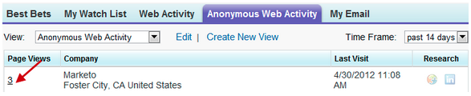

# Notas de la versión: mayo de 2012 {#release-notes-may}

## Rediseño del informe de rendimiento del correo electrónico {#email-performance-report-redesign}

Nota: Este será un despliegue por fases, a partir de la versión de mayo

Hemos hecho que los informes de Rendimiento de correo electrónico y Rendimiento de correo electrónico de campaña se ejecuten más rápido. También hemos mejorado las definiciones de ciertas métricas y consolidado las métricas &quot;Mensajes enviados&quot; y &quot;Posibles clientes enviados&quot; en una sola métrica, &quot;Enviados&quot;. Hemos combinado &quot;Mensajes entregados&quot; y &quot;Posibles clientes entregados&quot; con &quot;Entregados&quot;.

## Mejoras en pasos de espera {#wait-step-enhancements}

Con las nuevas propiedades de Espera avanzada, puede configurar el paso de espera en una acción de flujo de campaña inteligente para &quot;esperar hasta&quot; un día específico de la semana, el siguiente día hábil o una fecha u hora específicas. Estas mejoras garantizan que los correos electrónicos nutritivos lleguen a la bandeja de entrada durante el horario laboral.

Figura 1. Especifique el paso de espera para finalizar en un día laborable

## Assets archivado oculto {#archived-assets-hidden}

Los recursos archivados se filtran automáticamente de sugerencias automáticas, listas desplegables e informes, lo que facilita la búsqueda de lo que busca.

Figura 2. Ejemplo del filtro de correo electrónico archivado

## Nueva aplicación de registro de eventos para iPad {#new-event-check-in-app-for-ipad}

Simplifique el proceso de registro de eventos con nuestra nueva aplicación para iPad. La aplicación Event Check-in se sincroniza con su programa de Marketo y le permite registrar fácilmente a los inscritos en un evento, así como añadir nuevos posibles clientes sobre la marcha.

Requiere iOS 5.1 o posterior; solo iPad.

Figura 3. Página de inicio de registro de eventos

Figura 4. Registro de eventos: ¡Seleccione su evento!

Figura 5. Protéjalos en

## URL de confirmación de seminario web mejorado {#enhanced-webinar-confirmation-url}

¡Ahora disponible para ON24 y Adobe Connect! Incluya un vínculo único en el correo electrónico de confirmación para cada asistente registrado con el nuevo token `{{member.webinar URL}}`. Las mejoras de Adobe Connect también incluyen la capacidad de activar o desactivar el correo electrónico con información de la cuenta de Adobe que incluye el ID de inicio de sesión y la contraseña del usuario.

Figura 6. Llevar a las personas al seminario web

## Vista previa de la plantilla {#template-preview}

¿Busca una plantilla específica al crear el correo electrónico o la página de aterrizaje, pero no está seguro de su aspecto? Con la nueva capacidad de previsualización de plantilla, puede verificar la plantilla seleccionada antes de guardar un nuevo recurso.

Figura 7. Previsualice la plantilla elegida

## Relleno previo de formulario configurable {#configurable-form-prefill}

Controle la cumplimentación previa de datos de formulario en el nivel de suscripción y sobrescriba en el nivel de página de aterrizaje. Sin rellenado previo, puede asegurarse de que el posible cliente proporcione la información más actualizada.

Figura 8. Configuración de rellenado previo de formulario en administración

Figura 9. Editar la configuración de rellenado previo de un formulario en una página de aterrizaje

## Marketo Treasure Chest {#marketo-treasure-chest}

Obtenga acceso a las funciones experimentales desarrolladas por ingenieros de Marketo para mejorar su experiencia de usuario. Esta versión incluye Deshacer correo electrónico, además de la capacidad de introducir comentarios y colaborar con otros usuarios en las páginas de aterrizaje.

\

Figura 10. Características del cofre del tesoro del gerente en administración

## Integración de Microsoft Dynamics® CRM {#microsoft-dynamics-crm-integration}

Sincronice cuentas, contactos y posibles clientes entre Marketo y Microsoft Dynamics CRM en línea con nuestra nueva integración prediseñada.

Figura 11. Configuración de Microsoft Dynamics

## Mejoras en Sales Insight de Marketo {#marketo-sales-insight-enhancements}

**Opciones de cancelación de suscripción al pie**

Configure cuándo y si se muestra el pie de página de cancelación de suscripción para los correos electrónicos enviados a través de Sales Insight.

Figura 12. Configuración de perspectivas de ventas en administración

## Carpetas para plantillas de correo electrónico de ventas {#folders-for-sales-email-templates}

Ahora puede organizar las plantillas de correo electrónico compartidas con Marketo Sales Insight en carpetas especificadas, lo que facilita a sus representantes de ventas la búsqueda del correo electrónico correcto.

Figura 13. Elija una carpeta para los correos electrónicos

## Acceder al Analizador de oportunidades desde Sales Insight {#access-opportunity-analyzer-from-sales-insight}

Proporcione a sus representantes de ventas información sobre las actividades de marketing que impulsan la participación mediante el acceso directo al Analizador de oportunidades desde Marketo Sales Insight. Nota. Requiere una licencia de Revenue Cycle Analytics.

## Campo personalizado para el estado de contacto {#custom-field-for-contact-status}

Ahora puede asignar un campo personalizado en Salesforce para rellenar el campo Estado para Contactos en Mis resultados más probables, Los mejores resultados de mi equipo y las vistas personalizadas.

Figura 14. Asignar un campo personalizado a Contactos

Consulte Páginas visitadas por posibles clientes anónimos

Profundice hasta las páginas que vio un posible cliente anónimo desde la vista Actividad web anónima.

Figura 15. Consulte Actividad web anónima

## Suscripción de contacto y posible cliente mejorada {#enhanced-lead-and-contact-subscribe}

Siga a un posible cliente o contacto en cualquier momento utilizando el nuevo botón Suscribirse en la página de detalles de registro.
