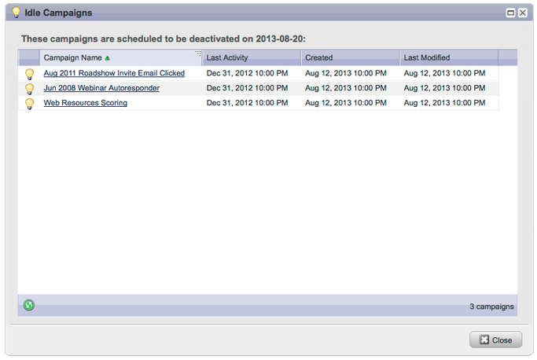

# Notas de la versión: agosto de 2013 {#release-notes-august}

En la versión de agosto de 2013 de se incluyen las siguientes funciones.

**Correos electrónicos solo de texto**

Ahora puedes enviar [solo la versión de texto](/help/marketo/product-docs/email-marketing/general/creating-an-email/create-a-text-only-email.md) de un correo electrónico. Tenga en cuenta que los vínculos no se decorarán al utilizar esta opción.

## Mejoras en el motor de participación del cliente {#customer-engagement-engine-enhancements}

### Ignorar contenido agotado {#ignore-exhausted-content}

Configure el programa de participación para [ignorar agotamiento](/help/marketo/product-docs/email-marketing/drip-nurturing/using-engagement-programs/disable-and-enable-exhausted-content-notifications.md), incluida la supresión de notificaciones.

## Prueba de flujo de participación {#engagement-stream-testing}

Use la [nueva característica de prueba](/help/marketo/product-docs/email-marketing/drip-nurturing/engagement-program-streams/test-an-engagement-stream.md) para simular una difusión y probar el contenido recién agregado a una transmisión en vivo.

## Prueba de envío personalizada {#personalized-send-test}

Al enviar una prueba por correo electrónico, puede seleccionar el nombre de un posible cliente para personalizar el correo electrónico de prueba.

## Tokens del sistema &quot;Ver correo electrónico como página web&quot; y &quot;Cancelar suscripción&quot; {#view-email-as-web-page-and-unsubscribe-system-tokens}

Utilice estos [nuevos tokens](/help/marketo/product-docs/email-marketing/general/using-tokens/system-tokens-glossary.md) para controlar mejor su ubicación en correos electrónicos.

## Limpieza de campañas de activador automático {#automatic-trigger-campaign-cleanup}

Marketo le notificará periódicamente a usted y a [desactivará automáticamente las campañas de déclencheur](/help/marketo/product-docs/core-marketo-concepts/smart-campaigns/using-smart-campaigns/automatic-trigger-campaign-cleanup.md) que no se hayan ejecutado en los últimos seis meses.

## Mejora de Marketo Financial Management {#marketo-financial-management-enhancement}

### Actualización de costos del programa  {#program-cost-update}

La sincronización de costes de programa permite realizar un seguimiento de los costes del programa en varias plataformas.

### Interfaz de usuario de Cobalt {#cobalt-user-interface}

Continuamos con el despliegue de nuestra nueva interfaz Cobalt. Este proyecto hará que todo en Marketo sea súper rápido. La actualización continuará durante el resto del año.
