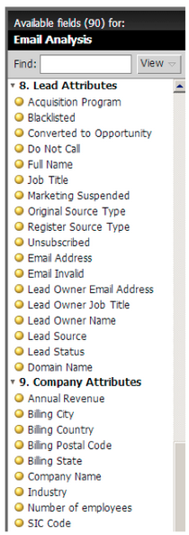

# Notas de la versión: Diciembre de 2013 {#release-notes-december}

La versión de diciembre incluye las siguientes funciones.

Después de la versión, asegúrese de consultar la pestaña Nueva versión de la Comunidad para ver los artículos detallados de la Base de conocimiento para cada función.

## Programa de e-mails {#email-program}

Enviar un correo electrónico nunca ha sido tan fácil. Utilice el nuevo [programa de correo electrónico](/help/marketo/product-docs/email-marketing/email-programs/creating-an-email-program/understanding-email-programs.md) para enviar un correo electrónico por lotes, en lugar del Programa predeterminado. Defina la lista inteligente, envíe un correo electrónico, programe la lista y ya no estará disponible.

Consulte también el nuevo [Panel de métricas de correo electrónico](/help/marketo/product-docs/email-marketing/email-programs/email-program-data/view-the-email-program-dashboard.md) para ver el rendimiento del correo electrónico.

## Pruebas A/B de correo electrónico {#email-a-b-testing}

En el nuevo programa de correo electrónico, ejecute una [prueba A/B](/help/marketo/product-docs/email-marketing/email-programs/email-program-actions/email-test-a-b-test/add-an-a-b-test.md) en un porcentaje de la población total de envíos de correo electrónico. Elija entre 4 tipos diferentes de pruebas: Línea de asunto, De dirección, Fecha/Hora y Correo electrónico completo. Incluso puede optar por promocionar manualmente el ganador o dejar que el sistema lo promueva en función de criterios de ganador predefinidos. El nuevo programa de correo electrónico, incluida la prueba A/B, se puede anidar en Eventos y el programa predeterminado para que ese correo electrónico se envíe tan simple.

## Prueba de campeón de correo electrónico/Challenger {#email-champion-challenger-testing}

[La ](/help/marketo/product-docs/email-marketing/general/functions-in-the-editor/email-tests-champion-challenger/add-an-email-champion-challenger.md) prueba Champion/Challenger es similar a la prueba A/B, pero la diferencia es que se utiliza para correos electrónicos activados y no se envía automáticamente un ganador. Esta prueba le permite desafiar una forma establecida de hacer algo, llamada el Campeón, y probar si sigue siendo la mejor mediante la introducción de un Challenger. Además, las pruebas de correo electrónico de Champion/Challenger se pueden utilizar dentro de los flujos de programas de Participación.

## Detalles del posible cliente en el análisis de correo electrónico {#lead-details-in-email-analysis}

Hemos introducido atributos adicionales de cliente potencial y empresa en el análisis de correo electrónico. Ahora puede ver las estadísticas de correo electrónico agrupadas por atributos nuevos, como el sector y la fuente de posibles clientes.

## Adaptador de evento BrightTALK mejorado {#enhanced-brighttalk-event-adapter}

Ahora puede extraer los usuarios registrados a Marketo desde su canal y evento BrightTALK. ¡Puede usar esta información para informar a otras campañas de marketing!
