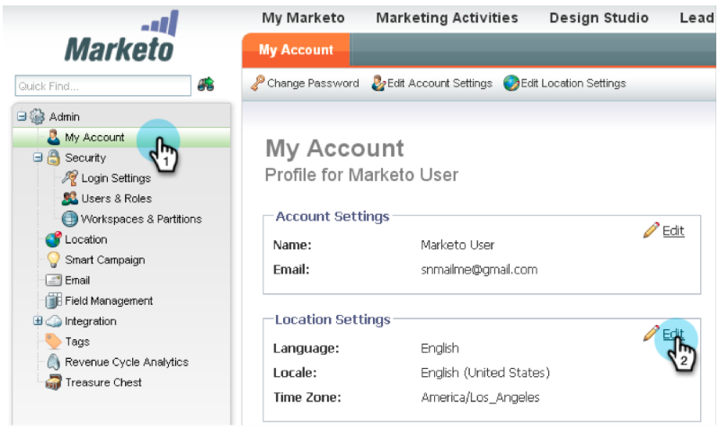

# Notas de la versión: enero de 2013 {#release-notes-january}

La versión de enero amplía nuestra oferta social con **Ofertas de referencia**. Además, los usuarios de Marketo Lead Management pueden establecer sus preferencias de zona horaria, idioma y configuración regional. Tenga en cuenta que las funciones de están marcadas con un &#42; solo están disponibles en la edición Select.

## Ofertas recomendadas {#referral-offers}

A **Oferta de referencia** le da a sus clientes potenciales un incentivo para referir a sus amigos. Cree metas y recompensas para referencias exitosas. Puede utilizarlo en páginas de aterrizaje, su sitio web e incluso Facebook.

## Preferencia de zona horaria {#time-zone-preference}

Puede cambiar la zona horaria predeterminada de su cuenta personal de Marketo. Por ejemplo, aunque el valor predeterminado de la suscripción sea Hora del Pacífico, puede cambiarla a Hora del Este para su propia cuenta.

## Seleccione el idioma de Marketo Lead Management {#select-your-marketo-lead-management-language}

Puede cambiar el idioma predeterminado de su cuenta de usuario de Marketo. Aunque la suscripción predeterminada esté en inglés, puede cambiarla al alemán o al francés para su propio uso.

## Mensajes de error de formulario multilingüe {#multi-lingual-form-error-messages}

Cuando un posible cliente rellena un formulario de Marketo, algunos mensajes de validación se incorporan automáticamente. Es posible que desee seleccionar un idioma de visualización diferente para estos mensajes de error. Ahora admitimos inglés, alemán y francés.

Un ejemplo de formulario en francés:

## Seleccione el idioma de Sales Insight (solo Salesforce) {#select-your-sales-insight-language-salesforce-only}

Si la preferencia de idioma de Salesforce está establecida en francés o alemán, Marketo Sales Insight respetará esta preferencia. Descargue el último paquete MSI para obtener esta funcionalidad (disponible la semana del 14 de enero).

## Nombre para mostrar del campo {#field-display-name}

Los nombres para mostrar de campos pueden mostrar texto en diferentes idiomas (por ejemplo, se admiten caracteres de bytes múltiples).

## Cambiar datos de programa {#change-program-data}

El paso de flujo Cambiar datos del programa le permite cambiar el estado de éxito y la fecha de éxito de un miembro del programa manualmente a través de una campaña. Puede utilizar este paso de flujo para corregir un error o para cambiar manualmente un miembro que puede no haber participado en el programa como estaba previsto.

