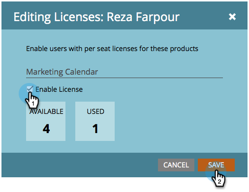

# Notas de la versión: Agosto de 2014 {#release-notes-august}

Las siguientes funciones están incluidas en la versión de agosto de 2014. Compruebe la disponibilidad de las funciones en su edición de Marketo. Vuelva después de la versión para ver vínculos a documentación detallada de las funciones.

## Licencias del Calendario de marketing {#marketing-calendar-licenses}

Después del 5 de septiembre de 2014, solo 5 usuarios pueden tener acceso gratuito al calendario de marketing. Asegúrese de [Publicar/Revocar una licencia de calendario de marketing](/help/marketo/product-docs/core-marketo-concepts/marketing-calendar/understanding-the-calendar/issue-revoke-a-marketing-calendar-license.md) antes de los usuarios que elija para obtener acceso sin interrupciones.

## Nuevos permisos de usuario {#new-user-permissions}

Se agregaron los siguientes permisos de usuario nuevos:

| Permiso | Descripción |
|---|---|
| Acceso al Explorador de ingresos | Si ha comprado RCA, ahora tendrá control sobre quién puede acceder a él. |
| Lista de importación | Restringir a los usuarios de la importación de listas en la base de datos de posibles clientes. |
| Lista de importación | Restringir a los usuarios de la importación de listas a través de un programa en actividades de marketing. |
| Activar campaña de Déclencheur | Controle quién puede activar y no puede activar las campañas de déclencheur. |
| Programar campaña por lotes | Controle quién puede programar y no puede programar ejecuciones de campañas por lotes. |

## Exportar usuarios y funciones desde el administrador {#export-users-and-roles-from-admin}

Ahora puede [Exportar una lista de usuarios y funciones](/help/marketo/product-docs/administration/users-and-roles/export-a-list-of-users-and-roles.md) desde Marketo. También puede incluir una marca de tiempo &quot;Último inicio de sesión&quot; para incluirla en la exportación.

## Eliminar canales y etiquetas {#delete-channels-and-tags}

Ahora puede eliminar cualquier canal y estado que no utilice. Como siempre, solo puede ocultar uno que esté en uso actualmente.

## DKIM automatizado {#automated-dkim}

Para mejorar la capacidad de envío, todos los correos electrónicos salientes se firmarán con DKIM (DomainKeys Identified Mail). De forma predeterminada, los correos electrónicos utilizan la firma DKIM compartida de Marketo. Tendrá la opción de personalizar esta firma.

>[!NOTE]
>
>DKIM se va a implantar lentamente, puede que no lo vea durante unas semanas.

## Actualizaciones de personalización en tiempo real {#real-time-personalization-updates}

Hemos agregado etiquetas a la página de campaña para que pueda etiquetar el contenido de sus corazones.

## Segmentación móvil {#mobile-targeting}

¡Preguntaste por la comunidad y nos entregamos! Ahora puede incluir, excluir o establecer una llamada a la acción específica para usuarios de móviles y tabletas.

## Segmentación y segmentación 1:1 mejoradas {#enhanced-segmentation-and-targeting}

Ahora puede usar operadores de filtro avanzados para segmentar visitantes conocidos.

## Uso compartido de campañas {#campaign-sharing}

Ahora tiene la capacidad de compartir rápida y fácilmente un vínculo de vista previa de una campaña RTP.

## Informe del motor de recomendación de contenido {#content-recommendation-engine-report}

Hemos agregado un nuevo informe de motor de recomendaciones de contenido para que vea un buen resumen.

## Administración de usuarios mejorada {#enhanced-user-administration}

Los usuarios administradores ahora pueden bloquear usuarios debido a varios intentos fallidos de inicio de sesión. También puede desbloquear a esos usuarios si lo desea.

## Control de seguimiento {#tracking-control}

Ahora puede excluir direcciones IP específicas de todos los informes y seguimiento en la personalización en tiempo real.

