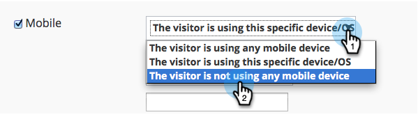

# Notas de la versión: agosto de 2014 {#release-notes-august}

Las siguientes funciones están incluidas en la versión de agosto de 2014. Compruebe la disponibilidad de las funciones en Marketo Edition. Vuelva después del lanzamiento para ver los vínculos a la documentación detallada de las funciones.

## Licencias de calendario de marketing {#marketing-calendar-licenses}

A partir del 5 de septiembre de 2014, solo 5 usuarios podrán acceder de forma gratuita al calendario de marketing. Asegúrese de [Emitir/revocar una licencia de calendario de marketing](/help/marketo/product-docs/core-marketo-concepts/marketing-calendar/understanding-the-calendar/issue-revoke-a-marketing-calendar-license.md) a los usuarios de su elección antes de, para un acceso sin interrupciones.

## Nuevos permisos de usuario {#new-user-permissions}

Se agregaron los siguientes permisos de usuario nuevos:

| Permiso | Descripción |
|---|---|
| Acceder al Explorador de ingresos | Si ha adquirido RCA, ahora tendrá control sobre quién puede acceder a él. |
| Lista de importación | Restringir a los usuarios la importación de listas en la base de datos de posibles clientes. |
| Lista de importación | Restrinja a los usuarios la importación de listas a través de un programa en actividades de marketing. |
| Activar campaña de Déclencheur | Controle quién puede activar y no puede activar campañas de déclencheur. |
| Programar campaña por lotes | Controle quién puede y no puede programar ejecuciones de campañas por lotes. |

## Exportar usuarios y funciones desde el administrador {#export-users-and-roles-from-admin}

Ahora puede [Exportar una lista de usuarios y funciones](/help/marketo/product-docs/administration/users-and-roles/export-a-list-of-users-and-roles.md) de Marketo. También puede incluir una marca de tiempo &quot;Último inicio de sesión&quot; para que se incluya en la exportación.

## Eliminar canales y etiquetas {#delete-channels-and-tags}

Ahora puede eliminar los canales y estados que no se utilicen. Como siempre, solo puede ocultar una que esté en uso actualmente.

## DKIM automatizado {#automated-dkim}

Para mejorar la capacidad de entrega, todos los correos electrónicos salientes se firmarán con DKIM (DomainKeys Identified Mail). De forma predeterminada, los correos electrónicos utilizarán la firma DKIM compartida de Marketo. Tendrá la opción de personalizar esta firma.

>[!NOTE]
>
>DKIM se desplegará lentamente; es posible que no lo vea durante unas semanas.

## Actualizaciones de personalización en tiempo real {#real-time-personalization-updates}

Hemos añadido etiquetas a la página de la campaña para que pueda etiquetar el contenido de su corazón.

## Segmentación móvil {#mobile-targeting}

¡Le preguntaste a la comunidad y lo hicimos! Ahora puede incluir, excluir o establecer una llamada a la acción específica para usuarios de móviles y tabletas.

## Segmentación y direccionamiento 1:1 mejoradas {#enhanced-segmentation-and-targeting}

Ahora puede utilizar operadores de filtro avanzados para segmentar visitantes conocidos.

## Uso compartido de campañas {#campaign-sharing}

Ahora tiene la capacidad de compartir rápida y fácilmente un vínculo de vista previa de campaña de RTP.

## Informe del motor de recomendaciones de contenido {#content-recommendation-engine-report}

Hemos agregado un nuevo informe de motor de recomendación de contenido para que vea un buen resumen.

## Administración de usuario mejorada {#enhanced-user-administration}

Los usuarios administradores ahora pueden bloquear a los usuarios debido a varios intentos fallidos de inicio de sesión. También puede desbloquear a esos usuarios si lo desea.

## Control de seguimiento {#tracking-control}

Ahora puede excluir direcciones IP específicas de todo el seguimiento y los informes en Personalización en tiempo real.

