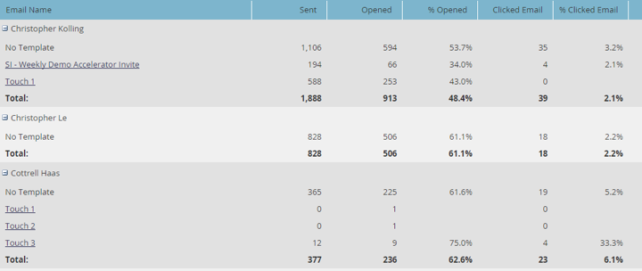
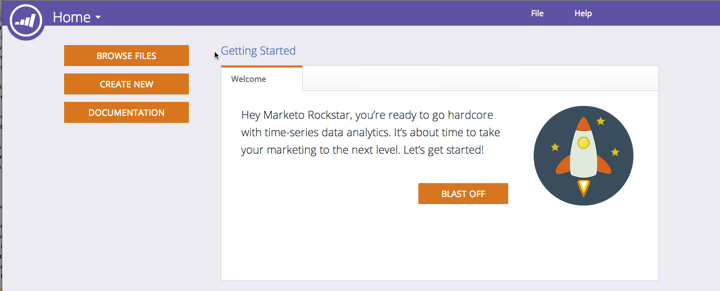

# Notas de la versión: diciembre de 2014 {#release-notes-december}

Las siguientes funciones están incluidas en la versión de diciembre de 2014. Compruebe la disponibilidad de las funciones en Marketo Edition. Después del lanzamiento, asegúrese de volver para encontrar vínculos a artículos detallados para cada función.

## Informes de perspectiva de ventas {#sales-insight-reports}

El [Informe de rendimiento de correo electrónico de Sales Insight](/help/marketo/product-docs/marketo-sales-insight/msi-for-salesforce/features/performance-reports/sales-insight-email-performance-report.md) le permite ver las métricas de correo electrónico por correo electrónico y representante de ventas. Admite correos electrónicos enviados a través de Salesforce, Microsoft Dynamics, el complemento de Outlook y el complemento de Gmail.

## Audiencias personalizadas de Facebook {#facebook-custom-audiences}

Una vez que el administrador de Marketo haya añadido [Facebook mediante Administración > Launchpoint](/help/marketo/product-docs/demand-generation/ad-network-integrations/add-facebook-custom-audiences-as-a-launchpoint-service.md), puede crear, actualizar o [reemplazar una audiencia personalizada de Facebook por posibles clientes de una lista estática o inteligente de Marketo](/help/marketo/product-docs/demand-generation/facebook/create-a-custom-audience-in-facebook.md). Busque el nuevo icono de Facebook en la parte inferior de la cuadrícula de posibles clientes de cualquier lista estática o inteligente.

## Clonación mejorada en espacios de trabajo  {#improved-cloning-across-workspaces}

[Clonación de un programa](/help/marketo/product-docs/core-marketo-concepts/programs/working-with-programs/clone-a-program.md) conectarse a otro espacio de trabajo nunca ha sido tan fácil. Al hacer clic en clonar, se selecciona el espacio de trabajo de destino. ¡No más clonar en una carpeta y luego mover la carpeta!

>[!NOTE]
>
>Esta nueva función de clonación solo está disponible para programas en este momento.

## Lista inteligente de referencia {#reference-smart-list}

[Se puede hacer referencia a las listas inteligentes compartidas con otro espacio de trabajo](/help/marketo/product-docs/core-marketo-concepts/smart-lists-and-static-lists/using-smart-lists/reference-a-list-or-smart-list-across-workspaces.md) al crear una lista inteligente o un flujo.

## Enumerar mejoras de importación {#list-import-improvements}

[Importar archivos](/help/marketo/getting-started/quick-wins/import-a-list-of-people.md) codificado en UTF-16, Shift-JIS o EUC-JP. Seguimos admitiendo archivos codificados con UTF-8.

## Seguimiento de vínculos en scripts de correo electrónico {#link-tracking-in-email-scripting}

Los vínculos de los scripts de correo electrónico ahora se rastrearán y estarán disponibles en el informe Rendimiento de los vínculos de correo electrónico.

## Configuración de codificación de token {#token-encoding-setting}

Hemos implementado una nueva función de seguridad para codificar tokens automáticamente en HTML, que se habilitará de forma predeterminada en marzo de 2015. Hasta entonces, alterne esta funcionalidad en Administración de campos para probar el comportamiento con antelación. Todos los tokens de cliente potencial y compañía se codificarán cuando se inserten en correos electrónicos o páginas de aterrizaje. Las opciones también están disponibles para campos individuales.

## Nuevas llamadas a la API de ReST {#new-rest-api-calls}

Tres nuevas llamadas para la API de REST de posible cliente y actividad:

· Obtener Particiones de Posibles Clientes

· Asociar posible cliente

· Combinar posible cliente

Todos los detalles estarán disponibles tras el lanzamiento en [https://experienceleague.adobe.com/en/docs/marketo-developer/marketo/home](https://experienceleague.adobe.com/en/docs/marketo-developer/marketo/home)

## Mejoras de compatibilidad de Munchkin Javascript {#munchkin-javascript-compatibility-enhancements}

Hemos realizado varias mejoras menores en Munchkin para garantizar que se siga cargando rápidamente y funcionando como se desea en casos con otro JavaScript en la página.

El despliegue se llevará a cabo a partir de mediados de diciembre y continuará durante los próximos meses.

## Aspecto y presentación actualizados del Explorador de ingresos {#revenue-explorer-upgraded-look-and-feel}

## RTP: Módulo de lista de cuentas con nombre {#rtp-named-account-list-module}

Administre y supervise sus cuentas clave de alto rendimiento en la nueva página Cuentas con nombre. Cargue nuevas listas de cuentas con nombre para identificar y segmentar estas organizaciones. Hemos automatizado el proceso para que tenga un mayor control y flexibilidad a la hora de implementar sus planes de marketing basados en cuentas y segmentar sus cuentas clave en diferentes canales (web y publicidad).

## RTP: Efecto deslizante para campañas en la zona {#rtp-sliding-effect-for-in-zone-campaigns}

Se ha agregado un nuevo efecto deslizante para las campañas de la zona de inserción que permite que el contenido personalizado se deslice en su lugar al cargar la página.

