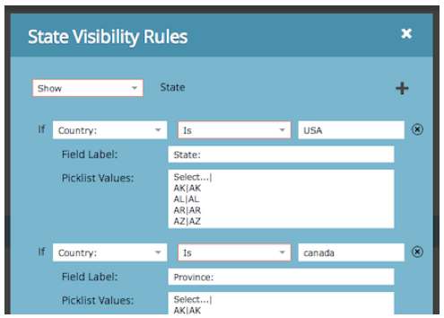

# Notas de la versión: febrero de 2014 {#release-notes-february}

Las siguientes funciones se incluyen en la versión de febrero de 2014. Compruebe la disponibilidad de las funciones en Marketo Edition. Después del lanzamiento, asegúrese de volver para encontrar vínculos a artículos detallados de la Base de conocimiento para cada función.

## Puntuación de participación como criterio ganador {#engagement-score-as-winning-criteria}

[Usar la puntuación de participación](/help/marketo/product-docs/email-marketing/email-programs/email-program-actions/email-test-a-b-test/define-the-a-b-test-winner-criteria.md) para determinar la variante ganadora en la prueba dividida A/B o en la prueba Campeón/Challenger. La prueba debe ejecutarse durante un mínimo de 24 horas, para proporcionar una puntuación de participación adecuada.

## Pestaña Resultados del programa de correo electrónico {#email-program-results-tab}

[Ver los resultados](/help/marketo/product-docs/email-marketing/email-programs/email-program-data/view-email-program-results.md) y actividades registradas para el programa de correo electrónico.

## Personas/posibles clientes bloqueados del correo {#people-leads-blocked-from-mailing}

[Haga clic en las personas o los posibles clientes bloqueados del correo](/help/marketo/product-docs/email-marketing/email-programs/managing-people-in-email-programs/define-an-audience-with-a-smart-list.md) número para ver quién no recibe el correo electrónico debido a que se ha dado de baja, está en la lista de bloqueados, tiene una dirección de correo electrónico no válida o en blanco o está suspendido el marketing.

## Exportar datos de programas de correo electrónico {#export-email-program-data}

[Exportar métricas de correo electrónico a Excel](/help/marketo/product-docs/email-marketing/email-programs/email-program-data/export-email-program-dashboard-to-excel.md), incluidos los datos de variante de la prueba AB.

## [!UICONTROL Puntuación de participación] in [!UICONTROL Rendimiento del flujo de participación] Informe {#engagement-score-in-engagement-stream-performance-report}

Hemos añadido la puntuación de participación a [[!UICONTROL Rendimiento del flujo de participación] Informe](/help/marketo/product-docs/email-marketing/drip-nurturing/reports-and-notifications/engagement-stream-performance-report.md) para ayudarle a ver la eficacia del contenido de su programa de participación.

## Detalles del programa en análisis de correo electrónico {#program-details-in-email-analysis}

[Ahora puede agrupar las métricas de correo electrónico por nombre de programa, canal y etiquetas](/help/marketo/product-docs/reporting/revenue-cycle-analytics/email-analysis/build-an-email-analysis-report-that-shows-program-information.md). El nombre del programa se añade al campo Nombre del correo electrónico cuando el correo electrónico es un recurso local del programa. El nuevo campo Nombre del programa muestra el nombre del programa de la campaña inteligente que envió el correo electrónico. Esto puede ser diferente al programa en el campo Nombre del correo electrónico si el correo electrónico es un recurso local de un programa diferente.

## Actualización del Déclencheur y los filtros de vínculo de Clics {#update-to-clicks-link-filters-and-trigger}

Se han actualizado los siguientes nombres de déclencheur y filtro:

* Clicks Link to Clicks Link on Web Page
* Vínculo al vínculo en el que se hizo clic en la página web
* Vínculo No hecho clic a Vínculo no hecho clic en la página web

## Mejoras de Forms 2.0 {#forms-enhancements}

Con esta versión, Forms 2.0 ofrece varias actualizaciones de &quot;calidad de vida&quot;. Además de permitir la creación progresiva de perfiles en los formularios incrustados, hemos realizado cambios en el flujo de trabajo y la experiencia de usuario que facilitarán el uso de la funcionalidad más avanzada en el editor. [inclusión de las reglas de visibilidad](/help/marketo/product-docs/demand-generation/forms/form-fields/dynamically-toggle-visibility-of-a-form-field.md), páginas de agradecimiento avanzadas y campos ocultos.

