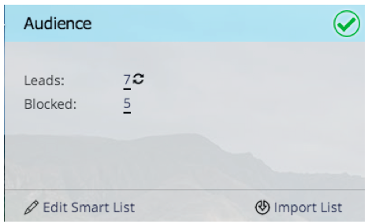

# Notas de la versión: Febrero de 2014 {#release-notes-february}

La versión de febrero de 2014 incluye las siguientes funciones. Compruebe la disponibilidad de las funciones en Marketo Edition. Después de la versión, asegúrese de volver para encontrar vínculos a artículos detallados de la Base de conocimiento para cada función.

## Puntuación de participación como criterio ganador {#engagement-score-as-winning-criteria}

[Uso de la puntuación de participación](/help/marketo/product-docs/email-marketing/email-programs/email-program-actions/email-test-a-b-test/define-the-a-b-test-winner-criteria.md) para determinar la variante ganadora en la prueba de división A/B o en la prueba Champion/Challenger. La prueba debe ejecutarse durante un mínimo de 24 horas para obtener una puntuación de participación adecuada.

## Pestaña Resultados del programa de correo electrónico {#email-program-results-tab}

[Ver los resultados](/help/marketo/product-docs/email-marketing/email-programs/email-program-data/view-email-program-results.md) y actividades registradas para el programa de correo electrónico.

## Personas/posibles clientes bloqueados del correo {#people-leads-blocked-from-mailing}

[Haga clic en las personas o posibles clientes a los que se haya bloqueado el envío por correo](/help/marketo/product-docs/email-marketing/email-programs/managing-people-in-email-programs/define-an-audience-with-a-smart-list.md) para ver quién no recibirá el correo electrónico debido a que se ha cancelado la suscripción, se ha incluido en la lista negra, se ha enviado una dirección de correo electrónico no válida o en blanco o se ha suspendido el marketing.

## Exportar datos de programa de correo electrónico {#export-email-program-data}

[Exportar métricas de correo electrónico a Excel](/help/marketo/product-docs/email-marketing/email-programs/email-program-data/export-email-program-dashboard-to-excel.md), incluidos los datos de variante de prueba A/B.

## Puntuación de participación en el informe Rendimiento del flujo de participación {#engagement-score-in-engagement-stream-performance-report}

Hemos agregado la puntuación de participación al [Informe Rendimiento del flujo de participación](/help/marketo/product-docs/email-marketing/drip-nurturing/reports-and-notifications/engagement-stream-performance-report.md) para ayudarle a ver la eficacia del contenido en su programa de participación.

## Detalles del programa en Análisis de correo electrónico {#program-details-in-email-analysis}

[Ahora puede agrupar las métricas de correo electrónico por nombre de programa, canal y etiquetas](/help/marketo/product-docs/reporting/revenue-cycle-analytics/email-analysis/build-an-email-analysis-report-that-shows-program-information.md). El nombre del programa se agrega al campo Nombre del correo electrónico cuando el correo electrónico es un recurso local del programa. El nuevo campo Nombre del programa muestra el nombre del programa de la campaña inteligente que envió el correo electrónico. Esto puede ser diferente del programa del campo Nombre de correo electrónico si el correo electrónico es un recurso local de un programa diferente.

## Actualización a los filtros de vínculo de clics y al Déclencheur {#update-to-clicks-link-filters-and-trigger}

Se han actualizado los siguientes nombres de filtro y déclencheur:

* Clics Vínculo a clics Vínculo en la página web
* Se hizo clic en Vínculo a vínculo en el que se hizo clic en la página Web
* Vínculo en el que no se hizo clic en Vínculo en la página web

## Mejoras en Forms 2.0 {#forms-enhancements}

Con esta versión, hemos dado a Forms 2.0 varias actualizaciones de &quot;calidad de vida&quot;. Además de habilitar la creación progresiva de perfiles en formularios incrustados, se han realizado cambios en el flujo de trabajo y la experiencia de usuario que facilitarán el uso de la funcionalidad más avanzada del editor. [inclusión de las reglas de visibilidad](/help/marketo/product-docs/demand-generation/forms/form-fields/dynamically-toggle-visibility-of-a-form-field.md), páginas de agradecimiento avanzadas y campos ocultos.

