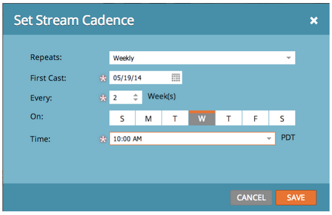

# Notas de la versión: Mayo de 2014 {#release-notes-may}

La versión de mayo de 2014 incluye las siguientes funciones. Compruebe la disponibilidad de las funciones en Marketo Edition. Después de la versión, asegúrese de volver para encontrar vínculos a artículos detallados de la Base de conocimiento para cada función.

## Eliminar espacio de trabajo {#delete-workspace}

Ahora puede [eliminar un espacio de trabajo sin utilizar](/help/marketo/product-docs/administration/workspaces-and-person-partitions/delete-a-workspace.md). Asegúrese de mover todos los recursos a otro espacio de trabajo antes de intentar eliminarlo.

## Programar primer ciclo {#schedule-first-cast}

En los programas de participación, puede programar la fecha de la [primera emisión para que se ejecute](/help/marketo/product-docs/email-marketing/drip-nurturing/engagement-program-streams/set-stream-cadence.md). Por ejemplo, especifique la cadencia para que sea cada 2 semanas y seleccione la fecha de la primera emisión.

## Programas de participación mejorados {#enhanced-engagement-programs}

Ahora todos tienen múltiples programas, flujos y límites de comunicación.

## Seguimiento de vínculos en correos electrónicos de texto {#link-tracking-in-text-emails}

[Agregue ](/help/marketo/product-docs/email-marketing/general/functions-in-the-editor/add-tracked-links-to-a-text-email.md) llaves dobles alrededor de las direcciones URL en la versión de texto de sus correos electrónicos para indicar cuándo se deben convertir los vínculos en vínculos de seguimiento de Marketo redirigidos

>[!NOTE]
>
>**Ejemplo**
>
>`[[https://www.marketo.com]]`

De forma predeterminada, no se rastreará ningún vínculo en la versión de texto de los correos electrónicos. Añada esta nueva sintaxis para indicar cuándo se debe convertir un vínculo en un vínculo de seguimiento. El comportamiento de los vínculos HTML no cambia.  Para añadir vínculos rastreados a los correos electrónicos:

* **Versión HTML:** inserte el vínculo. Se rastreará de forma predeterminada.
* **Versión de texto:** introduzca la dirección URL entre corchetes dobles.

Para añadir vínculos sin rastrear a los correos electrónicos:

* **Versión HTML:** inserte el vínculo y añada la clase &quot;mktNoTrack&quot; al vínculo.
* **Versión de texto:** simplemente introduzca la dirección URL. De forma predeterminada, no se le rastreará.

## Marcado de vínculos en correos electrónicos de ejemplo {#link-markup-in-sample-emails}

Vea cómo se comportan sus vínculos en los correos electrónicos con antelación. Los correos electrónicos de ejemplo ahora muestran vínculos exactamente como aparecerían en los posibles clientes. Previsualice qué vínculos se han convertido en vínculos de seguimiento, lo que le ofrece una mejor idea de cómo aparecerá realmente el mensaje para los destinatarios.

## Anular campaña {#abort-campaign}

¡No se asuste! Si encuentra un error, utilice el nuevo botón [abort campaign](/help/marketo/product-docs/core-marketo-concepts/smart-campaigns/using-smart-campaigns/abort-a-smart-campaign.md) para detener inmediatamente las campañas en sus pistas. Recibirá una notificación que describe cuántos posibles clientes estaban pendientes en cada paso del flujo cuando se detuvo la campaña.

## Perspectiva de ventas en japonés, portugués y español {#sales-insight-in-japanese-portuguese-and-spanish}

Descargue la última versión de Sales Insight desde la AppExchange para que sus agentes de ventas de habla japonesa, portuguesa y española puedan ver el contenido de Sales Insight en su idioma preferido.

## Estado del programa y intervalo de tiempo de éxito en el análisis de pertenencia al programa {#program-status-and-success-timeframe-in-program-membership-analysis}

Vea cuántos [miembros están en cada estado del programa](/help/marketo/product-docs/reporting/revenue-cycle-analytics/program-analytics/build-a-program-membership-analysis-report-that-lists-leads.md) y cuándo cambiaron a cada estado, incluida la fecha en la que alcanzaron el éxito del programa.

## Correos electrónicos de prueba A/B en análisis de correo electrónico {#a-b-test-emails-in-email-analysis}

Cree informes sobre cada una de las [variantes de correo electrónico de prueba A/B](/help/marketo/product-docs/reporting/revenue-cycle-analytics/email-analysis/build-an-email-analysis-report-that-shows-program-information.md) en Análisis de correo electrónico.

## Cambios en los paquetes de Analytics {#analytics-packaging-changes}

El modelador de ciclo de ingresos y el analizador de rutas de éxito ahora están incluidos en MA Standard Edition.

## Información de la plataforma móvil {#mobile-platform-info}

[Segmenta y ](/help/marketo/product-docs/reporting/basic-reporting/report-activity/build-a-people-performance-report-with-mobile-platform-columns.md) activa el apagado de los posibles clientes abriendo y haciendo clic en correos electrónicos desde sus dispositivos móviles.
