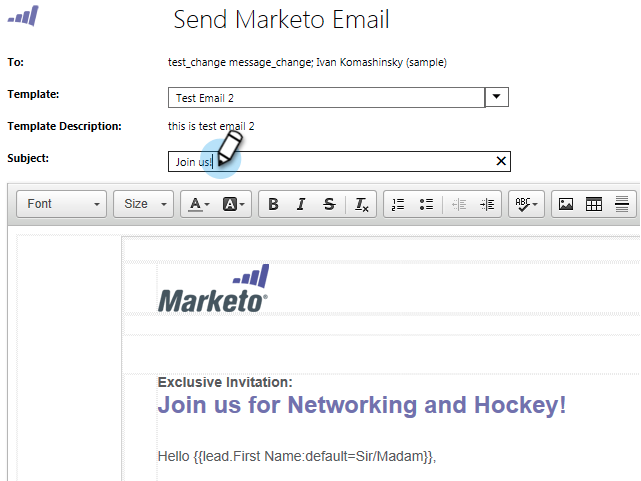

# Notas de la versión: octubre de 2014 {#release-notes-october}

Compruebe la disponibilidad de las funciones en Marketo Edition. La documentación estará disponible en el momento de la publicación.

## Enfoque del programa en el calendario de marketing {#program-focus-in-marketing-calendar}

[Cree y edite entradas](/help/marketo/product-docs/core-marketo-concepts/marketing-calendar/understanding-the-calendar/understand-enable-program-focus.md) directamente desde el calendario de marketing.

## Nuevas llamadas a la API REST {#new-rest-api-calls}

Utilice la API para extraer nuevas actividades o cambios en los posibles clientes:

* Obtener cambios de posibles clientes
* Obtener actividades de posibles clientes
* Obtener tipos de actividades
* Obtener token de paginación

Los detalles completos estarán disponibles después del lanzamiento en [https://experienceleague.adobe.com/en/docs/marketo-developer/marketo/rest/rest-api](https://experienceleague.adobe.com/en/docs/marketo-developer/marketo/rest/rest-api).

## MSI - Enviar correo electrónico de Marketo para [!DNL Microsoft Dynamics] {#msi-send-marketo-email-for-microsoft-dynamics}

[Envíe y rastree correos electrónicos de ventas](/help/marketo/product-docs/marketo-sales-insight/msi-for-microsoft-dynamics/setting-up-and-using/send-a-marketo-sales-email-from-microsoft-dynamics.md) a posibles clientes y contactos de [!DNL Microsoft Dynamics].

## MSI - Agregar a campañas de Marketo para [!DNL Microsoft Dynamics] {#msi-add-to-marketo-campaigns-for-microsoft-dynamics}

[Agregue posibles clientes y contactos a las campañas inteligentes de Marketo](/help/marketo/product-docs/marketo-sales-insight/msi-for-microsoft-dynamics/setting-up-and-using/add-a-lead-contact-to-a-marketo-campaign-from-microsoft-dynamics.md) directamente desde [!DNL Microsoft Dynamics]. El marketing puede elegir qué campañas de Marketo están disponibles para las ventas.

## Compatibilidad con entidades personalizadas para la sincronización de [!DNL Microsoft Dynamics] {#custom-entity-support-for-microsoft-dynamics-sync}

[Use datos de objeto personalizados](/help/marketo/product-docs/crm-sync/microsoft-dynamics-sync/microsoft-dynamics-sync-details/enable-sync-for-a-custom-entity.md) de [!DNL Microsoft Dynamics] para filtrar y activar en listas inteligentes, campañas inteligentes, programas...

## Compatibilidad con accionistas para la sincronización de [!DNL Microsoft Dynamics] {#shareholder-support-for-microsoft-dynamics-sync}

Sincronizar los datos de accionista de oportunidad de [!DNL Dynamics]. También se admiten oportunidades conectadas a una cuenta mediante el campo &quot;Cuenta principal&quot;, así como oportunidades conectadas a contactos mediante la sincronización &quot;Contacto principal&quot;.

## RTP: mejoras en el panel {#rtp-dashboard-enhancements}

El tablero ahora se ha mejorado para incluir más datos de un vistazo:

* Total de visitas a la organización
* Principales 5 sectores industriales
* Total de visitantes comprometidos

## RTP: nuevas plantillas móviles para campañas {#rtp-new-mobile-templates-for-campaigns}

[Cree campañas móviles](/help/marketo/product-docs/web-personalization/using-templates/using-templates-to-create-web-campaigns.md) rápida y fácilmente con estas nuevas plantillas.

## RTP: API de contexto de usuario {#rtp-user-context-api}

Utilice una nueva llamada que rastree el historial de visitas anteriores de los visitantes. Personalice las campañas en función de las necesidades del visitante:

* Páginas anteriores vistas
* Productos interesados en
* Qué campañas de RTP han visto

Visite [https://experienceleague.adobe.com/en/docs/marketo-developer/marketo/javascriptapi/rich-media-recommendation](https://experienceleague.adobe.com/en/docs/marketo-developer/marketo/javascriptapi/rich-media-recommendation) para obtener información detallada.
