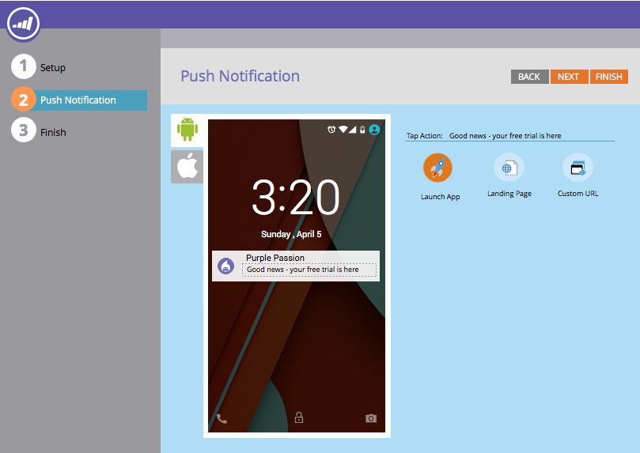

# Notas de la versión: abril de 2015 {#release-notes-april}

En la versión de abril de 2015 se incluyen las siguientes funciones. Compruebe la disponibilidad de las funciones en Marketo Edition. Después del lanzamiento, asegúrese de volver para encontrar vínculos a artículos detallados para cada función.

## Rediseño del hogar de Analytics

[Rediseño del hogar de Analytics](/help/marketo/product-docs/reporting/basic-reporting/creating-reports/navigating-the-analytics-home-page.md)

>[!NOTE]
>
>Esta función se lanzará el martes 28 de abril.

La nueva página de inicio [[!UICONTROL Analytics]](/help/marketo/product-docs/reporting/basic-reporting/creating-reports/navigating-the-analytics-home-page.md) permite un acceso rápido para ejecutar informes específicos en los tipos de informes disponibles.

Además, ahora está disponible la organización de informes privados frente a compartidos. Cree o arrastre informes a la carpeta [!UICONTROL Mis informes] para impedir que otros usuarios los vean, editen o eliminen. [!UICONTROL Informes de grupo] se comparten entre todos los usuarios.

## Marketo Mobile Engagement {#marketo-mobile-engagement}

**Participación de Marketo Mobile**

Con Marketo Mobile Engagement, ofrecer experiencias móviles atractivas es fácil. Cree campañas altamente personalizadas que proporcionen contenido atractivo sin tener que depender nunca de un equipo de desarrollo de aplicaciones. Los nuevos filtros y déclencheur le permiten escuchar y responder en el canal móvil mediante notificaciones push.

## Integración del acelerador de clientes potenciales [!DNL LinkedIn]

[Integración del acelerador de clientes potenciales [!DNL LinkedIn]](/help/marketo/product-docs/demand-generation/social/social-functions/use-a-marketo-list-or-smart-list-as-a-linkedin-audience-segment.md)

Amplíe su estrategia de nutrición de clientes potenciales a anuncios sociales y de exhibición de pago. La integración de red de anuncios [ad](/help/marketo/product-docs/demand-generation/ad-network-integrations/add-linkedin-matched-audiences-as-a-launchpoint-service.md) con el acelerador de clientes potenciales [!DNL LinkedIn] le permite crear de forma segura un segmento de audiencia dentro de [!DNL LinkedIn] basado en los miembros de cualquier lista inteligente o estática. Los miembros dentro de un segmento de audiencia [!DNL LinkedIn] se pueden nutrir con una secuencia de anuncios relevantes.

## Marketo [!DNL Sales Insight] para [!DNL Salesforce1] {#marketo-sales-insight-for-salesforce}

Sus características favoritas de [!DNL Sales Insight] (fuente de posibles clientes, mejores apuestas, momentos interesantes y agregar a Marketo Campaign) están disponibles en la aplicación [!DNL Salesforce1].

 

## RTP: Account-Based Marketing Analytics {#rtp-account-based-marketing-analytics}

**RTP - Account-Based Marketing Analytics**

Obtenga visibilidad instantánea del rendimiento de sus listas de cuentas con nombre clave en función de cada fase del ciclo de compra, con el nuevo gráfico de rendimiento de sus listas de cuentas con nombre. El gráfico muestra el estado de la visita desde la organización clave, desde la sensibilización hasta la acción, en función del número de visitas y el estado del visitante.
