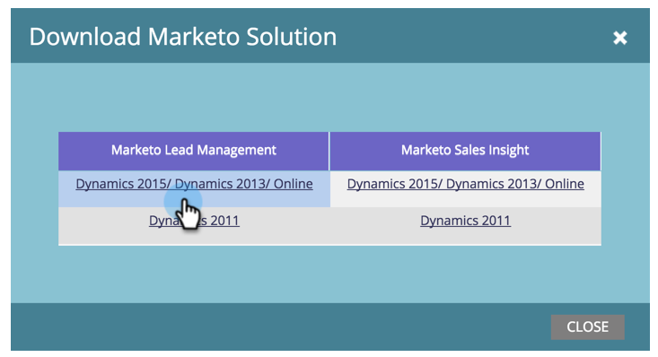

# Notas de la versión: marzo de 2015 {#release-notes-march}

En la versión de marzo de 2015 se incluyen las siguientes funciones. Compruebe la disponibilidad de las funciones en Marketo Edition. Después del lanzamiento, asegúrese de volver para encontrar vínculos a artículos detallados para cada función.

## Calendario HD {#calendar-hd}

Muestra las actividades de marketing de su equipo con el nuevo modo de presentación del calendario. ¡Son ideales para televisores o monitores gigantes alrededor de la oficina! Establece y muestra objetivos basados en una lista inteligente o en métricas personalizadas.

>[!NOTE]
>
>Esta característica no está disponible para las ediciones Spark y [!DNL Standard].

## Integración de [!DNL Google Adwords] {#google-adwords-integration}

Vincula tu cuenta de [[!DNL Google AdWords] a Marketo](/help/marketo/product-docs/administration/additional-integrations/add-google-adwords-as-a-launchpoint-service.md) para cargar automáticamente los datos de conversión sin conexión de Marketo a [!DNL Google AdWords]. A continuación, desde la interfaz de usuario de [!DNL AdWords], podrá ver fácilmente qué clics dieron como resultado posibles clientes calificados, oportunidades y nuevos clientes (o las fases de ingresos que desee rastrear).

## Rediseño de [!UICONTROL Explorador de ingresos] {#revenue-explorer-redesign}

[!UICONTROL Explorador de ingresos] tiene un aspecto completamente nuevo, así como el nuevo tipo de gráfico Sunburst. Esto se va a llevar a cabo durante las dos primeras semanas de abril.

## Nuevas API de REST de recursos {#new-asset-rest-apis}

[Nuevas API de REST de recursos](https://experienceleague.adobe.com/en/docs/marketo-developer/marketo/rest/assets/assets)

Ahora tenemos compatibilidad para crear y editar correos electrónicos, plantillas, mis tokens, archivos y fragmentos de código [a través de la API](https://developer.adobe.com/marketo-apis/api/asset/).

## [!DNL Microsoft Dynamics] 2015 local {#microsoft-dynamics-on-premise}

Ahora se admite con el instalador más reciente [accesible a través de la aplicación](/help/marketo/product-docs/crm-sync/microsoft-dynamics-sync/sync-setup/update-the-marketo-solution-for-microsoft-dynamics.md).

## RTP: participación web personalizada con datos de posibles clientes {#rtp-personalized-web-engagement-with-lead-data}

Aproveche los [campos de datos de posibles clientes](/help/marketo/product-docs/web-personalization/using-web-segments/manage-person-data.md) que tiene en la base de datos de posibles clientes de Marketo para crear campañas de segmentación en tiempo real y contenido personalizado. Administre los campos de datos de posibles clientes en RTP y agregue o elimine los campos de posibles clientes relevantes.

## RTP: Personalización del contenido web por correo electrónico o nombre de campaña del programa {#rtp-personalize-web-content-by-email-or-program-campaign-name}

Continúe la conversación con el posible cliente en todos los canales, desde el correo electrónico a la web. [Personalice el contenido entrante en función del nombre del programa o la campaña de correo electrónico](/help/marketo/product-docs/web-personalization/using-web-segments/web-segments.md) que se use en las actividades de marketing de Marketo.
