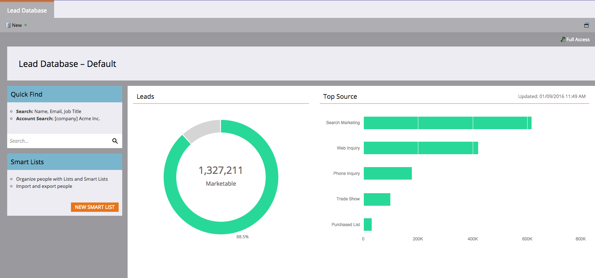

# Notas de la versión: Invierno &#39;16 {#release-notes-winter}

Las siguientes funciones están incluidas en la versión de invierno de 2016. Haga clic en los vínculos de título para ver los artículos detallados de cada función.

## [Es un filtro anónimo](/help/marketo/product-docs/administration/additional-integrations/add-munchkin-tracking-code-to-your-website/next-generation-munchkin-tracking-faq.md) {#is-anonymous-filter}

El filtro Es anónimo se ha eliminado de las listas inteligentes. Consulte el documento [Next Generation Munchkin Tracking FAQ](/help/marketo/product-docs/administration/additional-integrations/add-munchkin-tracking-code-to-your-website/next-generation-munchkin-tracking-faq.md) para obtener más información. Este cambio no afecta a la personalización web (RTP), que continúa identificando visitantes web anónimos y conocidos y personalizando el contenido en tiempo real para estos visitantes.

## [Panel de bases de datos](/help/marketo/product-docs/core-marketo-concepts/smart-lists-and-static-lists/managing-people-in-smart-lists/database-dashboard.md) {#database-dashboard}

La base de datos de posibles clientes tiene un panel de resumen actualizado que incluye el tamaño total de la base de datos de personas, el número de posibles clientes comercializables y un desglose de posibles clientes por las cinco fuentes principales.

## [Explorador de Microsoft Edge](/help/marketo/product-docs/administration/setup-administration/supported-browsers.md) {#microsoft-edge-browser}

Hemos agregado Microsoft Edge a la [lista de exploradores](https://docs.marketo.com/display/public/DOCS/Supported+Browsers) admitidos por Marketo.

## [Microsoft Outlook 2016](/help/marketo/product-docs/marketo-sales-insight/msi-outlook-plugin/install-the-marketo-email-add-in-for-outlook-with-a-registration-code.md) {#microsoft-outlook}

[Ahora se admite Microsoft Outlook 2016](/help/marketo/product-docs/marketo-sales-insight/msi-outlook-plugin/install-the-marketo-email-add-in-for-outlook-with-a-registration-code.md) .

## [Inicio del encabezado del programa de correo electrónico](/help/marketo/product-docs/email-marketing/email-programs/email-program-actions/head-start-for-email-programs.md) {#email-program-head-start}

Utilice Head Start para indicar que el procesamiento del envío debe realizarse con antelación. En lugar de clasificar posibles clientes y preparar correos electrónicos a la hora programada del programa, Head Start garantiza que estas tareas se realicen de antemano. De este modo, la audiencia comenzará a recibir correos electrónicos a la hora programada.

Para utilizar esta función, el programa de correo electrónico debe programarse con al menos 12 horas de antelación y la lista inteligente se bloqueará 12 horas antes del envío.

>[!NOTE]
>
>Esta función se implementará gradualmente durante una semana después de la versión de invierno &#39;16. No está disponible para su uso con campañas inteligentes o la API.

## [Mejoras de marketing móvil](/help/marketo/product-docs/mobile-marketing/admin/add-a-mobile-app.md) {#mobile-marketing-enhancements}

**Compatibilidad con PhoneGap:** ahora ofrecemos compatibilidad con PhoneGap para su aplicación móvil. [Obtenga más información](https://developers.marketo.com/documentation/mobile/phonegap-plugin/).

**Compatibilidad con aplicaciones de espacio aislado**:

## [API de programa](https://developers.marketo.com/documentation/programs/) {#program-api}

Cree, actualice y clone programas a través de la API de REST. Esto no incluye la creación o actualización de listas inteligentes y campañas inteligentes dentro de un programa.

## [Mejoras de Microsoft Dynamics](/help/marketo/product-docs/crm-sync/microsoft-dynamics-sync/microsoft-dynamics-sync-details/sync-status.md) {#microsoft-dynamics-enhancements}

**[Estado](/help/marketo/product-docs/crm-sync/microsoft-dynamics-sync/microsoft-dynamics-sync-details/sync-status.md)** de sincronización: Mantenga las pestañas en el rendimiento actual y el trabajo pendiente del proceso de sincronización. Desglose por el número de inserciones y actualizaciones por objeto.

**[Notificaciones](/help/marketo/product-docs/core-marketo-concepts/miscellaneous/understanding-notifications/notification-types.md)**: Reciba notificaciones para errores de sincronización comunes, junto con una lista de posibles clientes que tengan ese error.

## [Mejoras en los objetos personalizados](/help/marketo/product-docs/administration/marketo-custom-objects/create-marketo-custom-objects.md) {#custom-objects-enhancements}

Ahora puede crear relaciones de varios a varios entre posibles clientes y cuentas y un objeto personalizado utilizando un objeto intermedio con varios campos de vínculo.

## [Anuncios de posible cliente de facebook](/help/marketo/product-docs/demand-generation/facebook/set-up-facebook-lead-ads.md) {#facebook-lead-ads}

[Los ](https://www.facebook.com/business/a/lead-ads) anuncios de facebook Lead son una forma más directa de que una empresa ejecute campañas de generación de posibles clientes en Facebook. Las personas rellenan un formulario para expresar interés por un producto o servicio, de modo que la empresa pueda realizar el seguimiento con ellos. La integración de Marketo con los anuncios de posibles clientes de Facebook captura automáticamente la información que proporciona un posible cliente en el formulario de anuncios de posibles clientes. Las acciones de seguimiento y las notificaciones se pueden automatizar mediante el nuevo déclencheur de relleno de anuncios de posibles clientes de Facebook.

## [Programador de campañas web (personalización en tiempo real)](/help/marketo/product-docs/web-personalization/working-with-web-campaigns/schedule-a-web-campaign.md) {#web-real-time-personalization-campaign-scheduler}

Programe la campaña con antelación. Configure una fecha de inicio y de finalización para contenido web personalizado y repita campañas en días y horas específicos. Personalice la programación para mostrar la campaña según la hora del visitante web o el huso horario seleccionado.

