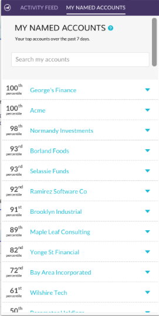
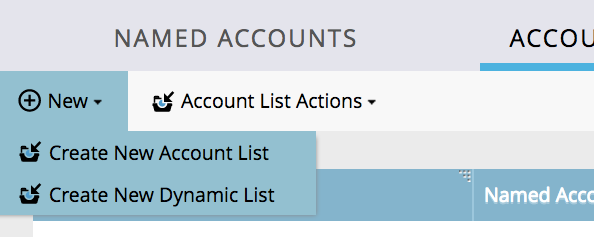

# Notas de la versión: Mejoras de ABM en agosto de 2017 {#release-notes-august-abm-enhancements}

Las siguientes funciones están incluidas en la versión de mejora de ABM de agosto de 1717. Compruebe la disponibilidad de las funciones en Marketo Edition.

Haga clic en los vínculos del título para ver los artículos detallados de cada función.

## [!DNL Account Insight] {#account-insight}

**[[!DNL Account Insight]](/help/marketo/product-docs/target-account-management/setup-tam/account-insight-plug-in-overview.md)** es un complemento de [!DNL Google Chrome] que muestra a sus equipos de ventas información sobre cuentas y ABM procesables, lo que les permite trabajar en estrecha colaboración con el departamento de marketing para atraer cuentas de forma eficaz. Los equipos de ventas obtendrán visibilidad de los datos y las perspectivas generados para cada una de las cuentas con nombre que poseen. Esto incluirá percentiles de puntuación de la cuenta, una lista priorizada de sus cuentas con nombre, personas comprometidas dentro de esas cuentas y un flujo de actividad en vivo de actividades recientes desde la cuenta.

 

## [Listas de cuentas dinámicas](/help/marketo/product-docs/target-account-management/target/account-lists.md) {#dynamic-account-lists}

Estamos agregando una nueva forma de crear listas de cuentas en ABM. Además de las listas de cuentas existentes, ahora puede crear listas de cuentas dinámicas que se generan a partir de vistas de cuentas de CRM públicas. Una vista de cuenta de CRM es un conjunto de reglas que actúa como filtro al mostrar cuentas. Por ejemplo, puede usarlo para buscar cuentas en las que el sector es atención médica _y_ los ingresos superan los 100 millones de dólares.

