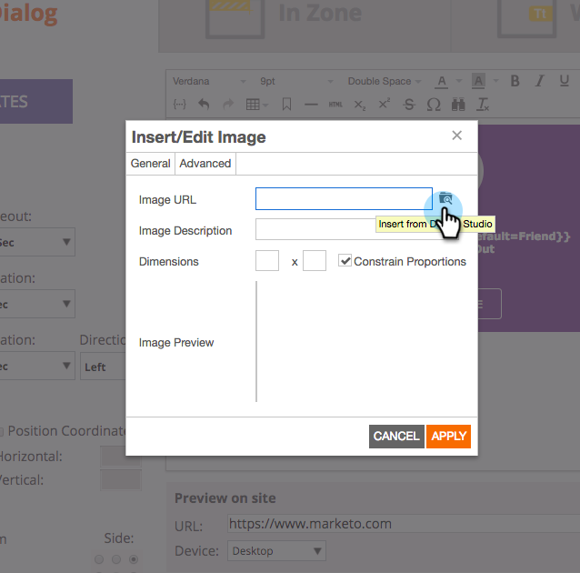

# Notas de la versión: Otoño del 2017 {#release-notes-fall}

Las siguientes funciones están incluidas en la versión del 17 de otoño. Compruebe la disponibilidad de las funciones en su edición de Marketo.

Haga clic en los vínculos de título para ver los artículos detallados de cada función. Nota: Algunas de las funciones incluidas en esta versión no tienen artículos asociados. Si un tema tiene varios subencabezados, los vínculos se colocan allí.

## Fiabilidad del sistema {#system-reliability}

Hemos realizado más mejoras en la infraestructura central de Marketo, incluida una mejor secuenciación, menos desajustes y una mejor estabilidad de Munchkin.

## Rendimiento de sincronización SFDC {#sfdc-sync-performance}

Aproveche la sincronización más rápida y enriquecida entre Marketo y Salesforce. Los cambios de datos que requieren actualizaciones masivas de cuentas o posibles clientes se pueden dividir en colas paralelas para evitar los retrasos. Los eventos y las tareas ahora también se sincronizan hasta un 50% más rápido.

## Mejoras en el rendimiento de Analytics {#analytics-performance-improvements}

Las mejoras recientes en la infraestructura ofrecen un aumento del tiempo de actividad y la estabilidad dentro de las herramientas de análisis e informes de Marketo, lo que le permite crear informes ad hoc más rápidamente.

## [Zona horaria del destinatario](/help/marketo/product-docs/email-marketing/email-programs/email-program-actions/scheduling-with-recipient-time-zone/understanding-recipient-time-zone.md) {#recipient-time-zone}

Con esta nueva función, ahora puede retener y enviar correos electrónicos según las zonas horarias locales. Los programas de correo electrónico y participación se pueden configurar para que se entreguen en las zonas horarias de los destinatarios, lo que elimina la necesidad de crear varios programas; enviar una vez y Marketo retendrá automáticamente el correo electrónico hasta la hora local correcta. Alza las métricas de correo electrónico, observa las prácticas locales y ahorra tiempo al usar un solo programa globalmente.

>[!NOTE]
>
>Si todavía no puede habilitar la zona horaria del destinatario en sus programas de correo electrónico y participación, no se asuste. Estamos habilitando gradualmente esta función para todos los clientes.

## [Revisar correos electrónicos de muestra por segmento](/help/marketo/product-docs/email-marketing/general/creating-an-email/send-a-sample-email.md) {#review-sample-emails-by-segment}

Marketo tiene una nueva opción para elegir un segmento al enviar correos electrónicos de muestra para su revisión. Ya no es necesario determinar manualmente a qué segmento pertenece un posible cliente, lo que facilita el envío de correos electrónicos con contenido dinámico a diferentes segmentos.

## [Preguntas personalizadas de la Generación de posibles clientes de linkedIn](/help/marketo/product-docs/demand-generation/social/social-functions/set-up-linkedin-lead-gen-forms.md) {#linkedin-lead-gen-custom-questions}

Personalice los formularios de LinkedIn Lead Gen para recopilar atributos de posible cliente personalizados. Ahora puede realizar hasta tres preguntas personalizadas por formulario, elegir entre una entrada de texto de una sola línea o preguntas de opción múltiple y volver a asignar a los campos de posible cliente de Marketo.

## Integración de Slack {#slack-integration}

Hemos lanzado dos funciones como parte de nuestra nueva integración de Slack:

* Notificaciones del sistema: Obtenga notificaciones de los Slack sobre eventos importantes en su instancia de Marketo, como alertas sobre estados de campañas actuales y cualquier problema que requiera atención inmediata.
* Momentos interesantes: Cuando una persona conocida ha activado Marketo Insight desde una cuenta de ventas, los propietarios potenciales pueden recibir notificaciones por medio de un Slack. Las notificaciones incluyen información sobre posibles clientes, así como detalles sobre la cuenta de ventas.

## Mejoras de ABM {#abm-enhancements}

**[Mostrar cuentas sin contactos](https://docs.marketo.com/x/fKCt)**

Marketo ABM ahora sincroniza y muestra cuentas CRM sin contactos. Incluya nuevas cuentas sin historial de ventas o marketing previo y rastree el progreso al hacer coincidir los posibles clientes subsiguientes con las cuentas.

## ContentAI Analytics {#contentai-analytics}

**[Nuevo filtro de lista de cuentas ABM](https://docs.marketo.com/x/1BPG)**

Vea y compare el rendimiento del contenido en las Listas de cuentas de ABM para optimizar el contenido existente. ContentAI le muestra:

* contenido más visitado
* contenido convertido principal
* Contenido sugerido por IA para actividades de marketing

## Mejoras en la personalización web {#web-personalization-enhancements}

**[Tokens para campañas web](/help/marketo/product-docs/web-personalization/working-with-web-campaigns/using-the-web-personalization-rich-text-editor.md)**

Los tokens ya están disponibles para su uso en campañas web. Aproveche los tokens para ofrecer contenido y mensajes personalizados con el fin de aumentar la participación en las campañas web.

**[Diseño de imágenes de Studio en Web Campaign Editor](/help/marketo/product-docs/web-personalization/working-with-web-campaigns/using-the-web-personalization-rich-text-editor.md)**

Ahorre tiempo reutilizando recursos creativos e imágenes en varios canales dentro de Marketo.

## Integración  {#integration}

**[API de vista previa de correo electrónico](https://developers.marketo.com/rest-api/assets/emails/)**

Ahora puede previsualizar el correo electrónico de forma remota fuera de Marketo, lo que simplifica el proceso de localización del contenido del correo electrónico y reduce los errores.

**[Reemplazar la API del HTML](https://developers.marketo.com/rest-api/assets/emails/)**

Los desarrolladores pueden actualizar el contenido del HTML de los recursos de correo electrónico de forma remota, lo que les permite trabajar en un solo sistema para mantener los recursos.
