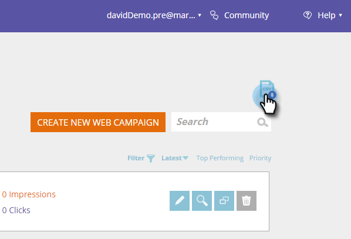

# Notas de la versión: Invierno de 2017 {#release-notes-winter}

En la versión de invierno de 17 se incluyen las siguientes funciones. Compruebe la disponibilidad de las funciones en Marketo Edition.

Haga clic en los vínculos del título para ver los artículos detallados de cada función.

>[!NOTE]
>
>Si un tema tiene varios subencabezados, los vínculos se colocan allí.

## [Coincidencia avanzada para audiencias personalizadas de Facebook](/help/marketo/product-docs/demand-generation/ad-network-integrations/add-facebook-custom-audiences-as-a-launchpoint-service.md) {#advanced-matching-for-facebook-custom-audiences}

La coincidencia básica solo utiliza direcciones de correo electrónico, pero la nueva coincidencia avanzada utiliza siete campos adicionales, lo que aumenta la tasa de coincidencia para obtener más conversión.

## [API de importación de objeto personalizado](https://developer.adobe.com/marketo-apis/api/mapi/#tag/Custom-Objects) {#custom-object-import-api}

Esta API proporciona una interfaz más rápida para sincronizar objetos personalizados en Marketo. Puede importar archivos de hoja de cálculo CSV, TSV o SSV en Marketo como objetos personalizados.

## [Exportación de campañas de personalización web](/help/marketo/product-docs/web-personalization/working-with-web-campaigns/export-web-campaign-data.md) {#web-personalization-campaigns-export}

Exporte todos los detalles y análisis de su campaña web en formato CSV. A continuación, puede ver los datos con un diseño conveniente.

## Localización {#localization}

Las aplicaciones de personalización web, contenido predictivo y perspectivas de correo electrónico ya están disponibles en japonés, alemán y español. Usted [seleccione su idioma y configuración regional](/help/marketo/product-docs/administration/settings/select-your-language-locale-and-time-zone.md) para ver el contenido en estos idiomas.

## Mejoras de marketing basado en cuentas {#account-based-marketing-enhancements}

**[Importar cuentas con nombre](/help/marketo/product-docs/target-account-management/target/named-accounts/import-named-accounts.md)**

Con la opción Named Account Import, cree o actualice varios registros a la vez mediante la carga de CSV.

**[Compatibilidad con Email Insights](/help/marketo/product-docs/reporting/email-insights/filtering-in-email-insights.md)**

Utilice la cuenta con nombre o la lista de cuentas como dimensiones en las perspectivas de correo electrónico.

## Mejoras en el contenido predictivo {#predictive-content-enhancements}

**[Filtrar por fuente habilitada](/help/marketo/product-docs/predictive-content/working-with-predictive-content/understanding-predictive-content.md)**

Filtre los fragmentos de contenido predictivo que estén habilitados para correo electrónico, medios enriquecidos o la barra de recomendaciones.

**[Filtrar Analytics por fuente](/help/marketo/product-docs/predictive-content/working-with-predictive-content/understanding-predictive-content.md)**

Filtre los análisis de contenido predictivo para fuentes específicas: correo electrónico, medios enriquecidos o barra de recomendaciones.

**Editor de contenido predictivo**

Hay una experiencia de edición y un diseño mejorados que dividen la preparación de contenido por fuente: correo electrónico, medios enriquecidos o barra de recomendaciones.

**[Contenido de detección automática para predicción](/help/marketo/product-docs/predictive-content/getting-started/enable-content-discovery.md)**

La URL de imagen y los metadatos ahora se utilizan en el proceso de detección automática de contenido.

## [Mejoras de SDK](https://experienceleague.adobe.com/en/docs/marketo-developer/marketo/mobile/mobile) {#sdk-enhancements}

Los desarrolladores ahora tienen control adicional sobre el envío de notificaciones push con la adición de una nueva llamada de API de SDK que permite a los desarrolladores eliminar tokens push.

## [Integración de LaunchPoint con SMS de Vibes](/help/marketo/product-docs/mobile-marketing/vibes-sms-messages/using-sms-options-in-a-smart-campaign.md) {#vibes-sms-launchpoint-integration}

Mejore su segmentación con una nueva opción de filtro, &quot;Miembro de la lista de vibraciones&quot;.

## [Obsolescencia del editor de texto enriquecido y del editor de formularios 1.0 heredados](https://nation.marketo.com/docs/DOC-4315) {#legacy-rich-text-editor-and-form-editor-deprecation}

A partir del 1 de agosto de 2017, los clientes que sigan utilizando el Editor de texto enriquecido y el Editor de formularios 1.0 heredados pasarán automáticamente a la nueva experiencia.

## [API de actividad de Marketo](https://developers.marketo.com/blog/important-change-activity-records-marketo-apis/) {#marketo-activity-apis}

Se está produciendo un cambio importante en las API de actividad de Marketo. ¿Estás preparado?
