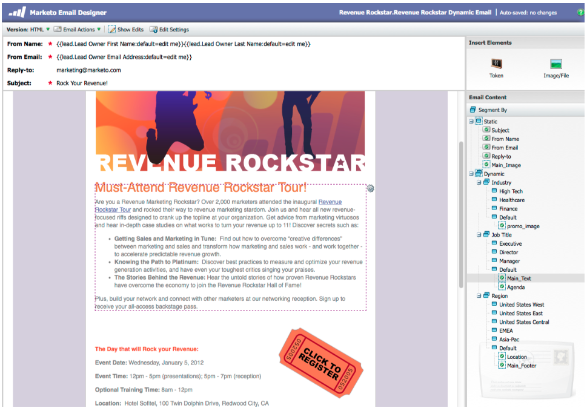
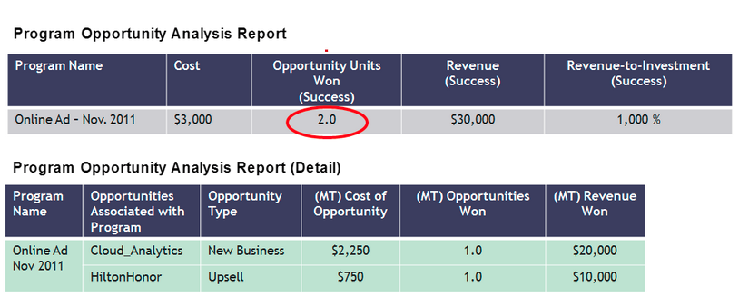
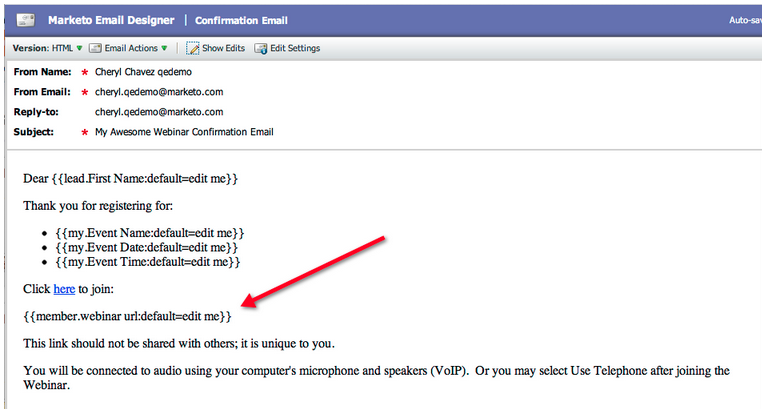
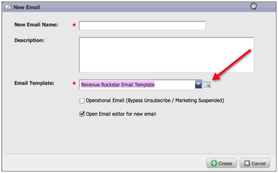
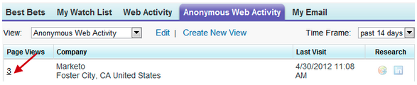
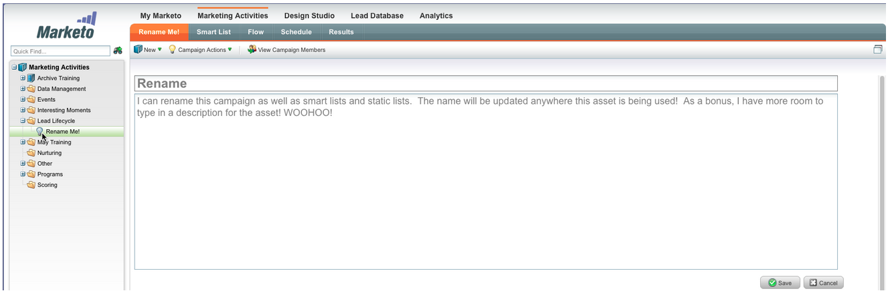
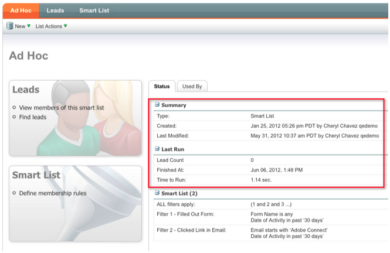
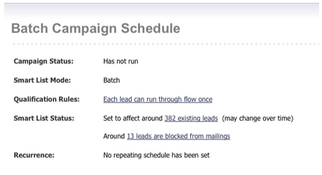
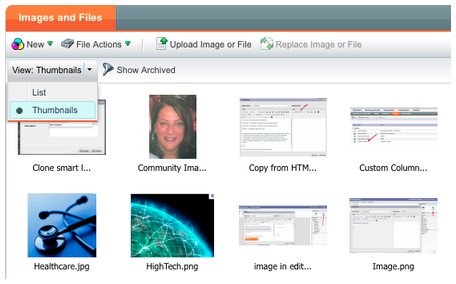
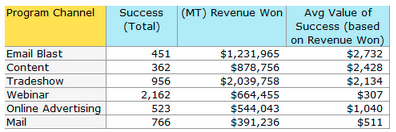

# 2012

## Enero/febrero de 2012 {#january-february}

En la versión de enero/febrero se incluyen las siguientes funciones. Compruebe la disponibilidad de las funciones en Marketo Edition. Vuelva después del lanzamiento para ver los vínculos a la documentación detallada de las funciones.

## Contenido dinámico avanzado {#advanced-dynamic-content}

_Disponible para las versiones Pro y Enterprise_

Con el contenido dinámico avanzado puede crear comunicaciones por correo electrónico y páginas de aterrizaje atractivas relevantes para su audiencia sin tener que crear varios recursos para el mismo mensaje. Los controladores de vista previa actualizados le permiten ver cada versión única en una sola pantalla.

## Segmentación  {#segmentation}

_Disponible para las versiones Pro y Enterprise_

La segmentación es un grupo de segmentos, que son un grupo segmentado de personas a las que comercializa. Los segmentos se definen mediante reglas que se rigen por criterios de filtro similares a las listas inteligentes. Sus segmentos pueden basarse en datos demográficos, como el puesto o el sector, o en comportamientos como páginas web visitadas o vínculos en los que se ha hecho clic.

## Fragmentos {#snippets}

_Disponible para las versiones Pro y Enterprise_

Almacene contenido enriquecido que se pueda utilizar una y otra vez para crear correos electrónicos y páginas de aterrizaje estáticos o dinámicos.

## PURL {#purls}

_Disponible para las versiones Pro y Enterprise_

Gracias a las direcciones URL personalizadas (PURL), los especialistas en marketing ahora pueden crear direcciones URL específicas del contacto para impulsar la personalización, la mensurabilidad y las respuestas de alza en programas de marketing multitáctil tanto para campañas de correo directo como de correo electrónico.

## Compatibilidad con la directiva de privacidad de la UE {#eu-privacy-directive-support}

Las nuevas funciones para respetar la configuración de &quot;No rastrear&quot; del navegador incluyen la capacidad de deshabilitar el seguimiento de posibles clientes anónimos; esto facilita el cumplimiento de las regulaciones de seguimiento de privacidad más estrictas de la UE.

## Inicio de sesión único {#single-sign-on}

Las organizaciones ahora tienen la capacidad de admitir un inicio de sesión sin problemas en la aplicación de Marketo mediante SAML 2.0 para el inicio de sesión único desde un portal corporativo.

## Editores de correo electrónico y páginas de aterrizaje actualizados {#updated-email-and-landing-page-editors}

Los editores de correo electrónico y páginas de aterrizaje se han rediseñado con una interfaz más atractiva, una navegación intuitiva y una experiencia de usuario considerablemente mejorada. Esto incluye lo siguiente:

Una vista de texto y HTML en paralelo

El nombre del formulario, el correo electrónico de origen, la respuesta a (NUEVO) y el asunto se muestran en el editor. Se puede acceder a todas las demás configuraciones mediante el botón Editar configuración.

## Compatibilidad con navegadores {#browser-support}

* [!DNL Mozilla Firefox] 9.0
* [!DNL Google Chrome] 16
* [!DNL Microsoft Internet Explorer] 8 &amp; 9
* **Nota**: ya no se admite [!DNL Internet Explorer] 7

## Administración de programas {#program-management}

La administración simplificada de programas mejora la facilidad de uso con la eliminación de tokens y la eliminación sencilla de programas.

## Cancelar suscripción al informe de suscripción {#unsubscribe-from-subscription-report}

Ahora puede cancelar la suscripción directamente desde el informe.

## Actualizaciones de Munchkin {#munchkin-updates}

Las nuevas llamadas de Munchkin reducen los tiempos de carga de las páginas web y proporcionan un rendimiento más coherente para los eventos de vínculos de clics.

## Análisis de oportunidad de programa (solo RCA) {#program-opportunity-analysis-rca-only}

Comprender la contribución de marketing a los ingresos de oportunidades individuales

## Análisis de fase de ingresos del programa {#program-revenue-stage-analysis}

Consiga insight en velocidad de avance del programa al comprender qué programas adquirieron los impulsores rápidos

## Marzo de 2012 {#march}

## Resolver mis tokens {#resolve-my-tokens}

Mis tokens (tokens de programa) se resolverán al obtener una vista previa de un correo electrónico, al enviar un correo electrónico de prueba y al enviar un correo electrónico local mediante una sola acción de flujo. Ya no tendrá que crear una campaña inteligente dentro del programa para probar Mis tokens.

## Alternar entre Previsor y Editor en correos electrónicos y páginas de aterrizaje {#toggle-between-previewer-and-editor-in-emails-and-landing-pages}

Con un solo clic, puede ir y volver fácilmente entre el editor y el previsualizador.

Editor para previsualizador:

Visualizador en el editor:

## Previsor de fragmentos {#snippet-previewer}

Seleccionar &quot;Vista previa de fragmento&quot; en el menú le permite ver un fragmento, sin convertirlo en borrador. Además, si tiene acceso de solo lectura a un fragmento compartido (a través de espacios de trabajo), puede ver el fragmento con esta acción.

## Enviar varios correos electrónicos de prueba {#send-multiple-test-emails}

Con la adición de contenido dinámico, es cada vez más importante previsualizar y probar todas las variaciones de los correos electrónicos que se pueden enviar a los posibles clientes. Cuando obtiene una vista previa con Ver por detalle de posibles clientes, tiene la opción de enviar una prueba para las variaciones de la lista de posibles clientes (hasta 100 correos electrónicos de prueba).

## Páginas de aterrizaje dinámicas basadas en el parámetro de URL {#dynamic-landing-pages-based-on-url-parameter}

Los posibles clientes anónimos constituyen una cantidad significativa de las visitas a sus páginas de aterrizaje. Con la adición de contenido dinámico y la capacidad de colocar la segmentación en la dirección URL como parámetro, puede mostrar dinámicamente el contenido de la página de aterrizaje cuando un posible cliente anónimo o conocido haga clic en el vínculo.

## Abril de 2012 {#april}

## Filtros y Déclencheur de segmentación {#segmentation-filters-and-triggers}

¿Se dirige al mismo grupo de posibles clientes de forma consistente? Si es así, utilice la segmentación en las listas inteligentes para segmentar posibles clientes. Con la segmentación, toda la base de datos de posibles clientes siempre se segmenta y se puede reutilizar en todos los programas para mantener la coherencia. Los resultados de la segmentación se extraen rápidamente porque no requieren que la lista inteligente se ejecute en el momento de la solicitud.

## Inserte valores externos en el contenido del correo electrónico y otros pasos de flujo mediante las funciones de API ampliadas {#insert-external-values-into-email-content-and-other-flow-steps-through-expanded-api-capabilities}

* La API de solicitud de campaña ahora le permite enviar valores para Mis tokens para esa ejecución concreta de la campaña, lo que resulta especialmente útil para rellenar contenido de correo electrónico mediante la API
* Las nuevas API Cargar a lista y Programar campaña admiten lo anterior para listas de posibles clientes y campañas por lotes.

## Correos electrónicos de confirmación más sencillos para [!DNL GoToWebinar] y [!DNL WebEx] (Adobe Connect y [!DNL ON24] próximamente) {#easier-confirmation-emails-for-gotowebinar-and-webex-adobe-connect-and-on-coming-soon}

Hemos simplificado la URL de confirmación creando un token de miembro que muestra la URL de confirmación de registro única para cada posible cliente. Ya no tendrá que crear esta dirección URL con tokens diferentes. Actualmente está disponible para clientes de [!DNL GoToWebinar] y [!DNL WebEx], y estará disponible para Adobe Connect y [!DNL ON24] en nuestra próxima versión.

## Cargar varias imágenes y archivos con un solo clic! {#upload-multiple-images-and-files-with-a-single-click}

Ahorre tiempo y sea más eficiente al importar imágenes y archivos en Marketo. Si usa [!DNL Firefox] o [!DNL Google Chrome], puede seleccionar varios archivos y cargarlos todos a la vez. Aunque no hay límite en el número de archivos que se pueden cargar, el límite de tamaño individual por archivo es de 50 MB.

Nota: En este momento, esta característica no es compatible con [!DNL Internet Explorer], debido a las limitaciones del explorador.

## Mover texto en un correo electrónico {#move-text-in-an-email}

Puede reordenar los bloques de texto en un correo electrónico. En el editor de texto, seleccione un bloque de texto; al hacer clic en el icono de edición, verá la opción para mover el bloque hacia arriba o hacia abajo.

## Se eliminaron [!DNL Salesforce] referencias para usuarios que no son [!DNL Salesforce] {#salesforce-references-removed-for-non-salesforce-users}

Si no está sincronizando su suscripción con [!DNL Salesforce], notará que se quitan todas las carpetas y acciones de flujo que hacen referencia a [!DNL Salesforce].

## Análisis del ciclo de ingresos de Marketo {#marketo-revenue-cycle-analytics}

**Fases de puerta mejoradas en el Modeler del ciclo de ingresos**

Permite a los usuarios definir un orden para sus reglas de transición.

## Mayo de 2012 {#may}

## Rediseño del informe de rendimiento del correo electrónico {#email-performance-report-redesign}

Nota: Este será un despliegue por fases, a partir de la versión de mayo

Hemos hecho que los informes de Rendimiento de correo electrónico y Rendimiento de correo electrónico de campaña se ejecuten más rápido. También hemos mejorado las definiciones de ciertas métricas y hemos consolidado las métricas &quot;Mensajes enviados&quot; y &quot;Posibles clientes enviados&quot; en una sola métrica, &quot;Enviados&quot;. Hemos combinado &quot;Mensajes entregados&quot; y &quot;Posibles clientes entregados&quot; con &quot;Entregados&quot;.

## Mejoras en pasos de espera {#wait-step-enhancements}

Con las nuevas propiedades de Espera avanzada, puede configurar el paso de espera en una acción de flujo de campaña inteligente para &quot;esperar hasta&quot; un día específico de la semana, el siguiente día hábil o una fecha u hora específicas. Estas mejoras garantizan que los correos electrónicos nutritivos lleguen a la bandeja de entrada durante el horario laboral.

Figura 1. Especifique el paso de espera para finalizar en un día laborable

## Assets archivado oculto {#archived-assets-hidden}

Los recursos archivados se filtran automáticamente de sugerencias automáticas, listas desplegables e informes, lo que facilita la búsqueda de lo que busca.

Figura 2. Ejemplo del filtro de correo electrónico archivado

## Nueva aplicación de registro de eventos para iPad {#new-event-check-in-app-for-ipad}

Simplifique el proceso de registro de eventos con nuestra nueva aplicación para iPad. La aplicación Event Check-in se sincroniza con su programa de Marketo y le permite registrar fácilmente a los inscritos en un evento, así como añadir nuevos posibles clientes sobre la marcha.

Requiere iOS 5.1 o posterior; solo iPad.

Figura 3. Página de inicio de registro de eventos

Figura 4. Registro de eventos: ¡Seleccione su evento!

Figura 5. Protéjalos en

## URL de confirmación de seminario web mejorado {#enhanced-webinar-confirmation-url}

¡Ahora disponible para [!DNL ON24] y Adobe Connect! Incluya un vínculo único en el correo electrónico de confirmación para cada asistente registrado con el nuevo token `{{member.webinar URL}}`. Las mejoras de Adobe Connect también incluyen la capacidad de activar o desactivar el correo electrónico con información de la cuenta de Adobe que incluye el ID de inicio de sesión y la contraseña del usuario.

Figura 6. Llevar a las personas al seminario web

## Vista previa de la plantilla {#template-preview}

¿Busca una plantilla específica al crear el correo electrónico o la página de aterrizaje, pero no está seguro de su aspecto? Con la nueva capacidad de previsualización de plantilla, puede verificar la plantilla seleccionada antes de guardar un nuevo recurso.

Figura 7. Previsualice la plantilla elegida

## Relleno previo de formulario configurable {#configurable-form-prefill}

Controle la cumplimentación previa de datos de formulario en el nivel de suscripción y sobrescriba en el nivel de página de aterrizaje. Sin rellenado previo, puede asegurarse de que el posible cliente proporcione la información más actualizada.

Figura 8. Configuración de rellenado previo de formulario en administración

Figura 9. Editar la configuración de rellenado previo de un formulario en una página de aterrizaje

## Marketo Treasure Chest {#marketo-treasure-chest}

Obtenga acceso a las funciones experimentales desarrolladas por ingenieros de Marketo para mejorar su experiencia de usuario. Esta versión incluye Deshacer correo electrónico, además de la capacidad de introducir comentarios y colaborar con otros usuarios en las páginas de aterrizaje.

\

Figura 10. Características del cofre del tesoro del gerente en administración

## Integración de [!DNL Microsoft Dynamics]® CRM {#microsoft-dynamics-crm-integration}

Sincronice las cuentas, los contactos y los posibles clientes entre Marketo y [!DNL Microsoft Dynamics] CRM Online con nuestra nueva integración prediseñada.

Figura 11. Configuración de [!DNL Microsoft Dynamics]

## Mejoras en Marketo [!DNL Sales Insight] {#marketo-sales-insight-enhancements}

**Opciones de cancelación de suscripción al pie**

Configure cuándo y si se muestra el pie de página de cancelación de suscripción para los correos electrónicos enviados a través de [!DNL Sales Insight].

Figura 12. [!DNL Sales Insight] Configuración en administración

## Carpetas para plantillas de correo electrónico de ventas {#folders-for-sales-email-templates}

Ahora puede organizar las plantillas de correo electrónico compartidas con Marketo [!DNL Sales Insight] en carpetas especificadas, lo que facilita a sus representantes de ventas la búsqueda del correo electrónico correcto.

Figura 13. Elija una carpeta para los correos electrónicos

## Acceder al Analizador de oportunidades desde [!DNL Sales Insight] {#access-opportunity-analyzer-from-sales-insight}

Proporcione a sus representantes de ventas insight en el que las actividades de marketing impulsan la participación mediante el acceso directo al Analizador de oportunidades desde Marketo [!DNL Sales Insight]. Nota. Requiere una licencia de Revenue Cycle Analytics.

## Campo personalizado para el estado de contacto {#custom-field-for-contact-status}

Ahora puede asignar un campo personalizado en [!DNL Salesforce] para rellenar el campo Estado para Contactos en las vistas Mis resultados más probables, Los resultados más probables de mi equipo y Personalizados.

Figura 14. Asignar un campo personalizado a Contactos

Consulte Páginas visitadas por posibles clientes anónimos

Desglose las páginas que vio un posible cliente anónimo desde la vista [!UICONTROL Actividad web anónima].

Figura 15. Consulte Actividad web anónima

## Suscripción de contacto y posible cliente mejorada {#enhanced-lead-and-contact-subscribe}

Siga a un posible cliente o contacto en cualquier momento utilizando el nuevo botón Suscribirse en la página de detalles de registro.

## Junio de 2012 {#june}

## Mejoras en Marketo Lead Management {#marketo-lead-management-enhancements}

### Cambiar nombre {#rename}

Puede cambiar el nombre de las listas inteligentes, las listas estáticas y las campañas. Si utiliza estos recursos en filtros, déclencheur o flujos, el nombre también se actualizará automáticamente. Siempre ha podido cambiar el nombre de los correos electrónicos, formularios y carpetas.

Además, hemos mejorado la introducción y visualización del texto de descripción de los recursos.

## Importar asignaciones de campos {#import-field-mapping}

¡Hemos hecho que importar una lista en Marketo sea mucho más fácil! Durante el proceso de importación, se puede asignar el nombre del campo Marketo al nombre del encabezado de columna del archivo de importación. Además, en [!UICONTROL Admin] puede configurar nombres de alias asignados al nombre del campo en Marketo, asegurándose de que los usuarios seleccionen el campo correcto cada vez.

A medida que siga importando y asignando campos, Marketo recordará y mostrará las asignaciones durante la importación para facilitar su uso. Y para facilitar aún más la vida, puede hacer clic en el encabezado Valor de muestra para ver los diferentes valores que se rellenarían en el campo. Esto ayuda a garantizar que asigne el campo correcto cada vez.

## [!UICONTROL Página de resumen] para listas inteligentes y listas estáticas {#summary-page-for-smart-lists-and-static-lists}

¿Alguna vez se ha preguntado dónde se están utilizando sus listas? ¿O quién creó la lista o quién la modificó por última vez? La nueva página de resumen disponible en listas inteligentes y listas estáticas le proporcionará estos detalles importantes.

En las páginas de resumen de Programa y Campaña existentes, también hemos añadido la fecha de creación/usuario y la información de fecha/usuario de la última modificación.

## [!UICONTROL Utilizado por] para Assets {#used-by-for-assets}

Hemos agregado una nueva pestaña a nuestras páginas de recurso [!UICONTROL Resumen], que se llama [!UICONTROL Usado por].

Ejemplo: [!UICONTROL Utilizado por] para listas estáticas

## Cuadrícula de página de aterrizaje {#landing-page-gridlines}

La adición de líneas de cuadrícula de página de aterrizaje facilita la alineación de texto, gráficos y formularios en la página de aterrizaje. Actívelo y desactívelo para cualquier página de aterrizaje y ajuste el ancho entre líneas.

## Posibles clientes bloqueados de correos {#leads-blocked-from-mailings}

Al programar una campaña, puede hacer clic en el enlace para ver la lista de posibles clientes bloqueados en su correo.

## [!UICONTROL Esperar] paso: token de posible cliente y mi token {#wait-step-lead-token-and-my-token}

En nuestra versión de mayo, agregamos opciones avanzadas al paso de flujo [!UICONTROL Wait]. Con estos cambios, puede especificar un día, una fecha y una hora laborables. En esta versión, hemos añadido la capacidad de utilizar un token en el paso de espera. Por ejemplo, es posible que quiera usar `{{lead.Birthday}}` para enviar un correo electrónico en su cumpleaños, o usar `{{my.Event Date}}` para enviar un recordatorio final del seminario web.

## [!UICONTROL Ver] como [!UICONTROL miniaturas] en Design Studio {#view-as-thumbnails-in-design-studio}

Cambie la vista de una lista de imágenes a una vista de miniaturas.

Nota: A partir de esta versión, la ordenación anterior de las cuadrículas de listas inteligentes no se aplicará a la siguiente lista inteligente que visualice. Por ejemplo, si ordena una lista inteligente por Nombre de la compañía, no ordenaremos automáticamente la siguiente lista inteligente vista por este mismo campo.

Recordatorio: la actualización del informe de rendimiento del correo electrónico está en curso.

## Mejoras de Marketo Revenue Cycle Analytics {#marketo-revenue-cycle-analytics-enhancements}

### Nuevas métricas en el análisis de oportunidades de programas  {#new-metrics-in-program-opportunity-analysis}

Ahora puede obtener información sobre la cantidad promedio de toques de marketing antes de crear o cerrar oportunidades, así como el valor promedio de un toque de marketing.

## Visualización de gráficos múltiples {#displaying-multi-charts}

La función de varios gráficos le permite mostrar varios gráficos en un único informe del Explorador de ciclos de ingresos. Por ejemplo, puede utilizar esta función cuando desee mostrar los mismos datos en distintos meses. Esta función también evita que tenga que crear filtros e informes independientes.

## Tipo de gráfico de cuadrícula de calor  {#heat-grid-chart-type}

Las cuadrículas de calor permiten visualizar los datos para identificar patrones de rendimiento de marketing. Este tipo de visualización codificará con colores los resultados para que vea el análisis empresarial complejo en una visualización fácil de entender.

## Tipo de gráfico de dispersión  {#scatter-chart-type}

Los gráficos de dispersión le ayudan a visualizar datos en varias dimensiones en un gráfico. Este tipo de visualización trazará una burbuja en un gráfico basado en los atributos utilizados. A continuación, puede utilizar una medida para codificar con colores la burbuja y/o utilizar una medida para especificar el tamaño de la burbuja.

## Septiembre de 2012 {#september}

Esta versión incluye características sociales integradas y muy esperadas y productos de administración de posibles clientes. Nota: las funciones sociales están disponibles como complemento o como parte de paquetes seleccionados.

## Publicar un vídeo de YouTube con uso compartido en medios sociales {#publish-a-youtube-video-with-social-sharing}

Amplíe la audiencia de sus vídeos animando a sus visitantes a compartirlos socialmente mediante el nuevo uso compartido de vídeos en sus páginas de aterrizaje.

## Añadir un botón Compartir {#add-a-share-button}

Personalice completamente los mensajes compartidos y el aspecto de un nuevo conjunto de botones de uso compartido en redes sociales. Además, capture datos de perfil social a medida que sus posibles clientes compartan su contenido.

## Inicio de sesión social {#social-sign-on}

Obtenga insight y reduzca la fricción al permitir que los posibles clientes rellenen previamente formularios con información de sus redes sociales.

## Publicar páginas de aterrizaje en [!DNL Facebook] {#publish-landing-pages-to-facebook}

Amplíe el alcance de sus páginas de aterrizaje publicándolas directamente en [!DNL Facebook], con aplicaciones sociales, formularios y la funcionalidad completa de las páginas de aterrizaje de Marketo.

## Adaptador de evento [!DNL ReadyTalk] {#readytalk-event-adapter}

Conecte sin problemas un evento de Marketo a una reunión de [!DNL ReadyTalk]. Use un formulario de Marketo para capturar a los inscritos y registrarlos automáticamente en [!DNL ReadyTalk]. Una sincronización bidireccional permite que la información de asistencia se rellene en Marketo.

## Microsoft [!DNL Dynamics] Local {#microsoft-dynamics-on-premise}

Ahora se admite Microsoft [!DNL Dynamics] 2011 local con una implementación con conexión a Internet.

## Webhooks (Cofre del tesoro) {#webhooks-treasure-chest}

Un webhook es una llamada de retorno HTTP definida por el usuario. Es una buena manera de insertar datos de Marketo en cualquier otro servicio. Actualmente, esta función está disponible en el cofre del tesoro y solo se admite en campañas de déclencheur en este momento.

Algunos ejemplos de cómo puede utilizar Webhooks son: publicar información de nombre de usuario y contraseña en otro sistema para crear una cuenta de prueba; enviar un mensaje de texto SMS cuando obtenga un nuevo posible cliente.

## Actualización de la API getMultipleLeads {#update-to-getmultipleleads-api}

Se han añadido nuevos criterios de filtrado a la llamada de API getMultipleLeads. Además del filtrado por fecha, ahora se admiten criterios adicionales:

* Intervalos de fechas
* Nombres de lista estáticos
* Matrices de claves de posibles clientes

## Octubre de 2012 {#october}

La versión de octubre incluye nuevas funciones más interesantes. Las funciones sociales están disponibles como complemento o como parte de paquetes seleccionados.

## Importar programas e intercambiar programas {#import-programs-and-program-exchange}

Un programa se puede importar de una suscripción de Marketo a otra. Por ejemplo, puede crear un programa en una zona protegida y luego importarlo en su suscripción activa. Además, puede importar un programa generado previamente desde la Biblioteca de programas de Marketo.

>[!NOTE]
>
>Solo los usuarios de Marketo a los que un usuario administrador de Marketo haya concedido permiso pueden importar programas.
>
>Póngase en contacto con el Soporte técnico de Marketo para conectar una cuenta de zona protegida a su suscripción activa.

## Notificaciones {#notifications}

Las notificaciones le mantienen informado sobre los eventos del sistema que se producen en su suscripción a Marketo. Por ejemplo, el sistema le notificará automáticamente cuando una campaña falle o cuando la sincronización de CRM necesite atención. Las notificaciones están disponibles en la pestaña Mi Marketo. Además, puede suscribirse a una notificación para poder recibirla en tiempo real, en su correo electrónico.

## Sondeos {#polls}

Cree encuestas para atraer a sus posibles clientes al contenido. Pueden votar por su red o película favorita, y luego compartir la encuesta con amigos a través de sus redes sociales. Puede recopilar análisis abundantes sobre lo que votaron sus posibles clientes.

## Seguimiento de actividades sociales {#track-social-activities}

Descubra quién ha estado compartiendo su contenido y votando en sus encuestas creando listas inteligentes basadas en actividades sociales específicas. Por ejemplo, cree una campaña inteligente para aumentar la puntuación de los posibles clientes que más comparten su contenido.

## Perfiles sociales {#social-profiles}

Ahora puede recopilar información sobre los posibles clientes cuando compartan contenido o rellenen formularios con sus perfiles sociales. Esto incluye los identificadores de [!DNL Facebook], [!DNL LinkedIn] y [!DNL Twitter], el número de amigos que tienen y más.

## [!UICONTROL Explorador de ingresos] Suscripciones de informes {#revenue-explorer-report-subscriptions}

Cree suscripciones a informes y envíe informes de [!UICONTROL Revenue Explorer] periódicamente a las partes interesadas clave, incluidos los usuarios que no son de Marketo. El mensaje de correo electrónico contiene una vista previa de la tabla o gráficos de datos del informe y una hoja de cálculo [!DNL Excel] con todos los datos del informe.

>[!NOTE]
>
>Solo está disponible para los usuarios que tienen [!UICONTROL Explorador de ingresos] al comprar Revenue Cycle Analytics con Enterprise o Select Edition.

## Diciembre de 2012 {#december}

La versión de diciembre incluye la muy esperada función **Forward to Friend**, así como varios otros detalles. Tenga en cuenta que las funciones marcadas con un asterisco (&#42;) solo están disponibles en Select Edition y en RCA (Revenue Cycle Analytics).

## Enviar a un amigo {#forward-to-friend}

Habilita la opción para compartir contenido con otras personas incluyendo el enlace **Reenviar a amigo** en tus correos electrónicos. La adición de nuevos filtros y déclencheur le ayudará a identificar a sus influencers, identificando a los usuarios que reenviaron un correo electrónico, así como a aquellos que recibieron los correos electrónicos reenviados.

Para incluir una invitación de **Reenviar a un amigo** en el correo electrónico, ábrala en el editor e inserte el token `{{system.forwardToFriendLink}}`.

Use los déclencheur y filtros correspondientes para identificar a los usuarios que usaron el vínculo **Reenviar a amigo** y a los que recibieron el correo electrónico.

## Permisos granulares de administración {#granular-admin-permissions}

Nuestra versión más reciente te brinda mayor acceso y control sobre los roles de [!UICONTROL Admin], al controlar el acceso a diferentes funciones en el área de [!UICONTROL Admin] de Marketo para cada rol. Cuando crea una función nueva, puede asignar funciones [!UICONTROL Admin] específicas a las que la función puede tener acceso.

>[!NOTE]
>
>De manera predeterminada, los roles existentes con el permiso &#39;[!UICONTROL Administrador de acceso]&#39; tienen acceso a todas las funciones de [!UICONTROL Admin] hasta que se modifiquen y a menos que se modifiquen.

## Adaptador [!UICONTROL BrightTALK] {#brighttalk-adapter}

El adaptador [!UICONTROL BrightTALK] de Marketo le permite capturar información de asistencia de una transmisión web en vivo o bajo demanda, directamente en un evento de Marketo.

## Marketo [!DNL Sales Insight] para [!DNL Microsoft Dynamics] {#marketo-sales-insight-for-microsoft-dynamics}

[!DNL Sales Insight] ya está disponible para [!DNL Microsoft Dynamics] clientes.

## Sincronización de oportunidad de [!DNL Dynamics] {#dynamics-opportunity-sync}

Sincronizar datos de oportunidad entre Marketo y [!DNL Microsoft Dynamics].

## Informe de oportunidades influenciadas por el marketing&#42; {#marketing-influenced-opportunities-report}

Vea qué porcentaje de la canalización y de los ingresos de su compañía se vio influido por sus programas de marketing. En **[!UICONTROL Explorador de ingresos]**, ahora puede crear informes personalizados con el nuevo punto amarillo &quot;Oportunidad influenciada por el marketing&quot; en Análisis de oportunidades. También puede utilizar los dos informes siguientes en la carpeta Estándar:

* Influencia del marketing en las oportunidades creadas
* Influencia del marketing en oportunidades ganadas cerradas

## Campos de oportunidad personalizados en Análisis de oportunidad de programa&#42; {#custom-opportunity-fields-in-program-opportunity-analysis}

Agregue campos de oportunidad personalizados para enriquecer los informes de Análisis de oportunidad de programa en [!UICONTROL Explorador de ingresos].

## Inspector de campañas {#campaign-inspector}

¿Alguna vez se ha preguntado qué campañas están usando una acción de flujo específica, como [!UICONTROL Cambiar puntuación] o [!UICONTROL Solicitar campaña]? ¿O dónde se está utilizando un filtro determinado? El nuevo [!UICONTROL Inspector de campañas] (disponible en el cofre del tesoro) le permite identificar estas campañas, así como las campañas activas y las campañas con errores.

Vaya a **[!UICONTROL Administrador]** > **[!UICONTROL Cofre del tesoro]** para habilitar el **[!UICONTROL Inspector de campaña]**.

