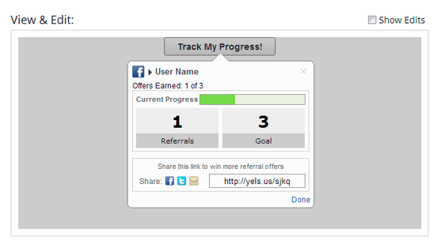
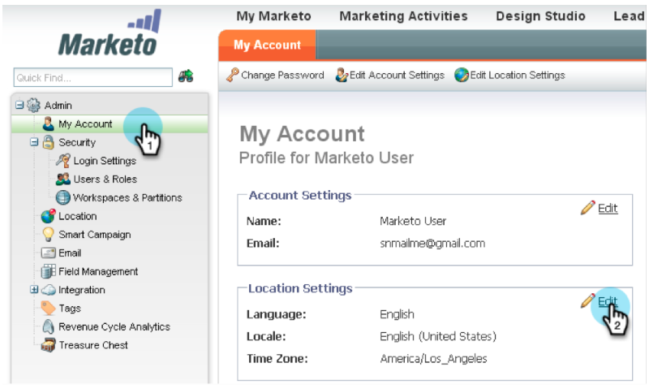
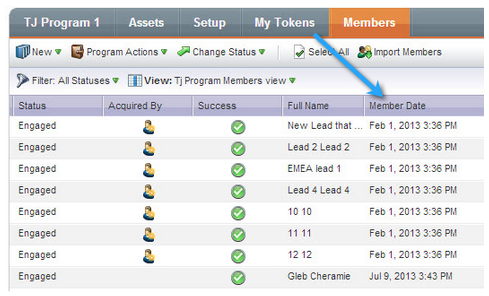
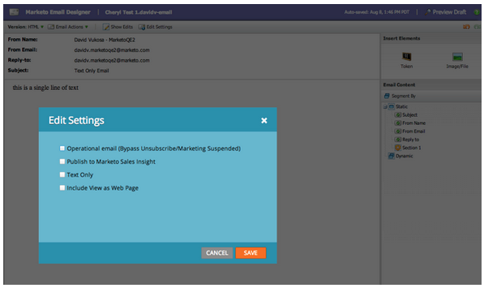
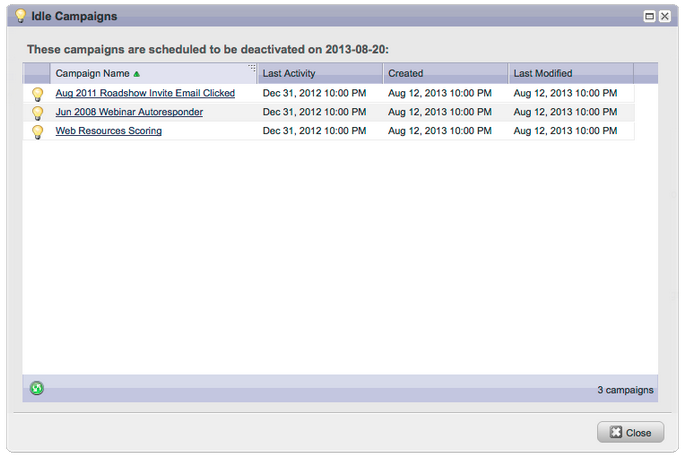
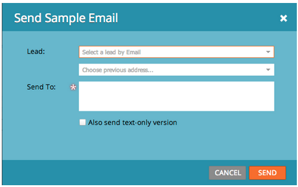
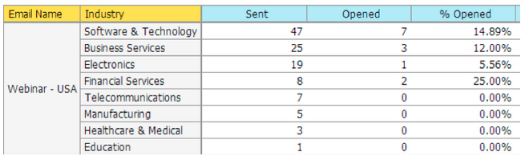

# 2013

## Enero de 2013 {#january}

La versión de enero amplía nuestra oferta social con **Ofertas de reenvío**. Además, los usuarios de [!DNL Marketo Lead Management] pueden establecer sus preferencias de zona horaria, idioma y configuración regional. Tenga en cuenta que las características marcadas con &#42; solo están disponibles en la edición seleccionada.

## Ofertas recomendadas {#referral-offers}

Una **oferta de reenvío** le da a tus posibles clientes un incentivo para remitir a sus amigos. Cree metas y recompensas para referencias exitosas. Puede utilizarlo en páginas de aterrizaje, su sitio web e incluso Facebook.

## Preferencia de zona horaria {#time-zone-preference}

Puede cambiar la zona horaria predeterminada de su cuenta personal de Marketo. Por ejemplo, aunque el valor predeterminado de la suscripción sea Hora del Pacífico, puede cambiarla a Hora del Este para su propia cuenta.

## Seleccione su idioma [!DNL Marketo Lead Management] {#select-your-marketo-lead-management-language}

Puede cambiar el idioma predeterminado de su cuenta de usuario de Marketo. Aunque la suscripción predeterminada esté en inglés, puede cambiarla al alemán o al francés para su propio uso.

## Mensajes de error de formulario multilingüe {#multi-lingual-form-error-messages}

Cuando un posible cliente rellena un formulario de Marketo, algunos mensajes de validación se incorporan automáticamente. Es posible que desee seleccionar un idioma de visualización diferente para estos mensajes de error. Ahora admitimos inglés, alemán y francés.

Un ejemplo de formulario en francés:

## Seleccione su idioma [!DNL Sales Insight] ([!DNL Salesforce] solamente) {#select-your-sales-insight-language-salesforce-only}

Si la preferencia de idioma de [!DNL Salesforce] está establecida en francés o alemán, Marketo [!DNL Sales Insight] respetará esta preferencia. Descargue el último paquete MSI para obtener esta funcionalidad (disponible la semana del 14 de enero).

## Nombre para mostrar del campo {#field-display-name}

Los nombres para mostrar de campos pueden mostrar texto en diferentes idiomas (por ejemplo, se admiten caracteres de bytes múltiples).

## Cambiar datos del programa {#change-program-data}

El paso de flujo [!UICONTROL Cambiar datos del programa] le permite cambiar el estado [!UICONTROL Éxito] y la [!UICONTROL Fecha de éxito] de un miembro del programa manualmente a través de una campaña. Puede utilizar este paso de flujo para corregir un error o para cambiar manualmente un miembro que puede no haber participado en el programa como estaba previsto.

## Febrero de 2013 {#february}

La versión de febrero incluye una característica muy solicitada, compatibilidad con [!DNL Apple Safari] y otras pequeñas mejoras.

## Soporte oficial para [!DNL Apple Safari] {#official-support-for-apple-safari}

Las versiones más recientes de [!DNL Apple Safari] para Mac y [!DNL Windows] son totalmente compatibles para su uso con la administración de posibles clientes de Marketo. Nota: [!DNL Safari] en iOS no es totalmente compatible.

## Mejoras de Webhooks {#webhooks-enhancements}

Los webhooks se han mejorado para que escapen a los tokens en la dirección URL/carga útil y también pueden actualizar los campos de posibles clientes de Marketo analizando las respuestas XML/JSON de sistemas de terceros (no disponibles en [!DNL Spark SMB Edition]).

## Punto final de API de SOAP actualizado {#updated-soap-api-endpoint}

Se ha actualizado el extremo de la API de SOAP preferido, que se muestra en [!UICONTROL Administración] -> API de SOAP. Actualice las llamadas para utilizar este nuevo punto de conexión. Las llamadas de API al extremo anterior están obsoletas, pero seguirán funcionando. (La API de SOAP no está disponible en [!DNL Spark SMB Edition])

## Compatibilidad móvil con [!DNL Facebook] fichas {#mobile-support-for-facebook-tabs}

[!DNL Facebook] fichas publicadas desde Marketo detectarán dispositivos móviles y los enrutarán a una página de aterrizaje. Esto garantizará que el usuario obtenga el contenido adecuado en los dispositivos móviles que no admiten las fichas [!DNL Facebook] (disponibles en [!DNL Spark], [!DNL Standard], [!DNL Select SMB Editions] y [!DNL Marketo Social Marketing]).

## Próximamente: compatibilidad con varios modelos {#coming-soon-support-for-multiple-models}

Estamos sentando las bases para admitir varios modelos de ciclo de ingresos, votados #1 idea para RCA en la Comunidad, en una versión futura. En esta versión, verá algunos cambios, incluidos los filtros de listas inteligentes y Agregar opciones en Pasos de flujo, para admitir la selección de un modelo y una fase. También estamos moviendo los campos Etapa de ingresos de clientes potenciales y Modelo de ciclo de ingresos de clientes potenciales fuera de la pestaña de cuadrícula de clientes potenciales de listas inteligentes.

## Marzo de 2013 {#march}

En la versión de marzo se incluyen las siguientes funciones.

## Archivos de calendario de Marketo {#marketo-calendar-files}

Cree un archivo de calendario como **Mi token** para utilizarlo en los correos electrónicos de recordatorio y confirmación de eventos. Este archivo de calendario integrado (por ejemplo, archivo .ics) procesará todos los tokens, incluidos Mis tokens y el token `{{member.webinar URL}}`.

## Esperar hasta +/- {#wait-until}

Crear pasos de espera que puedan ejecutar un número determinado de días antes o después de un token de fecha. Por ejemplo, puede crear un paso de espera que espere 3 días antes de la fecha del evento y, a continuación, enviar un recordatorio.

Puede crear un paso de espera que esperará 14 días antes del cumpleaños del posible cliente. Al seleccionar &quot;usar el próximo aniversario de esta fecha&quot;, el sistema ignorará automáticamente el año asociado con la fecha y usará en su lugar el año natural actual o el siguiente.

## Sorteo social {#social-sweepstakes}

Un sorteo le da a tus clientes la oportunidad de ganar un premio y contarles a sus amigos sobre ti. Selecciona los ganadores aleatorios de los participantes y envíales un correo electrónico.

## Idiomas del formulario adicional [!UICONTROL Mensaje de error] {#additional-form-error-message-languages}

Se han agregado más de una docena de idiomas a los mensajes de error del formulario.

## Noticias y alertas de asistencia {#support-news-and-alerts}

Manténgase conectado a la asistencia al cliente de Marketo mediante la suscripción a las noticias y alertas de soporte para alertas P1, problemas conocidos, sugerencias de nuestros expertos de asistencia y actualizaciones de la asistencia al cliente de Marketo.

## Abril de 2013 {#april}

En la versión de abril se incluyen las siguientes funciones.

## Integración de [!DNL Box] {#box-integration}

Conecte Marketo con su cuenta de [!DNL Box] para copiar fácilmente archivos en el estudio de diseño.

## Complemento [!DNL Gmail] {#gmail-plugin}

Si usa Marketo [!DNL Sales Insight], así como [!DNL Gmail], puede instalar nuestro nuevo complemento [!DNL Gmail] a través de la tienda [!DNL Chrome]. El complemento le permite registrar mensajes con Marketo, cargar plantillas de correo electrónico de Marketo y enviar mensajes con las funciones de seguimiento de Marketo.

## Análisis de correo electrónico {#email-analysis}

Cree informes avanzados de correo electrónico en [!UICONTROL Explorador de ingresos], como el informe Cuadrícula de calor de actividad de clic. Este informe muestra a insight el día y la hora en que las personas hacen clic en los vínculos de los correos electrónicos.

La función de análisis de correo electrónico en su conjunto se activará por fases durante abril y mayo a medida que migremos los datos de correo electrónico de 2012 y 2013. Es decir, algunos clientes tendrán acceso a esta función antes que otros.

## API de programa {#program-apis}

Compatibilidad con programas en la llamada de API de SOAP, incluido el acceso de solo lectura a datos de programa como: recuentos de miembros de programas, adquiridos por, éxito, configuración, canales, etiquetas, tokens y costes. Consulte la documentación de la API de SOAP para obtener más información.

## Mejora de [!DNL ON24] {#on-enhancement}

El puesto y el nombre de la empresa se sincronizarán con [!DNL ON24] desde el formulario de registro de Marketo.

## Mayo de 2013 {#may}

En la versión de mayo se incluyen las siguientes funciones.

## Archivos de calendario para páginas de destino {#calendar-files-for-landing-pages}

Cree un archivo de calendario como My Token que se pueda agregar a su página de aterrizaje. Este archivo de calendario integrado (por ejemplo, el archivo .ics) procesará todos los tokens, incluidos Mis tokens, en las páginas de aterrizaje de recursos locales.

## Pestaña Pertenencia a modelo {#model-membership-tab}

Vea todos los datos del miembro modelo en un solo lugar para supervisar y solucionar problemas fácilmente. La nueva ficha [!UICONTROL Miembros] es una vista de solo lectura disponible cuando selecciona un modelo de ciclo de ingresos aprobado.

## Árbol de acciones de flujo reorganizado {#reorganized-flow-action-tree}

Busque las acciones de flujo más rápido con el árbol de acciones de flujo recién reorganizado.

## Acciones de flujo renombradas {#renamed-flow-actions}

Cambiar estado de progresión ahora es [!UICONTROL Cambiar estado del programa]. Cambiar datos de programa ahora es [!UICONTROL Cambiar éxito de programa].

## Junio de 2013 {#june}

Las siguientes funciones se incluyen en la versión de junio.

## Idiomas de usuario adicionales {#additional-user-languages}

Vea la interfaz de Marketo Lead Management en su idioma preferido, ahora compatible con español y portugués.

## Interfaz de usuario de Cobalt {#cobalt-user-interface}

En los próximos meses verá un nuevo tema implementado en diferentes partes de la aplicación; afectando a las ventanas modales, por ejemplo.

## Clonación de subcarpetas {#subfolder-cloning}

Clonar recursos en subcarpetas.

## Varios modelos {#multiple-models}

Una idea principal para el análisis del ciclo de ingresos (RCA) en la comunidad, esta función le permite crear varios modelos para tener una comprensión más detallada de su funnel de ingresos por línea de producto, unidad de negocio o región. Los informes Leads by Revenue Stage, Success Path Analyzer, Program Analyzer y Revenue Explorer ahora admiten la capacidad de seleccionar un modelo específico para la creación de informes.

De forma predeterminada, hay dos modelos disponibles para Select SMB Edition y quince para Enterprise Edition. También puedes comprar modelos adicionales.

## Julio de 2013 {#july}

Las siguientes funciones están incluidas en la versión de julio, que está programada para un lanzamiento el viernes 26 de julio.

## Widget de contenido agotado en el panel {#exhausted-content-widget-on-the-dashboard}

Proporciona información sobre cuándo los posibles clientes agotarán el contenido del flujo. El sistema le proporcionará información sobre cuántos posibles clientes están a punto de llegar al contenido agotado o cuánto tiempo se han agotado los posibles clientes.

## Límites de comunicación {#communication-limits}

¿Quiere dejar de enviar posibles clientes por correo electrónico? Ahora es fácil limitar automáticamente la frecuencia a cada individuo. Simplemente establezca un límite de comunicación diaria y semanal, y el sistema hará el resto. Disponible en Select, Enterprise y con el paquete de complementos para clientes de Standard.

## Interfaz de usuario de Cobalt {#cobalt-user-interface-july}

En los próximos meses, notará más de nuestro nuevo tema desplegándose en diferentes partes de la aplicación. No se moverá ni eliminará ninguna funcionalidad.

## Columna de fecha de miembro de programa {#program-member-date-column}

Ver y ordenar la cuadrícula de miembros por la fecha en que se agregó el posible cliente.

## Cambios en el corrector ortográfico en el editor de WYSIWYG {#changes-to-spell-check-in-wysiwyg-editor}

El servicio utilizado por el editor de WYSIWYG para la revisión ortográfica se ha suspendido. Hemos eliminado el botón de revisión ortográfica del editor hasta que encontremos un reemplazo.

## Agosto de 2013 {#august}

En la versión de agosto de 2013 de se incluyen las siguientes funciones.

**Correos electrónicos solo de texto**

Ahora puedes enviar [solo la versión de texto](/help/marketo/product-docs/email-marketing/general/creating-an-email/create-a-text-only-email.md) de un correo electrónico. Tenga en cuenta que los vínculos no se decorarán al utilizar esta opción.

## Mejoras en el motor de participación del cliente {#customer-engagement-engine-enhancements}

### Ignorar contenido agotado {#ignore-exhausted-content}

Configure el programa de participación para [ignorar agotamiento](/help/marketo/product-docs/email-marketing/drip-nurturing/using-engagement-programs/disable-and-enable-exhausted-content-notifications.md), incluida la supresión de notificaciones.

## Prueba de flujo de participación {#engagement-stream-testing}

Use la [nueva característica de prueba](/help/marketo/product-docs/email-marketing/drip-nurturing/engagement-program-streams/test-an-engagement-stream.md) para simular una difusión y probar el contenido recién agregado a una transmisión en vivo.

## Prueba de envío personalizada {#personalized-send-test}

Al enviar una prueba por correo electrónico, puede seleccionar el nombre de un posible cliente para personalizar el correo electrónico de prueba.

## Tokens del sistema &quot;Ver correo electrónico como página web&quot; y &quot;Cancelar suscripción&quot; {#view-email-as-web-page-and-unsubscribe-system-tokens}

Utilice estos [nuevos tokens](/help/marketo/product-docs/email-marketing/general/using-tokens/system-tokens-glossary.md) para controlar mejor su ubicación en correos electrónicos.

## Limpieza de campañas de activador automático {#automatic-trigger-campaign-cleanup}

Marketo le notificará periódicamente a usted y a [desactivará automáticamente las campañas de déclencheur](/help/marketo/product-docs/core-marketo-concepts/smart-campaigns/using-smart-campaigns/automatic-trigger-campaign-cleanup.md) que no se hayan ejecutado en los últimos seis meses.

## Mejora de Marketo Financial Management {#marketo-financial-management-enhancement}

### Actualización de costos del programa  {#program-cost-update}

La sincronización de costes de programa permite realizar un seguimiento de los costes del programa en varias plataformas.

### Interfaz de usuario de Cobalt {#cobalt-user-interface-august}

Continuamos con el despliegue de nuestra nueva interfaz Cobalt. Este proyecto hará que todo en Marketo sea súper rápido. La actualización continuará durante el resto del año.

## Septiembre de 2013 {#september}

En la versión de septiembre se incluyen las siguientes funciones.

## URL más cortas {#shorter-urls}

Se ha dado a las direcciones URL de correo electrónico un recorte para que sean compatibles con los clics del destinatario, al tiempo que se conserva toda la funcionalidad de seguimiento

>[!CAUTION]
>
>A medida que pasamos a las URL cortas, los vínculos de los correos electrónicos enviados antes de la versión de septiembre caducarán 90 días después de esta versión.

Utilice datos de objetos personalizados de Marketo o agregue lógica condicional al contenido del correo electrónico mediante el lenguaje de plantilla Velocity.

## Cambiar la prueba de envío para enviar la muestra {#change-send-test-to-send-sample}

Se ha cambiado el nombre de la acción Enviar prueba a Enviar muestra

## [!UICONTROL Enviar correo electrónico de muestra personalizado] {#personalized-send-sample-email}

Al enviar un ejemplo de correo electrónico, puede seleccionar el nombre de un posible cliente para personalizar el correo electrónico de ejemplo.

## Sincronización de campos adicional para [!DNL GoToWebinar] {#additional-field-sync-for-gotowebinar}

Puede sincronizar Nombre de empresa y Puesto desde su formulario de Marketo a [!DNL GoToWebinar]. Para habilitar estos campos adicionales, vaya a Socios de eventos y marque &quot;Habilitar campos adicionales&quot;.

## Restringir el inicio de sesión del usuario solo a SSO {#restrict-user-login-to-sso-only}

Configure suscripciones para permitir que solo los usuarios de Marketo inicien sesión mediante SSO y no a través de la pantalla de inicio de sesión normal

## Detección de virus de archivos cargados {#virus-scan-of-uploaded-files}

Los archivos cargados en Design Studio ahora se analizan automáticamente y se bloquean si los archivos contienen virus

## Exportar analizador de influencia de oportunidades {#export-opportunity-influence-analyzer}

Ahora puede exportar los datos en el Analizador de influencia de oportunidades a [!DNL Excel]. Cada archivo [!DNL Excel] exportado contiene todas las interacciones de marketing de todos los posibles clientes (incluidos los que no tienen una función en la oportunidad), así como todas las oportunidades de la cuenta seleccionada en el analizador. Las filas de oportunidad se resaltan en verde. Puede usar las capacidades nativas de filtrado de datos de [!DNL Excel] si necesita centrarse en posibles clientes o actividades de marketing específicas.

## Configuración de atribución de programas {#program-attribution-settings}

Puede cambiar la forma en que Marketo vincula contactos y oportunidades para métricas de atribución de primer contacto y de varios contactos, incluida la capacidad de realizar atribuciones basadas en cuentas. Esta configuración afectará las métricas de atribución en los informes [!UICONTROL Explorador de ingresos] del área Análisis de oportunidad de programa y del área Análisis de oportunidad. Esto también afectará a las métricas de atribución en el Analizador de programas.

Puede cambiar la configuración de atribución del programa a una de las tres opciones. Cambiar esta configuración no modifica ningún dato de Marketo o CRM; simplemente cambia la forma en que se ejecutan los informes y se puede revertir en cualquier momento.

La opción Explicit sólo examina los contactos con funciones (comportamiento actual). Implicit examinará todos los contactos asociados a la cuenta independientemente de la función. Se recomienda encarecidamente utilizar el modo Explícito si es posible. El uso de Implicit puede crear falsos positivos, personas con crédito por una oportunidad a pesar de no tener influencia real en la oportunidad.

## [!UICONTROL Insight de ventas] disponible en francés y alemán ([!DNL Salesforce] solamente) {#sales-insight-available-in-french-and-german-salesforce-only}

Descargue la última versión de Marketo Lead Management y Marketo [!UICONTROL Sales Insight] de [!DNL AppExchange] para que sus vendedores franceses y alemanes puedan ver el contenido de [!UICONTROL Sales Insight] en su idioma preferido.

## Interfaz de usuario de Cobalt {#cobalt-user-interface-september}

En los próximos meses, se estará implementando un nuevo tema en diferentes partes de la aplicación. Este mes, es posible que observe más nuevas ventanas modales azules.

## Octubre de 2013 {#october}

En la versión de octubre de 2013 de se incluyen las siguientes funciones.

## templates.marketo.com {#templates-marketo-com}

[Templates.marketo.com](/help/marketo/product-docs/demand-generation/landing-pages/landing-page-templates/guided-landing-page-template-list.md) muestra plantillas de correo electrónico y de página de aterrizaje (incluidas las plantillas de correo electrónico móvil adaptable) que puede descargar desde [!DNL Marketo Program Library]. Añadiremos plantillas mensualmente, ¡vuelva a comprobarlo con frecuencia!

## developers.marketo.com {#developers-marketo-com}

[Developer.adobe.com](https://experienceleague.adobe.com/es/docs/marketo-developer/marketo/home) es para desarrolladores que desean crear integraciones en Marketo. Puede hacer referencia a diferentes opciones de integración, incluidas las API de JavaScript de Munchkin, ejemplos de código de API de SOAP, Webhooks y scripts de correo electrónico. También hay un SDK de Java disponible en [GitHub](https://github.com/Marketo/SOAP-API-Java-Client).

## Se actualizó el adaptador de eventos [!DNL BrightTALK] {#updated-brighttalk-event-adapter}

Sincronizar campos adicionales de [!DNL BrightTALK] a Marketo, incluido el nombre de la empresa, el cargo, el sector y el tamaño de la empresa.

## Aplicación de registro de eventos de Android Tablet {#android-tablet-event-check-in-app}

Registre inscritos en su evento con nuestra nueva aplicación de registro basada en Android, disponible en Google Play.

## Diciembre de 2013 {#december}

En la versión de diciembre se incluyen las siguientes funciones.

Después del lanzamiento, asegúrese de consultar la pestaña Nueva versión en la comunidad para ver los artículos detallados de la Base de conocimiento de cada función.

## Programa de correo electrónico {#email-program}

Enviar un correo electrónico nunca ha sido tan fácil. Use el nuevo [programa de correo electrónico](/help/marketo/product-docs/email-marketing/email-programs/creating-an-email-program/understanding-email-programs.md) para enviar un correo electrónico por lotes, en lugar del programa predeterminado. Defina la lista inteligente, envíe un correo electrónico, programe y ya no estará.

Consulte también el nuevo [Panel de métricas de correo electrónico](/help/marketo/product-docs/email-marketing/email-programs/email-program-data/view-the-email-program-dashboard.md) para ver el rendimiento de su correo electrónico.

## Pruebas A/B de correo electrónico {#email-a-b-testing}

En el nuevo programa de correo electrónico, ejecute una prueba [A/B](/help/marketo/product-docs/email-marketing/email-programs/email-program-actions/email-test-a-b-test/add-an-a-b-test.md) en un porcentaje de la población total de envíos de correo electrónico. Elija entre 4 tipos diferentes de pruebas: línea de asunto, dirección de origen, fecha/hora y correo electrónico completo. Incluso puede elegir promocionar manualmente al ganador o permitir que el sistema lo promocione en función de criterios ganadores predefinidos. El nuevo programa de correo electrónico, incluida la prueba A/B, se puede anidar en Eventos y el Programa predeterminado para que el envío de correo electrónico sea tan sencillo.

## Prueba de campeón de correo electrónico/Challenger {#email-champion-challenger-testing}

[Las pruebas de campeón/aspirante](/help/marketo/product-docs/email-marketing/general/functions-in-the-editor/email-tests-champion-challenger/add-an-email-champion-challenger.md) son similares a las pruebas A/B, pero la diferencia es que se usan para correos electrónicos activados y no se envía un ganador automáticamente. Esta prueba le permite desafiar una forma establecida de hacer algo, llamado el Campeón, y probar si sigue siendo el mejor presentando un Challenger. Además, las pruebas de correo electrónico de campeón/aspirante se pueden utilizar dentro de los flujos del programa de participación.

## Detalles del posible cliente de [!UICONTROL Análisis del correo electrónico] {#lead-details-in-email-analysis}

Hemos introducido atributos adicionales de posible cliente y compañía en [!UICONTROL Análisis de correo electrónico]. Ahora puede ver las estadísticas de correo electrónico agrupadas por nuevos atributos como [!UICONTROL Sector] y [!UICONTROL Source de posibles clientes].

## Adaptador de evento [!DNL BrightTALK] mejorado {#enhanced-brighttalk-event-adapter}

Ahora puede extraer inscritos en Marketo desde su canal y evento de [!DNL BrightTALK]. Puede utilizar esta información para informar a otras campañas de marketing.

