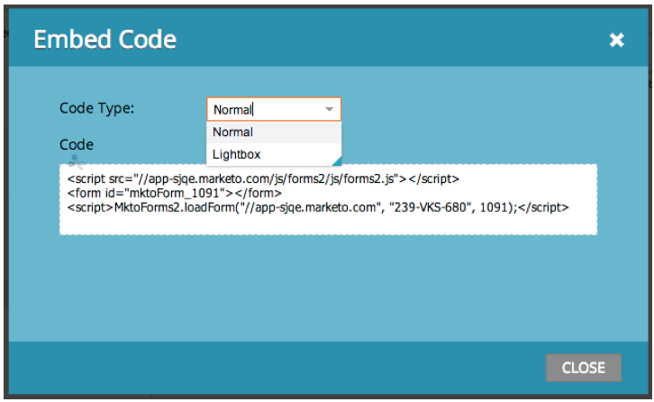
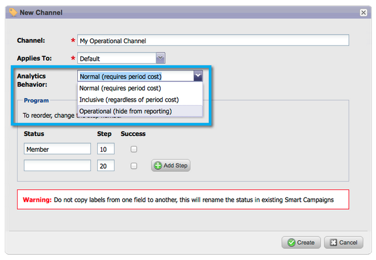
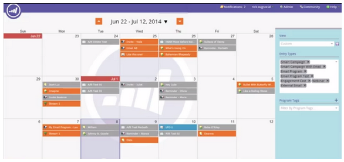

# 2014

## Enero de 2014 {#january}

En la versión de enero de 2014 se incluyen las siguientes funciones. Compruebe la disponibilidad de las características en [Marketo Edition](https://www.marketo.com/pricing/).

## Formularios 2.0 {#forms}

Atención: la documentación de Forms 2.0 estará disponible próximamente.

Tome el control del proceso de creación de formularios y dé un respiro a sus desarrolladores web. Forms 2.0 está diseñado para que los especialistas en marketing puedan crear formularios sólidos, tanto visual como funcionalmente, sin necesidad de tener conocimientos de programación.

**Dale a tu Forms el cambio visual que se merece:**

Los diseños de temas, la personalización de botones y los diseños flexibles le permiten diseñar formularios de aspecto moderno que se ajusten a la apariencia de su sitio.

**Visibilidad condicional y lógica de página de seguimiento:**

¿Quiere que &quot;Estado&quot; aparezca únicamente si un usuario selecciona Estados Unidos como su &quot;País&quot;? ¿Qué le parece presentar distintos documentos a los clientes en función de cómo respondan a las preguntas del formulario? Cree una lógica condicional en los formularios directamente desde el editor. No se requiere [!DNL javascript].

**Incruste fácilmente Forms en sus propias páginas de aterrizaje:**

Atrás quedaron los días en que se quitaba el código HTML de los formularios colocados en las páginas de aterrizaje de Marketo y se soltaban en un [!DNL iFrame]. Simplemente, obtenga el código incrustado y colóquelo en la página de aterrizaje donde desee que se represente el formulario. Dos modos (normal y lightbox) le proporcionan aún más flexibilidad con los formularios Marketo en su sitio.

## Límites de comunicación para el programa de correo electrónico {#communication-limits-for-email-program}

[Establezca límites de comunicación en un programa de correo electrónico](/help/marketo/product-docs/email-marketing/email-programs/email-program-actions/enable-disable-communication-limits-in-an-email-program.md) para asegurarse de que no se comunica en exceso con la base de datos. Si una persona supera el límite definido, no recibirá el correo electrónico.

## Campos adicionales en Análisis de pertenencia a programas {#additional-fields-in-program-membership-analysis}

Ahora puede agregar y agrupar las métricas de Análisis de pertenencia a programas por atributos de cliente potencial y compañía. Por ejemplo, puede agregar el campo Sector para ver la división de los miembros del programa y los éxitos.

## Febrero de 2014 {#february}

Las siguientes funciones se incluyen en la versión de febrero de 2014. Compruebe la disponibilidad de las funciones en Marketo Edition. Después del lanzamiento, asegúrese de volver para encontrar vínculos a artículos detallados de la Base de conocimiento para cada función.

## [!UICONTROL Puntuación de participación] como criterio ganador {#engagement-score-as-winning-criteria}

[Use la puntuación de participación](/help/marketo/product-docs/email-marketing/email-programs/email-program-actions/email-test-a-b-test/define-the-a-b-test-winner-criteria.md) para determinar la variante ganadora en su prueba A/B dividida o en la prueba Campeón/Challenger. La prueba debe ejecutarse durante un mínimo de 24 horas, para proporcionar una puntuación de participación adecuada.

## Ficha [!UICONTROL Resultados] del programa de correo electrónico {#email-program-results-tab}

[Ver los resultados](/help/marketo/product-docs/email-marketing/email-programs/email-program-data/view-email-program-results.md) y las actividades registradas para el programa de correo electrónico.

## Personas/[!UICONTROL posibles clientes] bloqueados en el envío de correos {#people-leads-blocked-from-mailing}

[Haga clic en el número de personas/posibles clientes a los que se ha bloqueado el envío de correo](/help/marketo/product-docs/email-marketing/email-programs/managing-people-in-email-programs/define-an-audience-with-a-smart-list.md) para ver quién no recibirá el correo electrónico debido a que se ha dado de baja, está en la lista de bloqueados, tiene una dirección de correo electrónico no válida o en blanco o está suspendido el marketing.

## Exportar datos de programas de correo electrónico {#export-email-program-data}

[Exportar métricas de correo electrónico a [!DNL Excel]](/help/marketo/product-docs/email-marketing/email-programs/email-program-data/export-email-program-dashboard-to-excel.md), incluidos los datos de variante de la prueba AB.

## [!UICONTROL Puntuación de participación] en el informe [!UICONTROL Rendimiento del flujo de participación] {#engagement-score-in-engagement-stream-performance-report}

Hemos agregado la puntuación de participación al [[!UICONTROL informe de rendimiento del flujo de participación]](/help/marketo/product-docs/email-marketing/drip-nurturing/reports-and-notifications/engagement-stream-performance-report.md) para ayudarle a ver la eficacia del contenido de su programa de participación.

## Detalles del programa en análisis de correo electrónico {#program-details-in-email-analysis}

Ahora puede agrupar las métricas de correo electrónico por Nombre de programa, Canal y Etiquetas. El nombre del programa se añade al campo Nombre del correo electrónico cuando el correo electrónico es un recurso local del programa. El nuevo campo Nombre del programa muestra el nombre del programa de la campaña inteligente que envió el correo electrónico. Esto puede ser diferente al programa en el campo Nombre del correo electrónico si el correo electrónico es un recurso local de un programa diferente.

## Actualización del Déclencheur y los filtros de vínculo de Clics {#update-to-clicks-link-filters-and-trigger}

Se han actualizado los siguientes nombres de déclencheur y filtro:

* Hace clic en el vínculo de [!UICONTROL Clics en el vínculo de la página web]
* Se hizo clic en el vínculo a [!UICONTROL Se hizo clic en el vínculo de la página web]
* Vínculo sin hacer clic a [!UICONTROL Vínculo sin hacer clic en la página web]

## Mejoras de Forms 2.0 {#forms-enhancements}

Con esta versión, Forms 2.0 ofrece varias actualizaciones de &quot;calidad de vida&quot;. Además de habilitar la generación progresiva de perfiles en los formularios incrustados, hemos realizado cambios en el flujo de trabajo y la experiencia de usuario que facilitarán el uso de la funcionalidad más avanzada del editor, [incluidas las reglas de visibilidad](/help/marketo/product-docs/demand-generation/forms/form-fields/dynamically-toggle-visibility-of-a-form-field.md), las páginas de agradecimiento avanzadas y los campos ocultos.

## Marzo de 2014 {#march}

En la versión de marzo de 2014 se incluyen las siguientes funciones. Compruebe la disponibilidad de las funciones en Marketo Edition. Después del lanzamiento, asegúrese de volver para ver los vínculos a los artículos de la base de conocimiento de cada función.

## Botón Actualizar del panel del programa de correo electrónico {#email-program-dashboard-refresh-button}

Use el [botón de actualización](/help/marketo/product-docs/email-marketing/email-programs/email-program-data/use-the-email-program-dashboard.md) para obtener métricas de correo electrónico actualizadas sobre su envío de correo electrónico o su prueba A/B.

## Deshacer/Rehacer en el editor de correo electrónico y en el editor de fragmentos de código {#undo-redo-in-the-email-editor-and-snippet-editor}

[Deshacer o rehacer](/help/marketo/product-docs/email-marketing/general/email-editor-2/edit-elements-in-an-email.md) hasta 50 acciones para la sesión actual.

## Columnas de estado de programa en el informe de rendimiento del programa {#program-status-columns-in-program-performance-report}

Al usar el [informe de rendimiento del programa](/help/marketo/product-docs/core-marketo-concepts/programs/program-performance-report/add-program-status-columns-to-a-program-report.md), ahora puede ver cuántas personas se encuentran en cada estado de programa.

## Programas operativos y de inclusión para Analytics {#inclusive-and-operational-programs-for-analytics}

Ahora puede incluir programas sin costos de período en [!UICONTROL Explorador de ingresos] y Analizadores si establece la opción Comportamiento de Analytics en &quot;Inclusivo&quot; al editar Canales de programa. También puede excluir programas operativos de la creación de informes seleccionando &quot;Operativo&quot;.

## Opciones híbridas e implícitas para la conversión de posibles clientes {#hybrid-and-implicit-options-for-lead-conversion}

Puede cambiar la forma en que Marketo vincula contactos y oportunidades para las métricas de conversión de posibles clientes en Análisis de posibles clientes. Puede [cambiar la configuración de atribución](/help/marketo/product-docs/administration/settings/change-attribution-settings-for-analytics.md) a una de las tres opciones. Cambiar esta configuración no modifica ningún dato de Marketo o CRM; simplemente cambia la forma en que se ejecutan los informes y se puede revertir en cualquier momento.

La configuración Explicit solo trata los contactos con funciones en una oportunidad como posibles clientes convertidos (comportamiento predeterminado). Implicit tratará todos los contactos asociados a la cuenta en la oportunidad, independientemente de la función, como convertidos. Híbrido tratará los contactos con funciones como convertidos si están disponibles; si no lo están, trataremos todos los contactos de la cuenta como convertidos.

Como recordatorio, esta configuración también cambia las métricas de atribución del programa.

## Idioma adicional del usuario {#additional-user-language}

Seleccione Su [Idioma De Aplicación De Marketo](/help/marketo/product-docs/administration/settings/change-time-zone.md). Vea la interfaz de Marketo Lead Management en su idioma preferido (ahora compatible con japonés).

## Marketo Developer Blog {#marketo-developer-blog}

El [blog para desarrolladores de Marketo](https://developers.marketo.com/blog/) está dedicado a aquellos desarrolladores web e ingenieros de software que apoyan las necesidades de rápida evolución del experto en marketing moderno. Puede suscribirse a anuncios sobre nuevas opciones de integración, actualizaciones de versiones de API y una nueva serie de artículos explicativos que incluyen ejemplos de código y prácticas recomendadas sobre la integración con la plataforma Marketo.

El [primer artículo](https://developers.marketo.com/blog/retrieving-customer-and-prospect-information-from-marketo-using-the-api/) de esta serie le guiará para recuperar de manera eficaz información sobre las personas (clientes, contactos o posibles clientes) almacenadas en Marketo mediante la API.

## Mayo de 2014 {#may}

En la versión de mayo de 2014 de se incluyen las siguientes funciones. Compruebe la disponibilidad de las funciones en Marketo Edition. Después del lanzamiento, asegúrese de volver para encontrar vínculos a artículos detallados de la Base de conocimiento para cada función.

## Eliminar espacio de trabajo {#delete-workspace}

Ahora puede [eliminar un espacio de trabajo sin usar](/help/marketo/product-docs/administration/workspaces-and-person-partitions/delete-a-workspace.md). Asegúrese de mover todos los recursos a otro espacio de trabajo antes de intentar eliminarlo.

## Programar primer lanzamiento {#schedule-first-cast}

En los programas de participación, puede programar la fecha para que [se ejecute por primera vez](/help/marketo/product-docs/email-marketing/drip-nurturing/engagement-program-streams/set-stream-cadence.md) la conversión. Por ejemplo, especifique la cadencia que debe ser cada 2 semanas y seleccione la fecha del primer lanzamiento.

## Programas de participación mejorados {#enhanced-engagement-programs}

Ahora todos tienen múltiples programas, flujos y límites de comunicación.

## Seguimiento de vínculos en correos electrónicos de texto {#link-tracking-in-text-emails}

[Agregue corchetes dobles](/help/marketo/product-docs/email-marketing/general/functions-in-the-editor/add-tracked-links-to-a-text-email.md) alrededor de las direcciones URL en la versión de texto de sus correos electrónicos para indicar cuándo se deben convertir los vínculos en vínculos de seguimiento de Marketo redirigidos

>[!NOTE]
>
>**Ejemplo**
>
>`[[https://www.marketo.com]]`

De forma predeterminada, no se realiza un seguimiento de los vínculos en la versión de texto de los correos electrónicos. Añada esta nueva sintaxis para indicar cuándo se debe convertir un vínculo en un vínculo de seguimiento. El comportamiento de los vínculos de HTML no cambia.  Para añadir vínculos rastreados a los correos electrónicos:

* **Versión de HTML:** Inserte el vínculo. Se rastreará de forma predeterminada.
* **Versión de texto:** Escriba la dirección URL entre corchetes dobles.

Para añadir vínculos sin rastrear a los correos electrónicos:

* **Versión de HTML:** Inserte el vínculo y agregue la clase &quot;mktNoTrack&quot; al vínculo.
* **Versión de texto:** Solamente ingrese la dirección URL. Se desrastreará de forma predeterminada.

## Marcado de vínculos en correos electrónicos de muestra {#link-markup-in-sample-emails}

Vea cómo se comportarán los vínculos en los correos electrónicos con antelación. Los correos electrónicos de muestra ahora muestran vínculos exactamente como aparecerían a los posibles clientes. Obtenga una vista previa de los vínculos que se han convertido en vínculos de seguimiento, lo que le permite tener una mejor idea de cómo aparecerá realmente el mensaje para los destinatarios.

## [!UICONTROL Anular campaña] {#abort-campaign}

¡No te asustes! Si encuentra un error, use el nuevo botón [cancelar campaña](/help/marketo/product-docs/core-marketo-concepts/smart-campaigns/using-smart-campaigns/abort-a-smart-campaign.md) para detener inmediatamente las campañas en su seguimiento. Recibirá una notificación que indica cuántos posibles clientes estaban pendientes en cada paso del flujo cuando se detuvo la campaña.

## [!UICONTROL Insight de ventas] en japonés, portugués y español {#sales-insight-in-japanese-portuguese-and-spanish}

Descargue la última versión de [!UICONTROL Sales Insight] de AppExchange para que sus agentes de ventas que hablan japonés, portugués y español vean el contenido de [!UICONTROL Sales Insight] en su idioma preferido.

## Estado del programa y plazo de éxito en el análisis de pertenencia a programas {#program-status-and-success-timeframe-in-program-membership-analysis}

Vea cuántos miembros hay en cada Estado de programa y cuándo se cambiaron a cada estado, incluida la fecha en la que alcanzaron el éxito del programa.

## Correos electrónicos de prueba A/B en [!UICONTROL análisis de correo electrónico] {#a-b-test-emails-in-email-analysis}

Informar sobre cada una de las variantes de correo electrónico de la prueba A/B en [!UICONTROL Análisis de correo electrónico].

## Cambios en paquetes de Analytics {#analytics-packaging-changes}

Revenue Cycle Modeler y Success Path Analyzer ahora se incluyen en MA Standard Edition.

## Información de plataforma móvil {#mobile-platform-info}

[Segmento y déclencheur](/help/marketo/product-docs/reporting/basic-reporting/report-activity/build-a-people-performance-report-with-mobile-platform-columns.md) de posibles clientes que abren y hacen clic en correos electrónicos desde sus dispositivos móviles.

## Junio de 2014 {#june}

Las siguientes funciones se incluyen en la versión de junio de 2014. Compruebe la disponibilidad de las funciones en Marketo Edition.

## Interfaz de usuario actualizada: ¡próximamente! {#updated-ui-coming-soon}

Una nueva apariencia, incluyendo la navegación para [!DNL Marketo Lead Management], estará disponible pronto en una versión posterior.

## Complemento de [!DNL Sales Insight] para [!DNL Outlook] 2013 {#sales-insight-plugin-for-outlook}

Esto requerirá una descarga del nuevo complemento. Puede descargarlo desde [aquí](/help/marketo/product-docs/marketo-sales-insight/msi-outlook-plugin/install-the-marketo-email-add-in-for-outlook-with-a-registration-code.md).

## Resolución de token {#token-resolution}

Cuando envía un correo electrónico de prueba desde [!DNL Sales Insight], los tokens actuales del correo electrónico no se resuelven y se envía el valor predeterminado. Esta mejora garantizará que los tokens se resuelvan en los correos electrónicos de prueba.

## Personalizar porcentajes para estrellas y llamas {#customize-percentages-for-stars-and-flames}

[Establece el porcentaje](/help/marketo/product-docs/marketo-sales-insight/msi-for-salesforce/features/stars-and-flames/customize-stars-and-flames.md) de posibles clientes que obtienen 1, 2 o 3 estrellas y llamas.

## API de REST de posible cliente {#lead-rest-api}

Cree, lea y actualice posibles clientes mediante programación a través de nuestra nueva API ReST. Para comenzar con ReST, debe [crear un servicio personalizado](/help/marketo/product-docs/administration/additional-integrations/create-a-custom-service-for-use-with-rest-api.md) en Marketo. A continuación, vaya al [sitio para desarrolladores](https://experienceleague.adobe.com/es/docs/marketo-developer/marketo/rest/rest-api) para obtener más información sobre el uso de esta API.

## Actualización de página de campañas de Marketo Real-Time Personalization (RTP) {#marketo-real-time-personalization-rtp-campaigns-page-update}

Las campañas de RTP ahora incluyen un nuevo diseño con vistas de miniaturas y rendimiento de la campaña. Además, puedes [organizar tus campañas](/help/marketo/product-docs/web-personalization/working-with-web-campaigns/sort-web-campaigns-by-latest-or-top-performing.md) según la fecha o el rendimiento superior.

## Integraciones de análisis web {#web-analytics-integrations}

Anexe todos los datos RTP en la plataforma de análisis web.

La integración con [Google Analytics](/help/marketo/product-docs/web-personalization/reporting-for-web-personalization/web-analytics-integrations/integrate-rtp-with-google-analytics.md) (GA) ahora está habilitada de manera predeterminada, por lo que en Configuración de cuenta active el conmutador para el que desea enviar datos a través de variables y eventos personalizados de GA.

También completamos la integración con [Adobe SiteCatalyst](/help/marketo/product-docs/web-personalization/reporting-for-web-personalization/web-analytics-integrations/integrate-with-adobe-analytics.md).

## Julio de 2014 {#july}

En la versión de julio de 2014 se incluyen las siguientes funciones. Compruebe la disponibilidad de las funciones en Marketo Edition. Vuelva después del lanzamiento para ver los vínculos a la documentación detallada de las funciones.

## Calendario de marketing {#marketing-calendar}

Vea todos los eventos, correos electrónicos y mucho más en todos los programas. [Este nuevo producto](/help/marketo/product-docs/core-marketo-concepts/marketing-calendar/understanding-the-calendar/navigating-the-marketing-calendar.md) estará disponible sin cargo para los clientes con 10 o menos usuarios de [!DNL Marketo Lead Management] o Dialog.

La documentación del calendario de marketing estará disponible en el momento del lanzamiento.

## Nueva apariencia {#new-look-and-feel}

[!DNL Marketo Lead Management] se actualizará con un nuevo aspecto que es moderno y elegante, e incluye una navegación actualizada.

## Operadores de fechas {#date-operators}

[Filtros avanzados](/help/marketo/product-docs/core-marketo-concepts/smart-lists-and-static-lists/creating-a-smart-list/smart-list-filter-operators-glossary.md) para &quot;[!UICONTROL en el pasado antes de]&quot;, &quot;[!UICONTROL en el futuro]&quot; y &quot;[!UICONTROL en el futuro después de]&quot;. Por ejemplo, busque posibles clientes que tengan una fecha de nacimiento en los próximos 3 meses o un contrato que caduque pasados 6 meses.

## Vista de calendario del programa {#program-schedule-view}

Además del calendario de marketing con el que administra los eventos y los programas predeterminados, hay una nueva vista de programación en el programa.

* Reprogramar todas las fechas a la vez
* Nuevas fechas provisionales - ¡péngalo!
* Tipos de entradas personalizadas: Tareas pendientes, Notas de prensa, lo que desee

## Operaciones de lista en la API de REST {#list-operations-in-the-rest-api}

Hemos añadido las llamadas siguientes relacionadas con las operaciones de lista en ReST. Consulte [https://experienceleague.adobe.com/es/docs/marketo-developer/marketo/rest/rest-api](https://experienceleague.adobe.com/es/docs/marketo-developer/marketo/rest/rest-api) para obtener toda la documentación.

* Obtener lista por identificador
* Obtener varias listas
* Importar a lista
* Obtener importación al estado de lista

## Importación rápida de listas {#fast-list-import}

Más de **50 veces más rápido**, sus archivos se acercarán a Marketo. Las antiguas opciones de importación &quot;Normal&quot; y &quot;Optimizado para nuevos posibles clientes&quot; se han sustituido por &quot;Predeterminado (importación rápida)&quot;.

La opción &quot;Omitir nuevos posibles clientes y actualizaciones&quot; permanece sin cambios.

## Nuevo Munchkin mejorado {#new-improved-munchkin}

El despliegue se llevará a cabo a partir de mediados de julio y continuará durante los próximos meses.

* Quita la dependencia [!DNL jQuery] para la compatibilidad completa y futura
* Más compatible con otros JavaScript del sitio
* ¡Probado completamente en muchos sitios durante el año pasado!

## RTP: Plantillas de campaña de Personalization en tiempo real {#rtp-real-time-personalization-campaign-templates}

La página RTP Set Campaign ahora [incluye plantillas listas para usar](/help/marketo/product-docs/web-personalization/using-templates/using-templates-to-create-web-campaigns.md). Elija entre una variedad de estilos, incluidos seminarios web, casos prácticos y libros electrónicos.

## RTP: Mejoras en la API de JavaScript {#rtp-javascript-api-enhancements}

Nueva llamada de API de RTP para obtener datos de visitantes en tiempo real, como organización, sector, ubicación y coincidencia de código de segmento. Además, al pasar el ratón por encima de un nombre de segmento en la página Segmentos, se muestra información del objeto que muestra el código de segmento. Consulte nuestro [sitio para desarrolladores](https://experienceleague.adobe.com/es/docs/marketo-developer/marketo/javascriptapi/rich-media-recommendation) para obtener documentación completa.

## RTP: Compatibilidad con HTML5 en el editor de contenido de Campaign {#rtp-html-support-in-campaign-content-editor}

El editor de WYSIWYG de contenido de la página Definir campañas ahora es totalmente compatible con HTML5. Haga clic en el icono &quot;HTML&quot; dentro del editor para insertar cualquier código HTML5.

## Agosto de 2014 {#august}

Las siguientes funciones están incluidas en la versión de agosto de 2014. Compruebe la disponibilidad de las funciones en Marketo Edition. Vuelva después del lanzamiento para ver los vínculos a la documentación detallada de las funciones.

## Licencias de calendario de marketing {#marketing-calendar-licenses}

A partir del 5 de septiembre de 2014, solo 5 usuarios podrán acceder de forma gratuita al calendario de marketing. Asegúrese de [Emitir/Revocar una licencia de calendario de marketing](/help/marketo/product-docs/core-marketo-concepts/marketing-calendar/understanding-the-calendar/issue-revoke-a-marketing-calendar-license.md) a los usuarios que elija antes de entonces para obtener acceso sin interrupciones.

## Nuevos permisos de usuario {#new-user-permissions}

Se agregaron los siguientes permisos de usuario nuevos:

| Permiso | Descripción |
|---|---|
| Acceder al explorador de ingresos | Si ha adquirido RCA, ahora tendrá control sobre quién puede acceder a él. |
| Lista de importación | Restringir a los usuarios la importación de listas en la base de datos de posibles clientes. |
| Lista de importación | Restrinja a los usuarios la importación de listas a través de un programa en actividades de marketing. |
| Activar campaña desencadenadora | Controle quién puede activar y no puede activar campañas de déclencheur. |
| Programar campaña por lotes | Controle quién puede y no puede programar ejecuciones de campañas por lotes. |

## Exportar usuarios y roles de [!UICONTROL Admin] {#export-users-and-roles-from-admin}

Ahora puede [Exportar una lista de usuarios y roles](/help/marketo/product-docs/administration/users-and-roles/export-a-list-of-users-and-roles.md) desde Marketo. También puede incluir una marca de tiempo &quot;Último inicio de sesión&quot; para que se incluya en la exportación.

## Eliminar canales y etiquetas {#delete-channels-and-tags}

Ahora puede eliminar los canales y estados que no se utilicen. Como siempre, solo puede ocultar una que esté en uso actualmente.

## Automatizado [!DNL DKIM] {#automated-dkim}

Para mejorar la capacidad de entrega, todos los correos electrónicos salientes se firmarán [!DNL DKIM] (DomainKeys Identified Mail). De forma predeterminada, los correos electrónicos usarán la firma compartida [!DNL DKIM] de Marketo. Tendrá la opción de personalizar esta firma.

>[!NOTE]
>
>[!DNL DKIM] se desplegará lentamente; es posible que no lo vea durante unas semanas.

## Actualizaciones de Real-Time Personalization {#real-time-personalization-updates}

Hemos añadido etiquetas a la página de la campaña para que pueda etiquetar el contenido de su corazón.

## Segmentación móvil {#mobile-targeting}

¡Le preguntaste a la comunidad y lo hicimos! Ahora puede incluir, excluir o establecer una call to action específica para usuarios de móviles y tabletas.

## Segmentación y direccionamiento mejorados de 1:1 {#enhanced-segmentation-and-targeting}

Ahora puede utilizar operadores de filtro avanzados para segmentar visitantes conocidos.

## Uso compartido de campañas {#campaign-sharing}

Ahora tiene la capacidad de compartir rápida y fácilmente un vínculo de vista previa de campaña de RTP.

## Informe del motor de recomendaciones de contenido {#content-recommendation-engine-report}

Hemos agregado un nuevo informe de motor de recomendación de contenido para que vea un buen resumen.

## Administración de usuario mejorada {#enhanced-user-administration}

Los usuarios administradores ahora pueden bloquear a los usuarios debido a varios intentos fallidos de inicio de sesión. También puede desbloquear a esos usuarios si lo desea.

## Control de seguimiento {#tracking-control}

Ahora puede excluir direcciones IP específicas de todo el seguimiento y los informes en Real-Time Personalization.

## Octubre de 2014 {#october}

Compruebe la disponibilidad de las funciones en Marketo Edition. La documentación estará disponible en el momento de la publicación.

## Enfoque del programa en el calendario de marketing {#program-focus-in-marketing-calendar}

[Cree y edite entradas](/help/marketo/product-docs/core-marketo-concepts/marketing-calendar/understanding-the-calendar/understand-enable-program-focus.md) directamente desde el calendario de marketing.

## Nuevas llamadas a la API REST {#new-rest-api-calls}

Utilice la API para extraer nuevas actividades o cambios en los posibles clientes:

* Obtener cambios de posibles clientes
* Obtener actividades de posibles clientes
* Obtener tipos de actividades
* Obtener token de paginación

Los detalles completos estarán disponibles después del lanzamiento en [https://experienceleague.adobe.com/es/docs/marketo-developer/marketo/rest/rest-api](https://experienceleague.adobe.com/es/docs/marketo-developer/marketo/rest/rest-api).

## MSI - Enviar correo electrónico de Marketo para [!DNL Microsoft Dynamics] {#msi-send-marketo-email-for-microsoft-dynamics}

[Envíe y rastree correos electrónicos de ventas](/help/marketo/product-docs/marketo-sales-insight/msi-for-microsoft-dynamics/setting-up-and-using/send-a-marketo-sales-email-from-microsoft-dynamics.md) a posibles clientes y contactos de [!DNL Microsoft Dynamics].

## MSI - Agregar a campañas de Marketo para [!DNL Microsoft Dynamics] {#msi-add-to-marketo-campaigns-for-microsoft-dynamics}

[Agregue posibles clientes y contactos a las campañas inteligentes de Marketo](/help/marketo/product-docs/marketo-sales-insight/msi-for-microsoft-dynamics/setting-up-and-using/add-a-lead-contact-to-a-marketo-campaign-from-microsoft-dynamics.md) directamente desde [!DNL Microsoft Dynamics]. El marketing puede elegir qué campañas de Marketo están disponibles para las ventas.

## Compatibilidad con entidades personalizadas para la sincronización de [!DNL Microsoft Dynamics] {#custom-entity-support-for-microsoft-dynamics-sync}

[Use datos de objeto personalizados](/help/marketo/product-docs/crm-sync/microsoft-dynamics-sync/microsoft-dynamics-sync-details/enable-sync-for-a-custom-entity.md) de [!DNL Microsoft Dynamics] para filtrar y activar en listas inteligentes, campañas inteligentes, programas...

## Compatibilidad con accionistas para la sincronización de [!DNL Microsoft Dynamics] {#shareholder-support-for-microsoft-dynamics-sync}

Sincronizar los datos de accionista de oportunidad de [!DNL Dynamics]. También se admiten oportunidades conectadas a una cuenta mediante el campo &quot;Cuenta principal&quot;, así como oportunidades conectadas a contactos mediante la sincronización &quot;Contacto principal&quot;.

## RTP: mejoras en el panel {#rtp-dashboard-enhancements}

El tablero ahora se ha mejorado para incluir más datos de un vistazo:

* Total de visitas a la organización
* Principales 5 sectores industriales
* Total de visitantes comprometidos

## RTP: nuevas plantillas móviles para campañas {#rtp-new-mobile-templates-for-campaigns}

[Cree campañas móviles](/help/marketo/product-docs/web-personalization/using-templates/using-templates-to-create-web-campaigns.md) rápida y fácilmente con estas nuevas plantillas.

## RTP: API de contexto de usuario {#rtp-user-context-api}

Utilice una nueva llamada que rastree el historial de visitas anteriores de los visitantes. Personalice las campañas en función de las necesidades del visitante:

* Páginas anteriores vistas
* Productos interesados en
* Qué campañas de RTP han visto

Visite [https://experienceleague.adobe.com/es/docs/marketo-developer/marketo/javascriptapi/rich-media-recommendation](https://experienceleague.adobe.com/es/docs/marketo-developer/marketo/javascriptapi/rich-media-recommendation) para obtener información detallada.

## Diciembre de 2014 {#december}

Las siguientes funciones están incluidas en la versión de diciembre de 2014. Compruebe la disponibilidad de las funciones en Marketo Edition. Después del lanzamiento, asegúrese de volver para encontrar vínculos a artículos detallados para cada función.

## [!DNL Sales Insight] informes {#sales-insight-reports}

El [[!DNL Sales Insight] informe de rendimiento del correo electrónico](/help/marketo/product-docs/marketo-sales-insight/msi-for-salesforce/features/performance-reports/sales-insight-email-performance-report.md) le permite ver las métricas de correo electrónico por correo electrónico y representante de ventas. Admite mensajes de correo electrónico enviados mediante [!DNL Salesforce], [!DNL Microsoft Dynamics], el complemento [!DNL Outlook] y el complemento [!DNL Gmail].

## [!DNL Facebook] audiencias personalizadas {#facebook-custom-audiences}

Una vez que el administrador de Marketo haya agregado [[!DNL Facebook] a través de [!UICONTROL Admin] > [!UICONTROL LaunchPoint]](/help/marketo/product-docs/demand-generation/ad-network-integrations/add-facebook-custom-audiences-as-a-launchpoint-service.md), puede crear, actualizar o [reemplazar fácilmente una  [!DNL Facebook] audiencia personalizada con posibles clientes de una lista estática o inteligente de Marketo](/help/marketo/product-docs/demand-generation/facebook/create-a-custom-audience-in-facebook.md). Busque el nuevo icono [!DNL Facebook] en la parte inferior de la cuadrícula de posibles clientes de cualquier lista estática o inteligente.

## Clonación mejorada en espacios de trabajo  {#improved-cloning-across-workspaces}

[Clonar un programa](/help/marketo/product-docs/core-marketo-concepts/programs/working-with-programs/clone-a-program.md) en otro espacio de trabajo nunca ha sido tan fácil. Al hacer clic en clonar, se selecciona el espacio de trabajo de destino. ¡No más clonar en una carpeta y luego mover la carpeta!

>[!NOTE]
>
>Esta nueva función de clonación solo está disponible para programas en este momento.

## Lista inteligente de referencia {#reference-smart-list}

Se puede hacer referencia a [listas inteligentes compartidas con otro área de trabajo](/help/marketo/product-docs/core-marketo-concepts/smart-lists-and-static-lists/using-smart-lists/reference-a-list-or-smart-list-across-workspaces.md) al crear una lista inteligente o un flujo.

## Enumerar mejoras de importación {#list-import-improvements}

[Importar archivos](/help/marketo/getting-started/quick-wins/import-a-list-of-people.md) codificados en UTF-16, Shift-JIS o EUC-JP. Seguimos admitiendo archivos codificados con UTF-8.

## Seguimiento de vínculos en scripts de correo electrónico {#link-tracking-in-email-scripting}

Los vínculos de los scripts de correo electrónico ahora se rastrearán y estarán disponibles en el informe Rendimiento de los vínculos de correo electrónico.

## Configuración de codificación de token {#token-encoding-setting}

Hemos implementado una nueva función de seguridad para codificar tokens automáticamente en HTML, que se habilitará de forma predeterminada en marzo de 2015. Hasta entonces, alterne esta funcionalidad en Administración de campos para probar el comportamiento con antelación. Todos los tokens de cliente potencial y compañía se codificarán cuando se inserten en correos electrónicos o páginas de aterrizaje. Las opciones también están disponibles para campos individuales.

## Nuevas llamadas a la API REST {#new-rest-api-calls-december}

Tres nuevas llamadas para la API de REST de posible cliente y actividad:

· Obtener Particiones de Posibles Clientes

· Asociar posible cliente

· Combinar posible cliente

Todos los detalles estarán disponibles después del lanzamiento en [https://experienceleague.adobe.com/es/docs/marketo-developer/marketo/home](https://experienceleague.adobe.com/es/docs/marketo-developer/marketo/home)

## [!DNL Munchkin Javascript] mejoras de compatibilidad {#munchkin-javascript-compatibility-enhancements}

Hemos realizado algunas mejoras de poca envergadura en [!DNL Munchkin] para asegurarnos de que continúa cargándose rápidamente y funcionando como se desea en los casos en que existen otros JavaScript en la página.

El despliegue se llevará a cabo a partir de mediados de diciembre y continuará durante los próximos meses.

## [!UICONTROL Explorador de ingresos]: aspecto y presentación actualizados {#revenue-explorer-upgraded-look-and-feel}

## RTP: Módulo de lista de cuentas con nombre {#rtp-named-account-list-module}

Administre y supervise sus cuentas clave de alto rendimiento en la nueva página [!UICONTROL Cuentas con nombre]. Cargue nuevas listas de cuentas con nombre para identificar y segmentar estas organizaciones. Hemos automatizado el proceso para que tenga un mayor control y flexibilidad a la hora de implementar sus planes de marketing basados en cuentas y segmentar sus cuentas clave en diferentes canales (web y publicidad).

## RTP: Efecto deslizante para campañas en la zona {#rtp-sliding-effect-for-in-zone-campaigns}

Se ha agregado un nuevo efecto deslizante para las campañas de la zona de inserción que permite que el contenido personalizado se deslice en su lugar al cargar la página.

