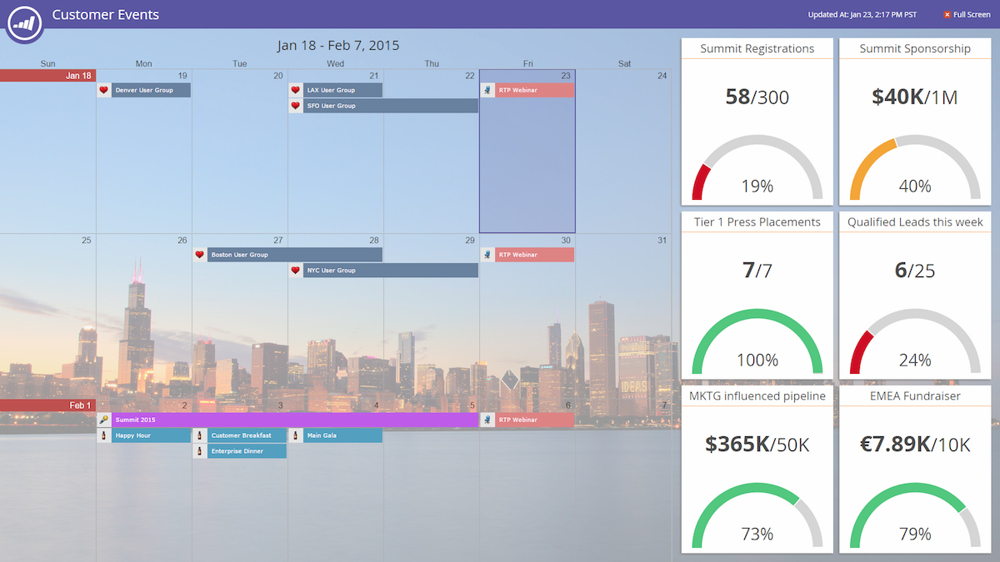
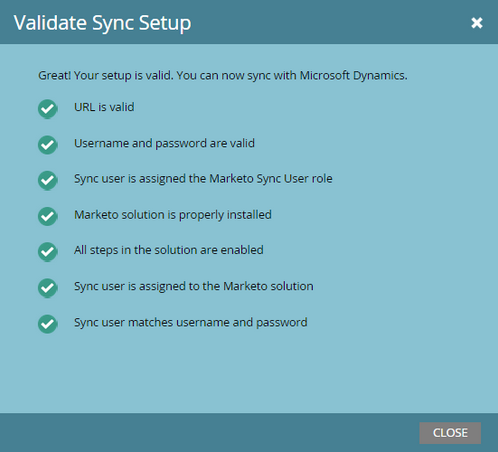

# 2015

## Enero de 2015 {#january}

En la versión de enero de 2015 se incluyen las siguientes funciones. Compruebe la disponibilidad de las funciones en Marketo Edition. Después del lanzamiento, asegúrese de volver para encontrar vínculos a artículos detallados para cada función.

## Actualizaciones de automatización de marketing {#marketing-automation-updates}

**Páginas de aterrizaje compatibles con dispositivos móviles**

Ahora puede [crear vistas móviles para páginas de aterrizaje](/help/marketo/product-docs/demand-generation/landing-pages/free-form-landing-pages/add-a-mobile-view-for-your-free-form-landing-page.md) desde el editor de páginas de aterrizaje. Ofrezca su mensaje de forma eficaz independientemente del dispositivo y aumente la participación adaptando su contenido para facilitar el consumo sobre la marcha. Esta función se implementará gradualmente durante la semana siguiente al lanzamiento.

[-Vídeo de introducción a la página de aterrizaje-](https://youtu.be/aPQHlG2X6c0)

**Nuevas llamadas a la API de REST**

Tres nuevas llamadas para la API de REST de posible cliente y actividad:

* Eliminar lead
* Obtener posibles clientes por ID de programa
* Obtener posibles clientes eliminados

Además, hay una nueva opción para Sincronizar posible cliente, para escribir el cambio de posible cliente asincrónicamente para una llamada de API más rápida. Todos los detalles estarán disponibles después del lanzamiento en [https://experienceleague.adobe.com/en/docs/marketo-developer/marketo/home](https://experienceleague.adobe.com/es/docs/marketo-developer/marketo/home)

**Compatibilidad con objeto personalizado de scripts de correo electrónico**

Ahora, acceda a los objetos personalizados asociados con el objeto de cuenta desde los scripts de correo electrónico.

## Personalización en tiempo real {#real-time-personalization}

**Remarketing personalizado para Google y[!DNL Facebook]**

El remarketing muestra anuncios a personas que han visitado su sitio web. Ahora puede personalizar sus campañas de remarketing en [Google](/help/marketo/product-docs/web-personalization/website-retargeting/personalized-remarketing-in-google.md) y [[!DNL Facebook]](/help/marketo/product-docs/web-personalization/website-retargeting/personalized-remarketing-in-facebook.md) con datos de Real-Time Personalization. Remarketing para audiencias de diferentes industrias, listas de cuentas con nombre, tamaños de empresas o cualquier dato de posibles clientes conocidos.

[Módulo de lista de cuentas con nombre](/help/marketo/product-docs/web-personalization/account-based-web-marketing/create-a-new-account-list.md)

Las mejoras en el módulo Cuentas con nombre mejorarán las tasas de coincidencia y las validaciones para los usuarios. Las adiciones incluyen:

* Organizaciones coincidentes de la lista de cuentas con nombre mediante la dirección de correo electrónico del posible cliente (también para clientes solo RTP)
* Compatibilidad con hasta 100.000 registros por cuenta
* Plantilla de archivo CSV para ver y descargar


**Opciones de etiqueta RTP actualizadas**

Las opciones de la etiqueta RTP de Configuración de cuenta se han actualizado para incluir lo siguiente:

1. CDN y asincrónico (etiqueta recomendada)
1. CDN y sincrónico (alta velocidad)
1. Etiqueta asíncrona sin CDN
1. Etiqueta sincrónica sin CDN

Para obtener el mejor rendimiento, se recomienda colocar la etiqueta al principio del encabezado de la página web después de `<head>`. Todas las etiquetas permiten el uso de [RTP API](https://experienceleague.adobe.com/en/docs/marketo-developer/marketo/javascriptapi/rich-media-recommendation). Para obtener información sobre cómo implementar la etiqueta RTP, consulte [aquí](/help/marketo/product-docs/web-personalization/rtp-tag-implementation/deploy-the-rtp-javascript.md).


## Febrero de 2015 {#february}

En la versión de febrero de 2015 se incluyen las siguientes funciones. Compruebe la disponibilidad de las funciones en Marketo Edition. Después del lanzamiento, asegúrese de volver para encontrar vínculos a artículos detallados para cada función. Rollo de tambor...

## Mejoras en la automatización de marketing {#marketing-automation-enhancements}

**[Mover campaña inteligente](/help/marketo/product-docs/core-marketo-concepts/smart-campaigns/using-smart-campaigns/move-a-smart-campaign.md)**

¡Alégrate! Ahora puede mover campañas inteligentes dentro y fuera de los programas mediante arrastrar y soltar o la función Mover del árbol.

**[[!DNL Dynamics] 2015 (En línea)](https://docs.marketo.com/display/docs/microsoft+dynamics+2013+on-premises)** - ¡Compatible!

**Cambios en el certificado HTTPS**

Para proteger la confidencialidad y la integridad de los datos de los clientes y los servicios SaaS, Marketo sigue las prácticas recomendadas del sector SaaS

y reemplazarán los protocolos de seguridad utilizados actualmente (SHA-1 y SSL) con versiones más seguras (SHA-2 (también conocido como SHA-256) y TLS) para los siguientes dominios:

* marketo.net (tráfico [!DNL Munchkin] cifrado)

* [marketo.com](https://marketo.com) (aplicaciones SaaS principales)

Esto sucederá poco después de esta versión. El protocolo SHA-1 se admitirá temporalmente en el dominio [mktoapi.com](https://mktoapi.com) hasta diciembre de 2015 para permitir que los propietarios de aplicaciones y sistemas heredados actualicen sus sistemas con compatibilidad con SHA-2.

**Proteger[!DNL Munchkin]**

Estamos eliminando nuestro soporte para SSL3. Hemos mantenido SSL3 hasta ahora para mantener la compatibilidad con navegadores web antiguos, pero en 2015 ya no vemos tráfico web significativo de esos navegadores. Esto solo afectaría a [!DNL Munchkin] cuando se utilice en páginas seguras y se implementará lentamente después de la versión de febrero.

## Mejoras de Real-Time Personalization {#real-time-personalization-enhancements}

**[URL de destino para campañas](/help/marketo/product-docs/web-personalization/working-with-web-campaigns/adding-a-target-url-to-a-web-campaign.md)**

Seleccione las páginas en las que desea que se muestre su campaña en tiempo real usando &quot;Añadir URL de Target&quot;. Esta función funciona con todos los tipos de campañas (diálogo, zona de entrada, widgets), pero es especialmente valiosa para las campañas de la zona de entrada en las que una campaña se renderiza en el ID de zona solo para la URL de destino seleccionada. Admite la adición de varias direcciones URL para dirigirse a diferentes páginas web.


Se agregó **país y estado a la segmentación basada en cuentas**

Ahora se pueden agregar el país y el estado a las listas de cuentas con nombre. Segmente a los posibles clientes de cuentas clave desde ubicaciones específicas.

## Marzo de 2015 {#march}

En la versión de marzo de 2015 se incluyen las siguientes funciones. Compruebe la disponibilidad de las funciones en Marketo Edition. Después del lanzamiento, asegúrese de volver para encontrar vínculos a artículos detallados para cada función.

## Calendario HD {#calendar-hd}

Muestra las actividades de marketing de su equipo con el nuevo modo de presentación del calendario. ¡Son ideales para televisores o monitores gigantes alrededor de la oficina! Establece y muestra objetivos basados en una lista inteligente o en métricas personalizadas.

>[!NOTE]
>
>Esta característica no está disponible para las ediciones Spark y [!DNL Standard].



## Integración de [!DNL Google Adwords] {#google-adwords-integration}

Vincula tu cuenta de [[!DNL Google AdWords] a Marketo](/help/marketo/product-docs/administration/additional-integrations/add-google-adwords-as-a-launchpoint-service.md) para cargar automáticamente los datos de conversión sin conexión de Marketo a [!DNL Google AdWords]. A continuación, desde la interfaz de usuario de [!DNL AdWords], podrá ver fácilmente qué clics dieron como resultado posibles clientes calificados, oportunidades y nuevos clientes (o las fases de ingresos que desee rastrear).


## Rediseño de [!UICONTROL Explorador de ingresos] {#revenue-explorer-redesign}

[!UICONTROL Explorador de ingresos] tiene un aspecto completamente nuevo, así como el nuevo tipo de gráfico Sunburst. Esto se va a llevar a cabo durante las dos primeras semanas de abril.

## Nuevas API de REST de recursos {#new-asset-rest-apis}

[Nuevas API de REST de recursos](https://experienceleague.adobe.com/en/docs/marketo-developer/marketo/rest/assets/assets)

Ahora tenemos compatibilidad para crear y editar correos electrónicos, plantillas, mis tokens, archivos y fragmentos de código [a través de la API](https://developer.adobe.com/marketo-apis/api/asset/).

## [!DNL Microsoft Dynamics] 2015 local {#microsoft-dynamics-on-premise}

Ahora se admite con el instalador más reciente [accesible a través de la aplicación](/help/marketo/product-docs/crm-sync/microsoft-dynamics-sync/sync-setup/update-the-marketo-solution-for-microsoft-dynamics.md).


## RTP: participación web personalizada con datos de posibles clientes {#rtp-personalized-web-engagement-with-lead-data}

Aproveche los [campos de datos de posibles clientes](/help/marketo/product-docs/web-personalization/using-web-segments/manage-person-data.md) que tiene en la base de datos de posibles clientes de Marketo para crear campañas de segmentación en tiempo real y contenido personalizado. Administre los campos de datos de posibles clientes en RTP y agregue o elimine los campos de posibles clientes relevantes.

## RTP: Personalización del contenido web por correo electrónico o nombre de campaña del programa {#rtp-personalize-web-content-by-email-or-program-campaign-name}

Continúe la conversación con el posible cliente en todos los canales, desde el correo electrónico a la web. [Personalice el contenido entrante en función del nombre del programa o la campaña de correo electrónico](/help/marketo/product-docs/web-personalization/using-web-segments/web-segments.md) que se use en las actividades de marketing de Marketo.

## Abril de 2015 {#april}

En la versión de abril de 2015 se incluyen las siguientes funciones. Compruebe la disponibilidad de las funciones en Marketo Edition. Después del lanzamiento, asegúrese de volver para encontrar vínculos a artículos detallados para cada función.

## Rediseño del hogar de Analytics

[Rediseño del hogar de Analytics](/help/marketo/product-docs/reporting/basic-reporting/creating-reports/navigating-the-analytics-home-page.md)

>[!NOTE]
>
>Esta función se lanzará el martes 28 de abril.

La nueva página de inicio [[!UICONTROL Analytics]](/help/marketo/product-docs/reporting/basic-reporting/creating-reports/navigating-the-analytics-home-page.md) permite un acceso rápido para ejecutar informes específicos en los tipos de informes disponibles.


Además, ahora está disponible la organización de informes privados frente a compartidos. Cree o arrastre informes a la carpeta [!UICONTROL Mis informes] para impedir que otros usuarios los vean, editen o eliminen. [!UICONTROL Informes de grupo] se comparten entre todos los usuarios.

## Marketo Mobile Engagement {#marketo-mobile-engagement}

**Participación de Marketo Mobile**

Con Marketo Mobile Engagement, ofrecer experiencias móviles atractivas es fácil. Cree campañas altamente personalizadas que proporcionen contenido atractivo sin tener que depender nunca de un equipo de desarrollo de aplicaciones. Los nuevos filtros y déclencheur le permiten escuchar y responder en el canal móvil mediante notificaciones push.


## Integración del acelerador de clientes potenciales [!DNL LinkedIn]

[Integración del acelerador de clientes potenciales [!DNL LinkedIn]](/help/marketo/product-docs/demand-generation/social/social-functions/use-a-marketo-list-or-smart-list-as-a-linkedin-audience-segment.md)

Amplíe su estrategia de nutrición de clientes potenciales a anuncios sociales y de exhibición de pago. La integración de red de anuncios [ad](/help/marketo/product-docs/demand-generation/ad-network-integrations/add-linkedin-matched-audiences-as-a-launchpoint-service.md) con el acelerador de clientes potenciales [!DNL LinkedIn] le permite crear de forma segura un segmento de audiencia dentro de [!DNL LinkedIn] basado en los miembros de cualquier lista inteligente o estática. Los miembros dentro de un segmento de audiencia [!DNL LinkedIn] se pueden nutrir con una secuencia de anuncios relevantes.


## Marketo [!DNL Sales Insight] para [!DNL Salesforce1] {#marketo-sales-insight-for-salesforce}

Sus características favoritas de [!DNL Sales Insight] (fuente de posibles clientes, mejores apuestas, momentos interesantes y agregar a Marketo Campaign) están disponibles en la aplicación [!DNL Salesforce1].

 

## RTP: Account-Based Marketing Analytics {#rtp-account-based-marketing-analytics}

**RTP - Account-Based Marketing Analytics**

Obtenga visibilidad instantánea del rendimiento de sus listas de cuentas con nombre clave en función de cada fase del ciclo de compra, con el nuevo gráfico de rendimiento de sus listas de cuentas con nombre. El gráfico muestra el estado de la visita desde la organización clave, desde la sensibilización hasta la acción, en función del número de visitas y el estado del visitante.

## Mayo de 2015 {#may}

En la versión de mayo de 2015 de se incluyen las siguientes funciones. Compruebe la disponibilidad de las funciones en Marketo Edition. Después del lanzamiento, asegúrese de volver para encontrar vínculos a artículos detallados para cada función.

## Páginas de aterrizaje totalmente interactivas

[Páginas de aterrizaje totalmente interactivas](/help/marketo/product-docs/demand-generation/landing-pages/guided-landing-pages/create-a-guided-landing-page.md)

Estamos lanzando un nuevo modo de edición de la página de aterrizaje y una sintaxis de plantilla. A diferencia de nuestro editor de páginas de aterrizaje de forma libre, el nuevo editor de páginas de aterrizaje guiado proporcionará una experiencia de edición estructurada para páginas de aterrizaje totalmente adaptables.


## Anular programa de correo electrónico

[Anular programa de correo electrónico](/help/marketo/product-docs/email-marketing/email-programs/email-program-actions/abort-email-program.md)

¿Ha pulsado Enviar antes de que un programa de correo electrónico estuviera listo para ejecutarse? Tire de los frenos con el nuevo botón abort email program. Esto detendrá los programas de correo electrónico en vuelo justo en su camino.

## Capacidad de entrega de correos electrónicos  {#email-deliverability}

Marketo ahora ejecutará comprobaciones automáticas [!DNL SPF] y [!DNL DKIM] semanales en los dominios agregados. Manténgase al tanto de esto comprobando sus notificaciones.

## Cambio de comportamiento de plantilla de correo electrónico {#email-template-behavior-change}

A partir de esta versión, ahora se permiten los comentarios válidos de HTML y no se eliminan al crear nuevos correos electrónicos.

## RTP: Arrastrar y soltar el editor de segmentos {#rtp-drag-and-drop-segment-editor}

RTP: [Arrastrar y soltar el editor de segmentos](/help/marketo/product-docs/web-personalization/using-web-segments/web-segments.md)

Arrastre y suelte sus criterios en el generador de segmentos, defina el valor y estará en camino de crear un segmento en tiempo real.

## RTP: Recomendaciones de contenido predictivo {#rtp-predictive-content-recommendations}

[Recomendaciones de contenido predictivo](/help/marketo/product-docs/predictive-content/enabling-predictive-content/enable-predictive-content-for-web-rich-media.md)

Utilice los algoritmos de aprendizaje automático y análisis predictivo de RTP para recomendar el contenido adecuado al cliente potencial correcto. Mejore visualmente sus recursos de contenido con imágenes y descripciones de texto y recomiende más de un recurso de contenido.

## Junio de 2015 {#june}

En la versión de junio de 2015 de se incluyen las siguientes funciones. Compruebe la disponibilidad de las funciones en Marketo Edition. Después del lanzamiento, asegúrese de volver para encontrar vínculos a artículos detallados para cada función.

## [Informe de correo electrónico de atribución](/help/marketo/product-docs/web-personalization/reporting-for-web-personalization/email-reports.md) {#attribution-email-report}

Consulte el valor que la personalización y el contenido recomendado proporcionan a sus actividades de marketing. [El informe de correo electrónico de atribución](/help/marketo/product-docs/web-personalization/reporting-for-web-personalization/email-reports.md) muestra los posibles clientes directos y asistidos atribuidos a las campañas de personalización y contenido recomendado de RTP. En RTP, Configuración de usuario e Informe de correo electrónico, añada el Informe de correo electrónico de atribución para recibir correos electrónicos mensuales o trimestrales.

## Julio de 2015 {#july}

## [!DNL Marketo Moments] {#marketo-moments}

¿Salió en el almuerzo pero necesita reprogramar un correo electrónico? La aplicación [!DNL Marketo Moments], disponible en App Store o [!DNL Google Play], te permite ver el rendimiento de tus campañas de correo electrónico y eventos en tiempo real, así como lo que vendrá en el futuro, desde tu teléfono iPhone, iPad o Android.


## Actualización del editor de texto enriquecido {#rich-text-editor-update}

Editor de texto actualizado con aspecto moderno, incluido el formato de texto optimizado, la edición de imágenes, la inserción de vínculos y la edición de HTML. El editor de HTML ahora incluye una validación mínima, lo que permite una edición de código menos restrictiva.
`<iframe width="420" height="315" src="https://www.youtube.com/embed/LmmBN6IQrII" frameborder="0" allowfullscreen></iframe>` Esta actualización se implementará automáticamente en un plazo de unos días a partir de la versión de julio. Después, podrás alternar entre las versiones nueva y heredada del editor en **[!UICONTROL Administrador] > [!UICONTROL Correo electrónico] > [!UICONTROL Editar configuración del editor]**.


Se han actualizado los cuadros de diálogo de vínculos e imágenes.


Cambie la versión del editor de texto.


## Entrega de correo electrónico - Inicio de sesión único {#email-deliverability-single-sign-on}

Al hacer clic en el mosaico de capacidad de entrega de correo electrónico, ya no necesita proporcionar sus credenciales de inicio de sesión.

## Priorización de campaña {#campaign-prioritization}

¿Ha configurado varias campañas de RTP personalizadas y ha notado que algunas de ellas pueden superponerse con otras? Continúe y establezca una prioridad para la cual el RTP de las campañas debe mostrarse por encima de otros.


## API de empresa {#company-api}

**Acceso al objeto Company a través de la API REST**: La API REST ahora proporciona acceso al objeto Company de Marketo (también conocido como Account). Esto significa que puede leer, actualizar y eliminar los objetos de empresa que haya creado en Marketo y asociar posibles clientes con dichas empresas mediante la API [!DNL Lead] actualizada.

Obtenga [más información]<https://developer.adobe.com/marketo-apis/api/mapi/#tag/Companies>) en nuestra guía de referencia sobre la API de la compañía.

## Acceso a entrega de correo electrónico {#access-email-deliverability}

**Acceder a la herramienta de entrega de correo electrónico**: este nuevo permiso permite a los administradores otorgar a los usuarios acceso a la herramienta de entrega de correo electrónico.

## Otoño de 2015 {#fall}

Las siguientes funciones se incluyen en la versión de otoño de 1515. Compruebe la disponibilidad de las funciones en Marketo Edition.

## Suscribirse a una lista inteligente {#subscribe-to-a-smart-list}

[Suscribirse a una lista inteligente](/help/marketo/product-docs/reporting/basic-reporting/report-subscriptions/subscribe-to-a-smart-list.md)

La suscripción a listas inteligentes permite a los especialistas en marketing exportar una lista inteligente y enviarla por correo electrónico a las partes interesadas que no utilizan Marketo, por ejemplo, los equipos de ventas o telemarketing.

La exportación puede programarse diariamente, semanalmente o mensualmente, puede tener una fecha de entrega final y puede personalizarse para compartir un número limitado de columnas.


Se pueden crear varias suscripciones en una lista inteligente. Hay una limitación de 100 suscripciones con 100 000 posibles clientes por suscripción, entre espacios de trabajo, por instancia de Marketo.


## Objetos personalizables de Marketo {#marketo-custom-objects}

[Objetos personalizables de Marketo](/help/marketo/product-docs/administration/marketo-custom-objects/understanding-marketo-custom-objects.md)

Cree fácilmente objetos personalizados desde la IU de administración. Actualmente admitimos la capacidad de crear un objeto personalizado de 1:N en Marketo y conectarlo a un posible cliente o compañía.

>[!NOTE]
>
>Los objetos personalizados de Marketo no están disponibles para Spark.


## Datos de Marketo para [!DNL Google Chrome] {#marketo-insights-for-google-chrome}

[Información de Marketo para  [!DNL Google Chrome]](/help/marketo/product-docs/marketo-sales-insight/msi-chrome-plugin/using-marketo-insights-for-google-chrome.md)

¡Nos complace anunciar el lanzamiento de una actualización de nuestra extensión [!DNL Google Mail] [!DNL Sales Insight]! Visualizarlo en el [[!DNL Chrome Store]](https://chrome.google.com/webstore/detail/marketo-insights-for-goog/jjkfbhajlmoeegbjgjipliamplidmbjb).

Esta actualización incluye muchas nuevas funciones y funcionalidades:

* Antes de participar, los vendedores pueden ver información relevante sobre sus clientes potenciales directamente en [!DNL Google Mail], incluidos títulos de trabajos, perfiles de Twitter, información de la compañía, fotos y más.
* Los vendedores pueden ver en tiempo real con qué contenido se relacionan los posibles clientes en distintos canales, como correos electrónicos abiertos o en los que se hace clic, eventos en línea o presenciales, páginas web visitadas, libros electrónicos descargados y mucho más.
* Los correos electrónicos enviados a través de [!DNL Google Mail] se registran en Marketo y se rastrean en tiempo real. Esto permite a los vendedores ver cuándo los posibles clientes ven sus correos electrónicos para que puedan realizar el seguimiento en el momento adecuado. Marketo [!DNL Sales Insight] para [!DNL Google Mail] también facilita a los vendedores el uso de las plantillas creadas por marketing con el fin de enviar invitaciones, ofertas y otros tipos de contenido atractivos.


## Marketo Mobile Engagement: tokens, enviar muestra y previsualizar {#marketo-mobile-engagement-tokens-send-sample-preview}

* [Tókenes](/help/marketo/product-docs/mobile-marketing/push-notifications/configure-mobile-push-notification.md)
* [Enviar muestra](/help/marketo/product-docs/mobile-marketing/push-notifications/send-a-push-notification-sample.md)
* [Vista previa](/help/marketo/product-docs/mobile-marketing/push-notifications/preview-a-push-notification.md)

Personalice fácilmente las notificaciones push con [tokens](/help/marketo/product-docs/mobile-marketing/push-notifications/configure-mobile-push-notification.md).


También puede [obtener una vista previa](/help/marketo/product-docs/mobile-marketing/push-notifications/preview-a-push-notification.md) o enviar una notificación push de [ejemplo](/help/marketo/product-docs/mobile-marketing/push-notifications/send-a-push-notification-sample.md) antes de implementarla a los clientes.


## Campañas inteligentes en momentos {#smart-campaigns-in-moments}

[Campañas inteligentes en momentos](/help/marketo/product-docs/core-marketo-concepts/mobile-apps/marketo-moments/understanding-moments/understanding-smart-campaign-cards.md)

Las estadísticas de los correos electrónicos enviados a través de campañas inteligentes ya están disponibles en Momentos. Otras funciones de esta actualización incluyen:

* Deslizar para terminar. ¿Tienes demasiadas cartas en el flujo? ¡Ahora puedes quitártelos!
* Enviar una muestra directamente desde la pantalla de previsualización
* Detalles de la lista inteligente añadida a las tarjetas de programa de correo electrónico
* Se ha añadido compatibilidad con el estado Anulado para Programas de correo electrónico


## RTP: Content Analytics y Recommendations {#rtp-content-analytics-and-recommendations}

[Content Analytics](/help/marketo/product-docs/web-personalization/understanding-web-personalization/understanding-content-analytics.md) y Recommendations

RTP Content Analytics le muestra el rendimiento de sus activos de contenido web desde las visitas web regulares y también las visitas generadas desde el motor de recomendación de contenido de RTP.

* Vea qué contenido tiene el mejor rendimiento y qué trae la mayoría de los posibles clientes
* Aumente su consumo de contenido habilitando contenido en el motor de contenido predictivo de RTP para recomendar automáticamente el mejor contenido a los visitantes adecuados
* Desglóselo en cada recurso de contenido para ver métricas, gráficos y rendimiento más detallados

La página de Assets de RTP ahora se divide en Content Analytics y Recomendaciones de contenido.

* **Content Analytics:** muestra las vistas y los posibles clientes de todo el contenido web detectado y definido, lo que le ayuda a analizar su contenido con mejor rendimiento
* **Recomendaciones de contenido:** Muestra impresiones y clics a partir del contenido recomendado por RTP y la atribución de posibles clientes asociada. También puede editar y habilitar recomendaciones de contenido desde esta página para las recomendaciones [bar](/help/marketo/product-docs/predictive-content/enabling-predictive-content/enable-the-content-recommendation-bar.md) y [medios enriquecidos](/help/marketo/product-docs/predictive-content/enabling-predictive-content/enable-predictive-content-for-web-rich-media.md).

* Todos los datos de posibles clientes directos en estas dos páginas se han actualizado de forma retrospectiva desde el inicio del año (1 de enero de 2015).

## RTP: clonar una campaña RTP {#rtp-clone-an-rtp-campaign}

[RTP: clonar una campaña RTP](/help/marketo/product-docs/web-personalization/working-with-web-campaigns/clone-a-web-campaign.md)

La clonación de una campaña RTP hace que la creación de campañas web más personalizadas sea más rápida y eficaz. Utilice la función de clonación en la página de campaña de RTP para copiar la configuración de la campaña y cambiar el contenido para la optimización de pruebas divididas, o bien clone una campaña con el mismo contenido y oriéntela a un segmento diferente. Cree campañas en segundos.


## Mejoras del editor de texto enriquecido {#rich-text-editor-improvements}

Se están realizando varias mejoras en el editor de texto enriquecido. Después de publicar el editor actualizado en julio, recibimos buenos comentarios y pudimos trabajar estos cambios en esta actualización. Hay mucho más por venir en los próximos meses. Esta es una lista de las novedades del cuarto trimestre:

* Ahora, VML es compatible con su código HTML:

```
<v:background xmlns:v="urn:schemas-microsoft-com:vml" fill="t">
<v:fill type="tile" src="<a href="https://i.imgur.com/YJOX1PC.png" rel="nofollow">https://i.imgur.com/YJOX1PC.png</a>" color="#7bceeb"/>
</v:background>
```

* Ahora, todo se puede insertar en un comentario válido de HTML (anteriormente se han eliminado ciertas sintaxis, como las que se ven a continuación):

`<!--[if gte mso 9]> <![endif]-->`

* No rellenar celdas de tabla vacías con `&nbsp;`

* Botón Maximizar/minimizar añadido al editor de origen de HTML
* Las propiedades de tabla preexistentes ahora se identifican y se muestran en el cuadro de diálogo Propiedades de tabla
* Ambas filas de botones se muestran ahora de forma predeterminada.
* El editor aceptará ahora cualquier elemento (incluso elementos obsoletos o no estándar):

`<myCustomElement>Hello World!</myCustomElement>`

* El editor ahora aceptará cualquier atributo (incluso atributos obsoletos o no estándar):

```
<myCustomElement myCustomAttribute="foo">Hello World!</myCustomElement>
<td background="someImage.png">
```

## [!DNL Microsoft Dynamics] - Validar sincronización {#microsoft-dynamics-validate-sync}

[[!DNL Microsoft Dynamics] - Validar sincronización](/help/marketo/product-docs/crm-sync/microsoft-dynamics-sync/sync-setup/validate-microsoft-dynamics-sync.md)

Esta nueva herramienta de administración ejecuta una serie de comprobaciones para ver si las configuraciones de sincronización se han configurado correctamente.



## Agregar campos a la sincronización de objetos personalizada de CRM {#add-fields-to-crm-custom-object-sync}

Agregue fácilmente nuevos campos a los objetos personalizados sincronizados desde [!DNL Salesforce] y [!DNL Dynamics]. Ahora puede agregar nuevos campos a la sincronización de objetos personalizada sin deshabilitar y habilitar todo el objeto personalizado.

## Cambios en las funciones de seguridad {#changes-to-security-features}

* Los intentos de contraseña están limitados a 5. Después del quinto intento, el usuario se bloquea.
* El tiempo de espera de sesión inactivo ahora se puede configurar para la suscripción.


## Compatibilidad con IE 11 (y compatibilidad obsoleta con IE 9) {#ie-support-and-deprecating-support-for-ie}

Ahora admitimos oficialmente el explorador [!DNL Microsoft Internet Explorer] 11 y eliminamos la compatibilidad con el explorador [!DNL Microsoft Internet Explorer] 9.

## Compatibilidad con la IU de Lightning para MSI {#lightning-ui-support-for-msi}

El último paquete MSI en intercambio de aplicaciones funciona tanto con las versiones Lightning como con las versiones heredadas de la interfaz de usuario de [!DNL Salesforce].

## Nuevo complemento [!DNL Dynamics] {#new-dynamics-plug-in}

Este nuevo complemento ejecuta varias acciones en modo asincrónico para ayudar a aumentar el rendimiento.

## Buscar por dirección URL de la página de aterrizaje en Design Studio {#search-by-url-of-landing-page-in-design-studio}

En la cuadrícula de la página de aterrizaje de Design Studio, ahora puede buscar por dirección URL de la página para encontrar las páginas de aterrizaje. Esto también es exportable.

