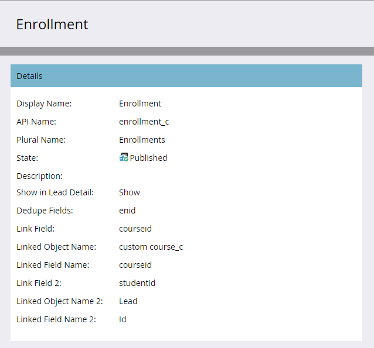
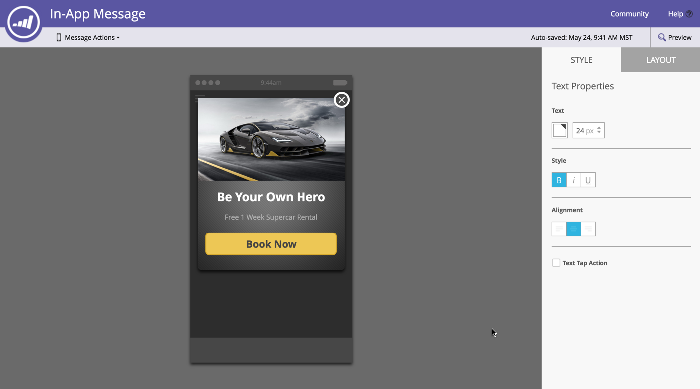

# 2016

## Invierno de 2016 {#winter}

En la versión de invierno de 16 se incluyen las siguientes funciones. Haga clic en los vínculos del título para ver los artículos detallados de cada función.

## [Es Un Filtro Anónimo](/help/marketo/product-docs/administration/additional-integrations/add-munchkin-tracking-code-to-your-website/next-generation-munchkin-tracking-faq.md) {#is-anonymous-filter}

El filtro Es anónimo se ha eliminado para las listas inteligentes. Consulte el documento [Preguntas frecuentes sobre el seguimiento de Munchkin de próxima generación](/help/marketo/product-docs/administration/additional-integrations/add-munchkin-tracking-code-to-your-website/next-generation-munchkin-tracking-faq.md) para obtener más información. Este cambio no afecta a Web Personalization (RTP), que sigue identificando visitantes web anónimos y conocidos y personalizando el contenido en tiempo real para estos visitantes.

## [Tablero de base de datos](/help/marketo/product-docs/core-marketo-concepts/smart-lists-and-static-lists/managing-people-in-smart-lists/database-dashboard.md)  {#database-dashboard}

La [!UICONTROL base de datos de posibles clientes] tiene un panel de resumen actualizado que incluye el tamaño total de la base de datos de personas, el número de posibles clientes comercializables y un desglose de los posibles clientes por las cinco fuentes principales.

## [Explorador Microsoft Edge](/help/marketo/product-docs/administration/setup-administration/supported-browsers.md) {#microsoft-edge-browser}

Hemos agregado [!DNL Microsoft Edge] a la [lista de exploradores](https://docs.marketo.com/display/public/DOCS/Supported+Browsers) admitidos por Marketo.

## [Microsoft Outlook 2016](/help/marketo/product-docs/marketo-sales-insight/msi-outlook-plugin/install-the-marketo-email-add-in-for-outlook-with-a-registration-code.md) {#microsoft-outlook}

[[!DNL Microsoft Outlook] 2016](/help/marketo/product-docs/marketo-sales-insight/msi-outlook-plugin/install-the-marketo-email-add-in-for-outlook-with-a-registration-code.md) ahora es compatible.

## [Inicio principal del programa de correo electrónico](/help/marketo/product-docs/email-marketing/email-programs/email-program-actions/head-start-for-email-programs.md) {#email-program-head-start}

Use [!UICONTROL Head Start] para indicar que el procesamiento del envío debe realizarse con antelación. En lugar de calificar a los posibles clientes y preparar correos electrónicos a la hora programada del programa, [!UICONTROL Head Start] se asegura de que estas tareas se realicen de antemano. De este modo, la audiencia comenzará a recibir correos electrónicos a la hora programada.

Para utilizar esta función, el programa de correo electrónico debe programarse al menos con 12 horas de antelación y la lista inteligente se bloqueará 12 horas antes del envío.

>[!NOTE]
>
>Esta función se implementará gradualmente durante una semana después del lanzamiento de invierno de 2016. No está disponible para su uso con campañas inteligentes o la API.

## [Mejoras en el marketing móvil](/help/marketo/product-docs/mobile-marketing/admin/add-a-mobile-app.md) {#mobile-marketing-enhancements}

Soporte técnico de **[!DNL PhoneGap]:** Ahora ofrecemos soporte técnico de [!DNL PhoneGap] para su aplicación móvil. [Más información](https://developers.marketo.com/documentation/mobile/phonegap-plugin/).

**Compatibilidad con aplicaciones de espacio aislado**:

## [API del programa](https://developers.marketo.com/documentation/programs/) {#program-api}

Cree, actualice y clone programas mediante la API de REST. Esto no incluye la creación o actualización de listas inteligentes y campañas inteligentes dentro de un programa.

## [Mejoras de Microsoft Dynamics](/help/marketo/product-docs/crm-sync/microsoft-dynamics-sync/microsoft-dynamics-sync-details/sync-status.md) {#microsoft-dynamics-enhancements}

**[[!UICONTROL Estado de sincronización]](/help/marketo/product-docs/crm-sync/microsoft-dynamics-sync/microsoft-dynamics-sync-details/sync-status.md)**: Mantenga un control del rendimiento actual y del registro de pendientes del proceso de sincronización. Desglose por el número de inserciones y actualizaciones por objeto.

**[[!UICONTROL Notificaciones]](/help/marketo/product-docs/core-marketo-concepts/miscellaneous/understanding-notifications/notification-types.md)**: recibe notificaciones por errores de sincronización comunes, junto con una lista de posibles clientes que tienen ese error.

## [Mejoras en los objetos personalizados](/help/marketo/product-docs/administration/marketo-custom-objects/create-marketo-custom-objects.md) {#custom-objects-enhancements}

Ahora puede crear relaciones &quot;varios a varios&quot; entre posibles clientes/cuentas y un objeto personalizado mediante un objeto intermedio con varios campos de vínculo.

## [Anuncios de clientes potenciales de Facebook](/help/marketo/product-docs/demand-generation/facebook/set-up-facebook-lead-ads.md) {#facebook-lead-ads}

[[!UICONTROL Los anuncios de posibles clientes de Facebook]](https://www.facebook.com/business/a/lead-ads) son una forma más directa para que una empresa ejecute campañas de generación de posibles clientes en [!DNL Facebook]. Las personas rellenan un formulario para expresar su interés por un producto o servicio, de modo que la empresa pueda hacer un seguimiento con ellos. La integración de Marketo con [!UICONTROL anuncios de clientes potenciales de Facebook] captura automáticamente la información que un posible cliente proporciona en el formulario de anuncios de clientes potenciales. Las acciones de seguimiento y las notificaciones se pueden automatizar con el nuevo déclencheur [!UICONTROL Rellena anuncios de posibles clientes de Facebook].

## [Programador de campañas web (Real-Time Personalization)](/help/marketo/product-docs/web-personalization/working-with-web-campaigns/schedule-a-web-campaign.md) {#web-real-time-personalization-campaign-scheduler}

Programe la campaña con antelación. Configure una fecha de inicio y de finalización para el contenido web personalizado y repita campañas en días y horas específicos. Personalice la programación para mostrar la campaña según la hora del visitante web o una zona horaria seleccionada.

## Primavera de 2016 {#spring}

En la versión de primavera de 16 se incluyen las siguientes funciones. Haga clic en los vínculos del título para ver los artículos detallados de cada función.

## [Perspectivas de correo electrónico](/help/marketo/product-docs/reporting/email-insights/email-insights-overview.md) {#email-insights}

Perspectivas de correo electrónico es una nueva experiencia histórica de análisis de datos agregados de correo electrónico. Se ha rediseñado de extremo a extremo para ofrecer un rendimiento increíblemente rápido. Cuenta con un diseño de interfaz de usuario completamente nuevo, optimizado para adaptarse a las necesidades y al flujo de trabajo de los especialistas en marketing por correo electrónico.

>[!NOTE]
>
>A partir del 3 de junio, publicaremos por lotes las perspectivas de correo electrónico para los clientes. Nuestro objetivo es completar esto en los próximos meses. Le notificaremos por correo electrónico cuando esté habilitado.

## [Selector de plantillas de correo electrónico](/help/marketo/product-docs/email-marketing/general/email-editor-2/email-template-picker-overview.md) {#email-template-picker}

Cree correos electrónicos atractivos con nuestras nuevas plantillas de inicio. Además, localice rápidamente las plantillas desde sus miniaturas en directo.

>[!NOTE]
>
>El Editor de correo electrónico 2.0 (con el Selector de plantillas) se implementará gradualmente a partir del 3 de junio. Completaremos el despliegue antes del 30 de junio. A diferencia de las Perspectivas de correo electrónico, no se le notificará cuando tenga acceso. Para ver si lo hace, siga los pasos de [este artículo](/help/marketo/product-docs/email-marketing/general/email-editor-2/transitioning-to-email-editor-2-0.md).

## [Edición por correo electrónico: reinventado](/help/marketo/product-docs/email-marketing/general/email-editor-2/email-editor-v2-0-overview.md) {#email-editing-re-imagined}

Así es, un nuevo editor de correo electrónico! Utilice la funcionalidad ligera de arrastrar y soltar para añadir y reordenar contenido. Los nuevos elementos, incluidas imágenes, vídeos, variables y módulos, seguramente mejorarán su experiencia de edición. Compruebe también la compatibilidad actualizada con el editor de código, el previsualizador y el preencabezado.

## [Mensajes móviles en la aplicación](/help/marketo/product-docs/mobile-marketing/in-app-messages/understanding-in-app-messages.md) {#mobile-in-app-messages}

Cree impresionantes mensajes en la aplicación para su aplicación directamente en Marketo. Defina exactamente quién debe verlo y cuándo con el programa de mensajes en la aplicación. Monitorice fácilmente su rendimiento con el panel del programa.

## [No hay fragmentos de borrador](/help/marketo/product-docs/administration/users-and-roles/enable-no-draft-for-snippets.md) {#no-draft-snippets}

Se acabaron los días en los que tenía que volver a aprobar todo cada vez que se actualizaba un fragmento. Con la opción Sin borrador, todos los correos electrónicos y páginas de aterrizaje que utilicen un fragmento de código recibirán las actualizaciones del fragmento y mantendrán su estado anterior. Cada vez que apruebe un fragmento, tendrá la opción de ejecutar Sin borrador y actualizar todo, o crear borradores. ¡Depende de ti! La opción Sin borrador estará disponible para todos los clientes y controlada por un nuevo permiso en Administración.

## [Página de aterrizaje, Plantilla de página de aterrizaje y API de formulario](https://developers.marketo.com/blog/spring-2016-updates/) {#landing-page-landing-page-template-and-form-apis}

Las API de REST de Marketo ahora admiten el control sobre páginas de aterrizaje de Marketo, plantillas de páginas de aterrizaje y formularios. Los usuarios ahora pueden crear, actualizar contenido, aprobar y eliminar estos recursos directamente a través de la API de REST de Marketo.

## [Inclusión en la lista de permitidos IP para acceso a API](/help/marketo/product-docs/administration/additional-integrations/create-an-allowlist-for-ip-based-api-access.md) {#ip-allowlisting-for-api-access}

Al igual que la función de inclusión en la lista de permitidos de IP para los inicios de sesión de usuarios de Marketo, los administradores de Marketo ahora pueden configurar una lista de permitidos de direcciones IP que pueden acceder a las API de Marketo SOAP y REST, bloqueando así el acceso desde direcciones IP no autorizadas. Esto proporciona un nivel adicional de seguridad a la instancia de Marketo y garantiza que el acceso a la API solo pueda producirse desde la red de la organización. Encontrará detalles sobre cómo configurarlo en el [sitio de documentación de Marketo](/help/marketo/product-docs/administration/additional-integrations/create-an-allowlist-for-ip-based-api-access.md).

## [Nuevo conector de sincronización de Microsoft Dynamics de alta velocidad](/help/marketo/product-docs/crm-sync/microsoft-dynamics-sync/microsoft-dynamics-sync-details/sync-status.md) {#new-high-speed-microsoft-dynamics-sync-connector}

El nuevo conector de alta velocidad de Dynamics ofrece velocidades de hasta 20 veces más rápidas para la sincronización inicial y hasta 5 veces más rápidas para la sincronización incremental. Todos los clientes nuevos incorporarán este conector en la fecha de lanzamiento y lo implementaremos gradualmente para los clientes existentes durante el periodo de lanzamiento de verano.

**Actualizar datos para nuevos campos**: Ahora puede habilitar nuevos campos de sincronización en cualquier momento y todos los valores de datos de ese campo se actualizarán de [!DNL Dynamics] CRM a Marketo. Ya no hay que preocuparse por seleccionar todos los campos durante la configuración inicial. Si deshabilita un campo de sincronización existente y lo vuelve a habilitar más adelante, todos los valores de datos de ese campo se actualizarán de [!DNL Dynamics] CRM a Marketo.

**Sincronizar posible cliente como contacto**: La acción de flujo de [!UICONTROL Sincronizar posible cliente con Microsoft] tiene una nueva opción para sincronizarse como posible cliente o contacto.

**Ficha de administración de errores de sincronización**: examinar, buscar o exportar posibles clientes (y otros objetos) que no se pudieron sincronizar con detalles como la operación, la dirección, el código de error y el mensaje de error.

**[!DNL Microsoft Dynamics]2016**: El conector está completamente certificado para [!DNL Dynamics] versiones de [!DNL Online] y [!DNL On-premise] de 2016.

**Ya se han documentado las actualizaciones de complementos:** Consulte el [artículo de documentos sobre actualizaciones de complementos](/help/marketo/product-docs/crm-sync/microsoft-dynamics-sync/marketo-plugin-releases-for-microsoft-dynamics.md).

## [Nombre descriptivo de instancia](/help/marketo/product-docs/administration/settings/edit-subscription-settings.md) {#friendly-instance-name}

Hoy en día, es difícil diferenciar entre instancias de Marketo, por ejemplo, instancias de zona protegida y de producción. Esta función le permite saber en qué instancias está trabajando actualmente.

## Acceso de tiempo limitado para suscripciones {#limited-time-access-for-subscriptions}

Hoy en día, los usuarios están invitados a la suscripción de Marketo por un período de tiempo indefinido. Esta función permite a los administradores invitar a usuarios a suscripciones durante un período de tiempo limitado, por ejemplo, 2 semanas o 1 mes.

## [Cuadrícula de objetos personalizados](/help/marketo/product-docs/administration/marketo-custom-objects/understanding-marketo-custom-objects.md) {#custom-objects-grid}

Ahora puede ver el número de registros y campos de todos los objetos personalizados publicados.

## Actividades personalizadas {#custom-activities}

Los administradores de Marketo ahora pueden definir y administrar sus tipos de actividades personalizadas mediante el modelador de definición de actividad personalizada de Marketo. De forma similar a (y junto con) Marketo Custom Object Modeler, los administradores ahora pueden ampliar el modelo de datos para adaptarlo a sus necesidades comerciales exactas. Encontrará detalles sobre cómo usar esta funcionalidad en el [sitio de documentación de Marketo](/help/marketo/product-docs/administration/marketo-custom-activities/understanding-custom-activities.md).

## Verano de 2016 {#summer}

Las siguientes funciones se incluyen en la versión de verano de 16. Compruebe la disponibilidad de las funciones en Marketo Edition. Haga clic en los vínculos del título para ver los artículos detallados de cada función.

## [Marketing basado en la cuenta](https://docs.marketo.com/display/docs/account+based+marketing) {#account-based-marketing}

El marketing basado en cuentas de Marketo proporciona todos los elementos esenciales en una sola plataforma:

* **Target**: detección de cuentas, coincidencia de clientes potenciales con cuentas y listas de cuentas con nombre
* **Participación**: Personalization basado en cuentas, participación en canales múltiples y flujos de trabajo específicos de la cuenta
* **Medida** - Perspectivas de nivel de cuenta y lista, Puntuación de participación de cuenta e Impacto en la canalización e ingresos

>[!NOTE]
>
>ABM está disponible como complemento de su suscripción a Marketo, por lo que debe ponerse en contacto con su representante de ventas para implementarlo.

## [Pista de auditoría](/help/marketo/product-docs/administration/audit-trail/audit-trail-overview.md) {#audit-trail}

La pista de auditoría proporciona un historial completo de los cambios realizados en la suscripción de Marketo. Creará responsabilidad entre usuarios y administradores, ayudará a identificar la causa de comportamientos inesperados y proporcionará la seguridad de saber quién hace qué y cuándo. Esta información estará disponible en cualquier momento y se puede utilizar para responder preguntas como las siguientes:

* ¿Qué ha pasado con este recurso o configuración y quién lo actualizó por última vez?
* ¿Qué ha estado haciendo el usuario X?
* ¿Quién inicia sesión en nuestra cuenta?

## Integración de LaunchPoint de SMS de Marketo-Vibes

Cree fácilmente mensajes SMS dentro de Marketo. Personalice y segmente su mensaje con los datos de Marketo enriquecidos y supervise fácilmente su rendimiento con el panel de mensajes SMS.

>[!NOTE]
>
>Esta característica requiere que tenga una cuenta de [!DNL Vibes SMS].

## [Mejoras en el correo electrónico 2.0](/help/marketo/product-docs/email-marketing/general/email-editor-2/email-editor-v2-0-overview.md) {#email-enhancements}

**Variables de nivel de módulo**

Anteriormente, todas las variables especificadas en las plantillas de correo electrónico 2.0 tenían un ámbito &quot;global&quot;. Cuando se utilizan variables dentro de los módulos, esto no siempre es deseable si planea utilizar varias instancias del módulo. Con esta versión, las variables ahora se pueden especificar como &quot;nivel de módulo&quot;, lo que le permite indicar que el usuario debe poder establecer valores únicos para cada módulo en el que se utilicen.

**Actualizaciones de sintaxis**

* Ahora puede utilizar &quot;mktoAddByDefault&quot; en los módulos especificados en las plantillas de correo electrónico 2.0 para indicar qué módulos deben mostrarse en los nuevos correos electrónicos de forma predeterminada. Esto resulta mucho más práctico si crea una plantilla de correo electrónico con una gran cantidad de módulos.
* En los elementos de imagen, ahora puede especificar si las propiedades &quot;height&quot; y &quot;width&quot; del elemento HTML `` subyacente deben bloquearse o editarse para el usuario final. mktoLockImgSize=&quot;true&quot; hará que el alto/ancho se bloquee (incluso si se cambia la imagen). Del mismo modo, mktoLockImgStyle=&quot;true&quot; hará que la propiedad &quot;style&quot; se bloquee.

**Buscando código**

Utilice la nueva funcionalidad de búsqueda para buscar y reemplazar contenido de forma eficaz dentro del código del correo electrónico. Esta funcionalidad también está disponible en el editor de plantillas de correo electrónico.

**Compatibilidad con tokens en elementos de imagen**

Ahora, los tokens se pueden utilizar en el área &quot;URL externa&quot; de la experiencia de inserción de imágenes. Si ha especificado imágenes con `{{my.tokens}}`, ahora puede hacer referencia a estos tokens en Email Editor 2.0. Tenga en cuenta que la imagen seguirá apareciendo rota en el lienzo del Editor de correo electrónico 2.0. Sin embargo, los verá procesados en Vista previa y Enviar muestra antes de enviar el correo electrónico.

## Varios dominios de personalización de marca {#multiple-branding-domains}

Se acabaron los días en que los vínculos de seguimiento de correo electrónico solo se podían añadir a un único dominio de marca. Ahora puede añadir varios dominios de promoción de la marca para inspirar confianza en los consumidores, crear una apariencia más optimizada para centrarse en la marca, mejorar la capacidad de envío de correos electrónicos y elegir, por correo electrónico, el dominio de promoción de la marca que se utilizará para los vínculos de seguimiento de cada correo electrónico.

## [Tokens de programa](/help/marketo/product-docs/demand-generation/landing-pages/personalizing-landing-pages/tokens-overview.md) {#program-tokens}

Hemos creado un nuevo tipo de token para los programas. Ahora puede procesar Nombre, Descripción e ID del programa en los pasos de flujo de recursos y campañas inteligentes.

## [Clave de empresa](/help/marketo/product-docs/marketo-sales-insight/msi-outlook-plugin/authorize-the-marketo-outlook-plugin.md) {#enterprise-key}

Requerir que cada persona del equipo de ventas instale nuestro complemento [!DNL Sales Insight] para [!DNL Outlook] puede ser tedioso. Hemos introducido una nueva forma de instalar el complemento para [!DNL Outlook] de forma remota mediante una clave empresarial. Envíe a su equipo de TI la clave única que encontró en la sección de Marketo [!DNL Sales Insight] de [!UICONTROL Admin] y déjeles hacer el resto.

## [Campañas de Web Personalization](/help/marketo/product-docs/web-personalization/working-with-web-campaigns/create-a-new-dialog-web-campaign.md) {#web-personalization-campaigns}

Especifique un retraso para que las campañas web reaccionen en el sitio web.

## [Exportación de Content Analytics y Recommendations](/help/marketo/product-docs/web-personalization/understanding-web-personalization/understanding-content-analytics.md) {#content-analytics-and-recommendations-export}

Ver datos de análisis de contenido y recomendaciones sin conexión.

## [Compatibilidad con API para el editor de correo electrónico 2.0](https://developers.marketo.com/documentation/asset-api/) {#api-support-for-email-editor}

Las API de recursos preexistentes, que anteriormente solo eran compatibles con las plantillas y los correos electrónicos de la versión 1.0, ahora están habilitadas para los recursos de correo electrónico de la versión 2.0.

## [Sitio para desarrolladores de Marketo](https://developers.marketo.com/) {#marketo-developers-site}

Nuevo y mejorado

## [Configuración de privacidad](/help/marketo/product-docs/administration/settings/understanding-privacy-settings.md) {#privacy-settings}

Los especialistas en marketing pueden usar la configuración de privacidad para decidir si desean realizar el seguimiento de los visitantes mediante las características de [!DNL Munchkin] y Web Personalization. El nivel de seguimiento se controla mediante la configuración No rastrear del explorador, una cookie de exclusión o una IP no específica. Estos métodos pueden afectar al valor y la funcionalidad de Marketo en áreas específicas, pero si el experto en marketing no cambia nada, la funcionalidad de Marketo permanece igual.

Esta función se lanzará gradualmente a los clientes durante un periodo de seis semanas. Si lo necesita de inmediato, póngase en contacto con el Soporte técnico de Marketo.

## Otoño de 2016 {#fall}

Las siguientes funciones se incluyen en la versión de otoño de 1616. Compruebe la disponibilidad de las funciones en Marketo Edition. Haga clic en los vínculos del título para ver los artículos detallados de cada función.

## [!UICONTROL Contenido predictivo] en el correo electrónico {#predictive-content-in-email}

Hay una nueva experiencia de usuario para nuestra aplicación [!UICONTROL Contenido predictivo] que permite rastrear, administrar y recomendar su contenido a través de nuestro aprendizaje automático y algoritmos predictivos en los canales web y de correo electrónico.

>[!NOTE]
>
>Todos los clientes con el módulo Predictive estarán habilitados el 10 de enero.

Ahora puede añadir contenido predictivo al correo electrónico. Cuando se abre el correo electrónico, el destinatario recibe automáticamente contenido relevante recomendado que ayuda a aumentar la participación y las conversiones del contenido.

## [Conversiones de Facebook sin conexión](/help/marketo/product-docs/demand-generation/facebook/understanding-facebook-offline-conversions.md) {#facebook-offline-conversions}

Con la integración de [!DNL Facebook] conversiones sin conexión, los datos de conversión en Marketo (para posibles clientes con publicidad) se envían automáticamente de vuelta a [!DNL Facebook] para que su equipo de publicidad pueda optimizar mejor su gasto en publicidad. En este informe de administrador de anuncios [!DNL Facebook], se resaltan las conversiones sin conexión.

## ID universal {#universal-id}

Un ID universal le permite acceder a varias suscripciones de Marketo con un solo inicio de sesión y cambiar entre suscripciones rápidamente. Puede utilizar un único perfil de comunidad para todas las suscripciones.

>[!NOTE]
>
>Póngase en contacto con el Soporte técnico de Marketo para habilitar esta función.

## Mejoras de marketing basado en cuentas de Marketo {#marketo-account-based-marketing-enhancements}

Ahora puede asignar equipos de cuentas a cuentas con nombre en Marketing basado en cuentas (ABM), por ejemplo, propietario de cuenta, representante de desarrollo de ventas, representante de desarrollo empresarial y administrador de éxito de clientes. También puede crear listas de cuentas específicas del propietario de la cuenta y enviar informes personalizados de ABM semanales al equipo de la cuenta.

**API DE REST**

Esta versión también le permite administrar atributos de cuenta con nombre y puntuaciones de cuentas en ABM mediante la API de REST de Marketo. Para obtener más información sobre las operaciones de la API, visite el [sitio web de desarrolladores de Marketo](https://developers.marketo.com/rest-api/lead-database/named-accounts).

## [Mejoras en la pista de auditoría](/help/marketo/product-docs/administration/audit-trail/change-details-in-audit-trail.md) {#audit-trail-enhancements}

La pista de auditoría proporciona un historial completo de los cambios realizados en la suscripción de Marketo. Hemos agregado funcionalidades de seguimiento adicionales para programas, así como detalles importantes sobre cambios para campañas inteligentes, listas inteligentes y cambios realizados en usuarios y funciones.

## Nuevos permisos

**Poner el correo electrónico en funcionamiento**

Se acabaron los días en los que tenía que preocuparse por los usuarios que enviaban correos electrónicos transaccionales a personas de la base de datos que habían cancelado la suscripción. Ahora puede especificar qué usuarios pueden hacer que un correo electrónico sea operativo o editar correos electrónicos operativos.

**Editar restricciones de campaña**

¿Por qué establecer [restricciones de campaña](/help/marketo/product-docs/administration/email-setup/enable-person-restrictions-for-smart-campaigns.md) si no puede aplicarlas? Cuando establece la Configuración de límite de campaña para restringir el número de personas en la base de datos a las que se puede dirigir con una sola campaña, ahora puede restringir qué usuarios pueden anular esta configuración al programar una campaña.

## [Sonido para notificaciones push móviles](/help/marketo/product-docs/mobile-marketing/push-notifications/configure-mobile-push-notification.md) {#sound-for-mobile-push-notifications}

Aporte mayor riqueza a las notificaciones push de iOS habilitando el sonido. Esta nueva función le permite almacenar en déclencheur un sonido cuando las notificaciones push se muestran en el dispositivo móvil.

>[!NOTE]
>
>* Los propietarios de dispositivos pueden optar por evitar que los sonidos se reproduzcan en la configuración del dispositivo, y los desarrolladores de aplicaciones pueden proporcionar a los propietarios de dispositivos opciones dentro de la aplicación para evitar que se reproduzcan sonidos.
>* Los sonidos se reproducen automáticamente cuando se muestra una notificación push en un dispositivo Android.

## [Insight de ventas compatible con Salesforce Encryption](/help/marketo/product-docs/marketo-sales-insight/msi-for-salesforce/installation/install-marketo-sales-insight-package-in-salesforce-appexchange.md) {#sales-insight-compatible-with-salesforce-encryption}

Market [!DNL Sales Insight] ahora es compatible con cifrado de escudo [!DNL Salesforce]. Todos los clientes de [!DNL Sales Insight] deben actualizar a este último paquete administrado (versión 1.4359.2), que está [disponible en el [!DNL Appexchange]](https://appexchange.salesforce.com/listingDetail?listingId=a0N30000001SVZmEAO).

## [API de cuentas con nombre](https://developers.marketo.com/rest-api/lead-database/named-accounts/) {#named-accounts-apis}

Con esta versión, los usuarios de Marketo ABM pueden administrar cuentas con nombre a través de la API de Cuentas con nombre. Los usuarios pueden crear, actualizar y eliminar cuentas con nombre, así como leer y actualizar las puntuaciones de cuentas con nombre de ABM.

## [Compatibilidad con la API del Editor de correo electrónico v2.0](https://developers.marketo.com/rest-api/assets/emails/) {#email-editor-v-api-support}

Administre variables y módulos para correos electrónicos en formato v2.0 mediante la API de REST de Marketo.

## [Cambios en la sincronización de Marketo Salesforce](https://nation.marketo.com/docs/DOC-3840) {#changes-to-marketo-salesforce-sync}

La integración de [!DNL Salesforce] de Marketo está evolucionando para mejorar la forma en que los campos de Marketo se sincronizan con [!DNL Salesforce]. Ahora, en lugar de tener que sincronizar un grupo grande de campos que puede que necesite o no, puede elegir qué campos desea incluir. Consulte nuestra documentación aquí para obtener más información: [https://nation.marketo.com/docs/DOC-3840](https://nation.marketo.com/docs/DOC-3840).
