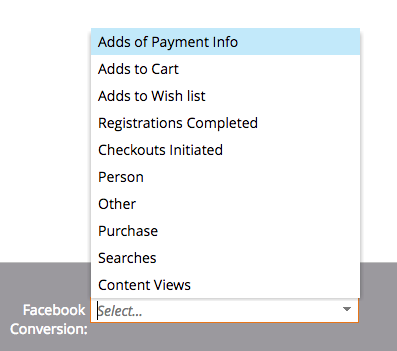
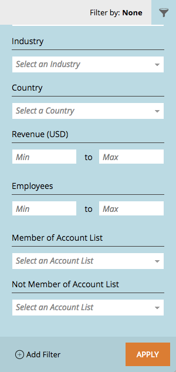

# 2017

## Invierno de 2017 {#winter}

En la versión de invierno de 17 se incluyen las siguientes funciones. Compruebe la disponibilidad de las funciones en Marketo Edition.

Haga clic en los vínculos del título para ver los artículos detallados de cada función.

>[!NOTE]
>
>Si un tema tiene varios subencabezados, los vínculos se colocan allí.

## [Coincidencia avanzada para audiencias personalizadas de Facebook](/help/marketo/product-docs/demand-generation/ad-network-integrations/add-facebook-custom-audiences-as-a-launchpoint-service.md) {#advanced-matching-for-facebook-custom-audiences}

La coincidencia básica solo utiliza direcciones de correo electrónico, pero la nueva coincidencia avanzada utiliza siete campos adicionales, lo que aumenta la tasa de coincidencia para obtener más conversión.

## [API de importación de objeto personalizado](https://developers.marketo.com/rest-api/lead-database/custom-objects/) {#custom-object-import-api}

Esta API proporciona una interfaz más rápida para sincronizar objetos personalizados en Marketo. Puede importar archivos de hoja de cálculo CSV, TSV o SSV en Marketo como objetos personalizados.

## [Exportación de campañas Web Personalization](/help/marketo/product-docs/web-personalization/working-with-web-campaigns/export-web-campaign-data.md) {#web-personalization-campaigns-export}

Exporte todos los detalles y análisis de su campaña web en formato CSV. A continuación, puede ver los datos con un diseño conveniente.

## Localización {#localization}

Las aplicaciones Web Personalization, [!UICONTROL Contenido predictivo] y Perspectivas de correo electrónico ya están disponibles en japonés, alemán y español. Usted [selecciona su idioma y configuración regional](/help/marketo/product-docs/administration/settings/change-time-zone.md) para ver su contenido en estos idiomas.

## Mejoras de marketing basado en cuentas {#account-based-marketing-enhancements}

**[Importar cuentas con nombre](/help/marketo/product-docs/target-account-management/target/named-accounts/import-named-accounts.md)**

Con la opción de importación [!UICONTROL Cuenta con nombre], cree o actualice varios registros a la vez mediante la carga de CSV.

**[Compatibilidad con Email Insights](/help/marketo/product-docs/reporting/email-insights/filtering-in-email-insights.md)**

Use [!UICONTROL Cuenta con nombre] o [!UICONTROL Lista de cuentas] como dimensiones en las Perspectivas de correo electrónico.

## [!UICONTROL Mejoras en el contenido predictivo] {#predictive-content-enhancements}

**[Filtrar por [!UICONTROL Source habilitado]](/help/marketo/product-docs/predictive-content/working-with-predictive-content/understanding-predictive-content.md)**

Filtrar [!UICONTROL contenido predictivo] piezas que estén habilitadas para [!UICONTROL correo electrónico], [!UICONTROL medios enriquecidos] o la [!UICONTROL barra de recomendaciones].

**[Filtrar [!UICONTROL Analytics por Source]](/help/marketo/product-docs/predictive-content/working-with-predictive-content/understanding-predictive-content.md)**

Filtrar [!UICONTROL contenido predictivo] para orígenes específicos: [!UICONTROL correo electrónico], [!UICONTROL medios enriquecidos] o [!UICONTROL barra de recomendaciones].

**[!UICONTROL Editor de contenido predictivo]**

Hay una experiencia de edición y un diseño mejorados que dividen la preparación de contenido por origen: [!UICONTROL Correo electrónico], [!UICONTROL Medios enriquecidos] o [!UICONTROL Barra de recomendaciones].

**[Contenido de detección automática para Predictive](/help/marketo/product-docs/predictive-content/getting-started/enable-content-discovery.md)**

La URL de imagen y los metadatos ahora se utilizan en el proceso de detección automática de contenido.

## [Mejoras de SDK](https://developers.marketo.com/mobile/) {#sdk-enhancements}

Los desarrolladores ahora tienen control adicional sobre el envío de notificaciones push con la adición de una nueva llamada de API de SDK que permite a los desarrolladores eliminar tokens push.

## Integración de LaunchPoint con SMS de Vibes

Mejore su segmentación con una nueva opción de filtro, &quot;Miembro de la lista de vibraciones&quot;.

## [Obsolescencia del editor de texto enriquecido y del editor de formularios 1.0 heredados](https://nation.marketo.com/docs/DOC-4315) {#legacy-rich-text-editor-and-form-editor-deprecation}

A partir del 1 de agosto de 2017, los clientes que sigan utilizando el Editor de texto enriquecido y el Editor de formularios 1.0 heredados pasarán automáticamente a la nueva experiencia.

## [API de actividad de Marketo](https://developers.marketo.com/blog/important-change-activity-records-marketo-apis/) {#marketo-activity-apis}

Se está produciendo un cambio importante en las API de actividad de Marketo. ¿Estás preparado?

## Primavera de 2017 {#spring}

En la versión de primavera de 17 se incluyen las siguientes funciones. Compruebe la disponibilidad de las funciones en Marketo Edition.

Haga clic en los vínculos del título para ver los artículos detallados de cada función. **Nota**: Si un tema tiene varios subencabezados, los vínculos se colocan allí.

## [Forms de generación de clientes potenciales de LinkedIn](/help/marketo/product-docs/demand-generation/social/social-functions/set-up-linkedin-lead-gen-forms.md) {#linkedin-lead-gen-forms}

[[!UICONTROL LinkedIn Lead Gen] Forms](https://business.linkedin.com/marketing-solutions/native-advertising/lead-gen-ads) es una forma más directa para que una empresa ejecute campañas de generación de clientes potenciales en [!DNL LinkedIn]. Las personas pueden rellenar formularios para expresar interés en un producto o servicio, lo que permite a la empresa capturar los detalles de la persona y sincronizarlos con Marketo, donde se pueden producir procesos de seguimiento automatizados y actividades de enrutamiento de posibles clientes.

La integración de Marketo con [!UICONTROL LinkedIn Lead Gen] Forms captura automáticamente la información que un posible cliente proporciona en el formulario de generación de clientes. Las acciones de seguimiento y las notificaciones se pueden automatizar mediante el nuevo déclencheur **Rellena el formulario [!DNL LinkedIn Lead Gen]** y filtrarlos.

## [Caducar plantilla MSI](/help/marketo/product-docs/marketo-sales-insight/msi-for-salesforce/features/actions-in-the-msi-panel/send-marketo-email/publish-an-email-to-sales-insight.md) {#expire-msi-template}

Se acabaron los días en que se limpiaban las plantillas obsoletas de [!DNL Sales Insight]. Establezca una fecha de caducidad cuando publique su correo electrónico y nos encargamos de cancelar la publicación por usted cuando la fecha de caducidad se desplace.

>[!NOTE]
>
>Establecer la fecha de caducidad del 31/5/17 significa que la plantilla se eliminará de [!DNL Sales Insight] al final del día, el 31/5/17.

## [API de extracción masiva para personas y actividades](https://developers.marketo.com/rest-api/bulk-extract/) {#bulk-extract-apis-for-people-and-activities}

Transfiera fácilmente grandes cantidades de datos de persona y actividad de Marketo a sus sistemas externos.

## Mejoras de ABM {#abm-enhancements}

**[Campos personalizados en cuentas con nombre ABM](https://docs.marketo.com/x/1wnG)**

Marketo ABM ahora le permite crear hasta 10 campos personalizados en sus cuentas con nombre. Puede asignar estos campos personalizados a campos en su objeto de cuenta de CRM y Marketo ABM sincronizará los datos, lo que le permitirá ampliar sus cuentas con nombre de ABM y le ayudará a dirigir su marketing.

**[Puntuación porcentual en cuentas con nombre ABM](https://docs.marketo.com/display/docs/assets/abmpercentiles.png)**

Las puntuaciones de las cuentas con nombre pueden variar considerablemente. Marketo ABM ahora calcula automáticamente un percentil para cada una de sus puntuaciones, para que pueda ver de un vistazo dónde se clasifica cada cuenta con nombre entre sus otras cuentas con nombre.

**[API de lista de cuenta ABM](https://developers.marketo.com/rest-api/lead-database/named-account-lists/)**

Aproveche las integraciones de socios de ABM enriquecidas y sólidas con compatibilidad de API mejorada para Listas de cuentas con nombre.

## Mejoras de Web Personalization {#web-personalization-enhancements}

**[Campaña web tras el desplazamiento](/help/marketo/product-docs/web-personalization/working-with-web-campaigns/set-how-your-web-campaign-displays.md)**

Los nuevos efectos de campaña web proporcionan a los visitantes una experiencia más personalizada. Configure sus [!UICONTROL Campañas web] personalizadas para que se muestren solamente cuando un visitante web se desplace hacia abajo en su página web. Puede configurar su Diálogo [!UICONTROL Campañas web] para que se muestre al desplazarse en función de:

* porcentaje de página desplazada
* píxel alcanzado
* desplazarse por debajo del pliegue de la página

**[Campaña Web Tras La Intención De Salida](/help/marketo/product-docs/web-personalization/working-with-web-campaigns/set-how-your-web-campaign-displays.md)**

Capte la atención de los visitantes antes de que cierren la página. Configure sus [!UICONTROL Campañas web] personalizadas para que se muestren solamente cuando un gesto del ratón indique que el visitante está saliendo de la página.

**[Efectos de animación para [!UICONTROL campañas web]](/help/marketo/product-docs/web-personalization/working-with-web-campaigns/create-a-new-dialog-web-campaign.md)**

Establezca los efectos de animación para la campaña web de Dialogue para personalizar cómo aparece una campaña al entrar o al salir de la página web. Puede seleccionar entre 6 efectos diferentes y controlar el tiempo y la dirección del cuadro de diálogo.

**[Personalización del botón Cerrar diálogo](/help/marketo/product-docs/web-personalization/working-with-web-campaigns/create-a-new-dialog-web-campaign.md)**

Personalice el botón Cerrar para cuadros de diálogo. Seleccione entre una gama de opciones utilizadas en el estilo de diálogo transparente [!UICONTROL Campañas web]. Seleccione el icono, el color y la posición del botón Cerrar. También puede agregar su propia imagen de botón.

**[Archivar campañas web](/help/marketo/product-docs/web-personalization/working-with-web-campaigns/archive-a-web-campaign.md)**

Archivar es un nuevo estado de Campaña web que le permite archivar [!UICONTROL Campañas web] y ocultarlas de la vista de Campaña web predeterminada. Esto le permite centrarse en las campañas activas más relevantes y recuperar campañas archivadas más antiguas bajo demanda.

**[Localización](/help/marketo/product-docs/administration/settings/change-time-zone.md)**

Web Personalization ahora se ofrece en todos los idiomas compatibles con Marketo (inglés, japonés, alemán, español, francés y portugués).

## Mejoras predictivas {#predictive-enhancements}

**[Localización](/help/marketo/product-docs/administration/settings/change-time-zone.md)**

El contenido predictivo ahora se ofrece en todos los idiomas compatibles con Marketo (inglés, japonés, alemán, español, francés y portugués).

## [Obsolescencia del editor de texto enriquecido y del editor de formularios 1.0 heredados](https://nation.marketo.com/docs/DOC-4315) {#legacy-rich-text-editor-and-form-editor-deprecation}

A partir del 1 de agosto de 2017, los clientes que sigan utilizando el Editor de texto enriquecido y el Editor de formularios 1.0 heredados pasarán automáticamente a la nueva experiencia.

## Verano de 2017 {#summer}

Las siguientes funciones se incluyen en la versión de verano de 17. Compruebe la disponibilidad de las funciones en Marketo Edition.

Haga clic en los vínculos del título para ver los artículos detallados de cada función. Nota: Algunas de las funciones incluidas en esta versión no tienen artículos asociados. Si un tema tiene varios subencabezados, los vínculos se colocan allí.

## [Fases adicionales de conversión sin conexión a Facebook](/help/marketo/product-docs/demand-generation/facebook/set-up-facebook-offline-conversions.md) {#additional-facebook-offline-conversion-stages}

Elija hasta 7 fases de conversión sin conexión adicionales para asignarlas a las fases del ciclo vital de Marketo (más allá de las 3 disponibles hoy). Optimice su gasto publicitario de [!DNL Facebook] en función de las conversiones del recorrido de sus clientes para obtener un mejor retorno de la inversión.

## [Bloquear plantilla de Insight de ventas](/help/marketo/product-docs/marketo-sales-insight/msi-for-salesforce/features/actions-in-the-msi-panel/send-marketo-email/lock-sales-template.md) {#lock-sales-insight-template}

Asegúrese de que el mensaje y el contenido sean coherentes y evite realizar ediciones en las plantillas de ventas. Esto ayuda a estandarizar las plantillas y mantener las comunicaciones profesionales.

## Mejoras de ABM {#abm-enhancements}

**Búsqueda de datos en Source para empresas japonesas**

Hacer coincidir personas con nombres de empresas en japonés en el idioma local.

**[Integración de ABM y LeanData](https://docs.marketo.com/x/pKmt)**

La integración de [!DNL LeanData] ahora permite la coincidencia de cliente potencial con cuenta en Marketo. Mantenga el marketing y las ventas alineados al tener los mismos posibles clientes asociados a las cuentas dentro de los sistemas de ventas y marketing de registro. Las opciones más flexibles proporcionan a las operaciones de marketing y ventas más control sobre las reglas de coincidencia de cliente potencial con cuenta para que puedan alcanzar el nivel de precisión deseado.

## Mejoras de Web Personalization {#web-personalization-enhancements}

**[Mejoras en la vista previa de Campaign](/help/marketo/product-docs/web-personalization/working-with-web-campaigns/preview-and-test-a-web-campaign.md)**

Los profesionales del marketing ahora pueden asegurarse de que sus campañas web tengan un aspecto impecable en cualquier dispositivo *antes de* iniciarlas. Con estas mejoras, vea el rendimiento de sus campañas web en equipos de escritorio, dispositivos móviles y tabletas. El nuevo complemento de [!DNL Chrome] también ofrece vistas previas más coherentes y precisas.

**[Mejoras en la campaña de widgets](/help/marketo/product-docs/web-personalization/working-with-web-campaigns/create-a-new-widget-web-campaign.md)**

Ya están disponibles nuevas opciones para las campañas de widgets, como las siguientes:

* Activación de campañas (retraso, desplazamiento)
* Visualización de campañas (en cualquier posición alrededor de la pantalla)
* Cambiar la flecha de expansión/minimización a cualquier texto de CTA

## ContentAI {#contentai}

**[Sugerencias y análisis ContentAI](/help/marketo/product-docs/predictive-content/predictive-content-analytics-overview.md)**

Aumente el retorno de su marketing de contenido con análisis más profundos y sugerencias de contenido con tecnología de IA para aumentar la participación. Los potentes análisis muestran el rendimiento del contenido recomendado, incluidas las vistas populares, de tendencias y basadas en audiencias. También verá sugerencias para que se incluya contenido adicional.

## Analytics {#analytics}

**[!UICONTROL Mejoras en las perspectivas de correo electrónico]**

Obtén aún más de tu experiencia con [!UICONTROL Email Insights] con nuevas formas de preparar y compartir datos. Ahora puede descargar los resultados de [!UICONTROL Email Insights] en [!DNL Microsoft Excel] y [!DNL PowerPoint] para trabajar con los datos fuera de Marketo.

## Compatibilidad con configuración de identidad federada {#federated-identity-configuration-support}

Mantenga la autenticación (Active Directory) detrás del firewall local mientras sigue usando [!DNL Microsoft Dynamics] CRM en la nube.

## Otoño de 2017 {#fall}

Las siguientes funciones se incluyen en la versión de otoño de 1717. Compruebe la disponibilidad de las funciones en Marketo Edition.

Haga clic en los vínculos del título para ver los artículos detallados de cada función. Nota: Algunas de las funciones incluidas en esta versión no tienen artículos asociados. Si un tema tiene varios subencabezados, los vínculos se colocan allí.

## Fiabilidad del sistema {#system-reliability}

Hemos mejorado aún más la infraestructura principal de Marketo, incluida una mejor secuencia, menos discrepancias y una mayor estabilidad de [!DNL Munchkin].

## Rendimiento de sincronización de SFDC {#sfdc-sync-performance}

Aproveche la sincronización más rápida y completa entre Marketo y [!DNL Salesforce]. Los cambios de datos que requieren actualizaciones masivas en cuentas o posibles clientes se pueden dividir en colas paralelas para evitar atrasos. Los eventos y las tareas ahora también se sincronizan hasta un 50 % más rápido.

## Mejoras de rendimiento de Analytics {#analytics-performance-improvements}

Las mejoras recientes de la infraestructura ofrecen un mayor tiempo de actividad y estabilidad dentro de las herramientas de análisis e informes de Marketo, lo que le permite crear informes ad hoc más rápidamente.

## [Zona horaria del destinatario](/help/marketo/product-docs/email-marketing/email-programs/email-program-actions/scheduling-with-recipient-time-zone/understanding-recipient-time-zone.md) {#recipient-time-zone}

Con esta nueva función, ahora puede retener y enviar correos electrónicos según las zonas horarias locales. Los programas de correo electrónico y participación se pueden configurar para que se entreguen en los husos horarios de los destinatarios, lo que elimina la necesidad de crear varios programas: enviar una vez y Marketo retendrá automáticamente el correo electrónico hasta la hora local correcta. Levante las métricas de correo electrónico, observe las prácticas locales y ahorre tiempo gracias al uso de un solo programa a nivel global.

>[!NOTE]
>
>Si todavía no puedes habilitar la Zona horaria del destinatario en tus programas de correo electrónico y participación, ¡no te asustes! Estamos habilitando gradualmente esta función para todos los clientes.

## [Revisar correos electrónicos de muestra por segmento](/help/marketo/product-docs/email-marketing/general/creating-an-email/send-a-sample-email.md) {#review-sample-emails-by-segment}

Marketo tiene una nueva opción para elegir un segmento al enviar correos electrónicos de muestra para su revisión. Ya no es necesario determinar manualmente a qué segmento pertenece un posible cliente, lo que facilita el envío de correos electrónicos con contenido dinámico a diferentes segmentos.

## [Preguntas personalizadas sobre LinkedIn Lead Gen](/help/marketo/product-docs/demand-generation/social/social-functions/set-up-linkedin-lead-gen-forms.md) {#linkedin-lead-gen-custom-questions}

Personaliza tus formularios [!UICONTROL LinkedIn Lead Gen] para recopilar atributos de posibles clientes personalizados. Ahora puede hacer hasta tres preguntas personalizadas por formulario, elegir entre preguntas de una sola línea o de opción múltiple y volver a asignar a los campos de posible cliente de Marketo.

## Integración de Slack {#slack-integration}

Hemos lanzado dos funciones como parte de nuestra nueva integración con Slack:

* Notificaciones del sistema: obtenga notificaciones de Slack sobre eventos importantes de su instancia de Marketo, como alertas sobre estados de campañas actuales y cualquier problema que requiera atención inmediata.
* Momentos interesantes: Cuando una persona conocida activa un Marketo Insight desde una cuenta de ventas, se puede notificar a los propietarios del posible cliente mediante Slack. Las notificaciones incluyen información sobre posibles clientes y sobre la cuenta de ventas.

## Mejoras de ABM {#abm-enhancements}

**[Mostrar cuentas sin contactos](https://docs.marketo.com/x/fKCt)**

Marketo ABM ahora sincroniza y muestra cuentas de CRM sin contactos. Incluya nuevas cuentas sin historial de ventas o marketing anterior y rastree el progreso haciendo coincidir los posibles clientes subsiguientes con las cuentas.

## ContentAI Analytics {#contentai-analytics}

**[Nuevo filtro de lista de cuenta ABM](https://docs.marketo.com/x/1BPG)**

Vea y compare el rendimiento del contenido en las listas de cuentas de ABM para optimizar el contenido existente. ContentAI le muestra:

* contenido principal visualizado
* contenido convertido superior
* Contenido sugerido con tecnología de IA para actividades de marketing

## Mejoras de Web Personalization {#web-personalization-enhancements}

**[Tokens para campañas web](/help/marketo/product-docs/web-personalization/working-with-web-campaigns/using-the-web-personalization-rich-text-editor.md)**

Los tokens ya están disponibles para su uso en campañas web. Aproveche los tokens para ofrecer mensajes y contenido personalizados y aumentar la participación en sus campañas web.

**[Imágenes de Design Studio en el editor de campañas web](/help/marketo/product-docs/web-personalization/working-with-web-campaigns/using-the-web-personalization-rich-text-editor.md)**

Ahorre tiempo reutilizando recursos e imágenes creativos en varios canales dentro de Marketo.

## Integración  {#integration}

**[API de vista previa de correo electrónico](https://experienceleague.adobe.com/es/docs/marketo-developer/marketo/email-scripting)**

Ahora puede previsualizar de forma remota el correo electrónico fuera de Marketo, lo que simplifica el proceso de localización del contenido del correo electrónico y reduce los errores.

**[Reemplazar la API de HTML](https://experienceleague.adobe.com/es/docs/marketo-developer/marketo/email-scripting)**

Los desarrolladores pueden actualizar el contenido de HTML de los recursos de correo electrónico de forma remota, lo que les permite trabajar dentro de un solo sistema para mantener los recursos.

## Abril Mejoras de ABM {#april-abm}

Las siguientes funciones se incluyen en la versión de mejora de ABM de abril de 2017. Compruebe la disponibilidad de las funciones en Marketo Edition.

## Sincronización de campos estándar asignados a CRM {#synching-of-crm-mapped-standard-fields}

Marketo ABM está cambiando el comportamiento relacionado con los CRM. En adelante, Marketo ABM establecerá y mantendrá una relación individual entre las cuentas ABM y las cuentas en CRM. Esto permite a Marketo mantener los campos de cuenta asignados sincronizados con CRM.

## Campos personalizados para la detección de CRM {#custom-fields-for-crm-discovery}

Ahora puede agregar campos personalizados a las cuentas, asignarlos a su CRM y utilizarlos para la detección de cuentas de CRM en Marketo.

## Filtros basados en cuentas en la cuadrícula de cuentas con nombre {#account-based-filters-in-the-named-account-grid}

Ahora puede filtrar fácilmente sus cuentas con nombre basándose en una Lista de cuentas.

## Mejoras de ABM en agosto {#august-abm}

Las siguientes funciones están incluidas en la versión de mejora de ABM de agosto de 1717. Compruebe la disponibilidad de las funciones en Marketo Edition.

Haga clic en los vínculos del título para ver los artículos detallados de cada función.

## [!DNL Account Insight] {#account-insight}

**[[!DNL Account Insight]](/help/marketo/product-docs/target-account-management/setup-tam/account-insight-plug-in-overview.md)** es un complemento de [!DNL Google Chrome] que muestra a sus equipos de ventas información sobre cuentas y ABM procesables, lo que les permite trabajar en estrecha colaboración con el departamento de marketing para atraer cuentas de forma eficaz. Los equipos de ventas obtendrán visibilidad de los datos y las perspectivas generados para cada una de las cuentas con nombre que poseen. Esto incluirá percentiles de puntuación de la cuenta, una lista priorizada de sus cuentas con nombre, personas comprometidas dentro de esas cuentas y un flujo de actividad en vivo de actividades recientes desde la cuenta.

 

## [Listas de cuentas dinámicas](/help/marketo/product-docs/target-account-management/target/account-lists.md) {#dynamic-account-lists}

Estamos agregando una nueva forma de crear listas de cuentas en ABM. Además de las listas de cuentas existentes, ahora puede crear listas de cuentas dinámicas que se generan a partir de vistas de cuentas de CRM públicas. Una vista de cuenta de CRM es un conjunto de reglas que actúa como filtro al mostrar cuentas. Por ejemplo, puede usarlo para buscar cuentas en las que el sector es atención médica _y_ los ingresos superan los 100 millones de dólares.

